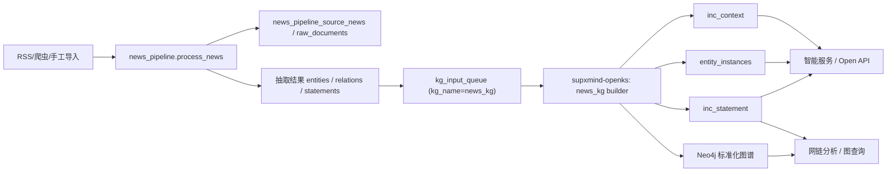

# zhilian-robot

智链机器人统一代码仓，包含主平台（前后端 + 数据服务）以及 `openspg`、`kag` 两个模块，统一由 `zhilian-robot` 仓库管理。

## 调试前必读

后续联调、排障、部署排查，默认先看本 README。当前仓库内已经能确认的部署和访问信息如下：

- 线上访问域名：<https://ai-zhilian.quant-chi.com>
- 网站登录账号：`admin`
- 网站登录密码：`quantchi123`
- 登录校验位置：`frontend/src/utils/auth.js`
- 当前登录方式说明：前端本地校验写死账号密码，登录成功后写入浏览器 `localStorage`，不是后端账号体系

> 说明：域名 `https://ai-zhilian.quant-chi.com` 当前可访问；仓库内能确认应用容器对外暴露前端端口为 `8100`（见 `.env.remote`），域名层的反向代理/网关配置不在本仓库内。

## 仓库整合说明

当前仓库采用模块化目录：

- `modules/openspg`：OpenSPG 引擎代码
- `modules/kag`：KAG 框架代码
- `supxmind/supxmind-openks`：SupXmind 知识计算子项目，承接四段式平台中的“知识计算”阶段
- 根目录继续承载智链机器人业务平台（frontend/backend + docker-compose）

## 项目结构

```text
zhilian-robot/
├── backend/                        # 智链机器人后端（FastAPI + Celery）
├── frontend/                       # 智链机器人前端（React + Vite）
├── supxmind/
│   └── supxmind-openks/            # 仓库内知识计算子项目（OpenKS）
├── docs/                           # 平台文档与方案文档
├── scripts/                        # 仓库级脚本
├── docker-compose.yml              # 智链机器人一键部署编排
├── deploy.sh                       # 平台部署脚本
├── modules/
│   ├── openspg/                    # OpenSPG 模块
│   │   ├── builder/
│   │   ├── server/
│   │   ├── reasoner/
│   │   ├── cloudext/
│   │   ├── dev/release/            # OpenSPG Docker Compose 与发布脚本
│   │   └── pom.xml
│   └── kag/                        # KAG 模块
│       ├── kag/
│       ├── knext/
│       ├── tests/
│       ├── requirements.txt
│       └── setup.py
├── .gitignore
└── README.md
```

## 部署方式

## 当前平台入口

当前前端主入口已经切换为五板块总览页：

- `/platform?tab=overview`
- `/platform?tab=data-hub`
- `/platform?tab=knowledge-computing`
- `/platform?tab=chain-analysis`
- `/platform?tab=intelligent-service`

详细操作仍然回到各独立工作区：

- `/workflow`
- `/graph`
- `/agent/industry-qa`

`supxmind-openks` 当前是仓库内子项目，不是独立 HTTP 服务；backend 通过仓库内安装和源码目录读取模块状态。

## 当前真实全链路

### 以资讯为例的真实落库路径

当前代码中的资讯链路已经能在页面上串起来，但“总览页串联”和“真实执行链路”是两层：

1. 页面总览层：
   - `数据汇聚`：展示资源规模、治理任务、质量状态与资源详情
   - `OpenKS知识建模与计算`：展示 OpenKS 模块状态、`news_kg` 状态和 workflow 摘要
   - `网链分析`：展示图谱、动量与时序摘要
   - `智能服务`：展示头条样本、问答入口和 Open API 能力
2. 真实执行层：
   - `RSS/爬虫/手工导入`
   - `news_pipeline.process_news`
   - `kg_input_queue (kg_name=news_kg)`
   - `supxmind-openks -> news_kg builder`
   - `entity_instances / inc_statement / inc_context`
   - `Neo4j`
   - `网链分析 / 智能服务`

当前资讯的真实落库主线：



### OpenSPG、本体模型库、实例知识层的关系

当前项目里需要区分三层：

1. 本体模型库（规范层）
   - 作用：管理类、属性、关系、约束等元数据
   - 当前本地载体：`ontology_schema_registry`（MySQL）
   - 当前代码入口：`backend/app/database/mysql_ontology_db.py`
2. 实例知识层（事实层）
   - 作用：存放抽取后的实体、事实、上下文
   - 当前主集合：`entity_instances`、`inc_statement`、`inc_context`
   - 当前 OpenKS builder 主要落在这一层
3. OpenSPG / Neo4j（语义执行层）
   - 作用：承接 schema、builder、graph、search、reason 等语义执行能力
   - 当前用于工作流页建模/执行、图谱查询和增强检索

当前真实状态不是“所有数据都直接落到 OpenSPG 本体表”。更准确地说：

- `supxmind-openks` 当前把结构化事实先落到本项目的实例知识层和 Neo4j
- OpenSPG 目前承担 schema/build/search/reason/graph 的语义执行层角色
- 智能服务当前已经优先消费 `inc_statement / entity_instances / inc_context`，并保留 workflow/legacy 兜底

### `supxmind-openks` 当前是怎么实现的

当前仓库里的 `supxmind-openks` 不是一个完整复刻 KAG 的独立框架，而是一个“OpenKS 模块定义 + 轻量执行适配层”：

1. 模块发现
   - `openks/common/registry/discovery.py` 递归读取 `openks/kg/*/*/module.toml`
   - 读出 `name/title/stage/owner/path/summary/status/dependencies`
   - `openks/common/registry/catalog.py` 只是把 discovery 暴露成统一入口
2. 入口装配
   - `openks/entry/bootstrap/loader.py` 把模块清单整理成 bootstrap manifest
   - `openks/entry/api/service.py` 暴露 overview，并直接挂接 `NewsKgBuilder` / `NewsKgSolver`
3. 当前真正跑通的执行链路
   - `openks/kg/fact/news_kg/schema/news_kg_schema.py` 用 Python `describe()` 定义实体、关系、字段
   - `openks/kg/fact/news_kg/builder/news_kg_builder.py` 读取 `kg_input_queue`
   - builder 通过 `openks/common/adapters/mongodb_adapter.py` 写 `entity_instances / inc_statement / inc_context / kg_build_runs`
   - builder 通过 `openks/common/adapters/neo4j_adapter.py` 调用主仓图服务写 Neo4j
   - `openks/kg/fact/news_kg/solver/news_kg_solver.py` 直接查 Mongo 集合返回结果

一句话：当前 `supxmind-openks` 已经有自己的模块注册、builder、reasoner、solver 组织方式，但真正落库仍主要是“主仓 Mongo + Neo4j”这条链路。

### 它和 KAG 的关系

当前代码里，`supxmind-openks` 和 KAG 是“上层定义编排”和“下层通用能力框架”的关系，不是同一层，也不是现在已经完全打通的一套运行时：

- OpenKS：定义 KG 模块边界、负责人、依赖关系，以及各模块自己的 `schema / builder / reasoner / solver`
- KAG：提供项目、schema 提交、索引管理、检索推理、OpenSPG 交互这一套通用框架能力
- OpenSPG：提供服务端 schema / graph / reason / search 能力

从当前实现看，`news_kg` 这条已落地链路并没有直接走 KAG 的 `knext schema commit -> project schema -> solver` 流程，而是：

- 用 OpenKS 自己的 Python schema 描述结构
- 用 OpenKS builder 直接写主仓 Mongo / Neo4j
- 用 OpenKS solver 直接查主仓集合

所以，当前代码里“OpenKS 复用 KAG 的抽取/融合能力”更多还是架构意图和后续扩展方向；至少在已实现的 `news_kg` 代码路径里，schema 还没有自动传入 KAG。

### 哪些定义在 KAG 里

KAG 侧和 schema 直接相关的定义主要在这些位置：

1. 项目约定
   - `modules/kag/knext/project/__init__.py`
   - 约定 schema 目录是 `schema/`，文件名是 `$namespace.schema`
2. 项目环境与 `project_id`
   - `modules/kag/knext/common/env.py`
   - 从 `kag_config.yaml` 读取 `project.id / namespace / host_addr`
3. schema 提交命令
   - `modules/kag/knext/command/sub_command/schema.py`
   - `knext schema commit` 会读取本地 `.schema` 文件，并补充 index manager 自带 schema
4. schema 解析与提交
   - `modules/kag/knext/schema/marklang/schema_ml.py`
   - `SPGSchemaMarkLang` 解析 `.schema` DSL，再通过 `SchemaClient` 同步到 OpenSPG 服务端
5. KAG 自带索引 schema
   - `modules/kag/kag/indexer/kag_index_manager.py`
   - 例如 `Chunk`、`AtomicQuery` 这类索引类型 schema 就定义在这里
6. 运行时取 schema
   - `modules/kag/kag/interface/solver/model/schema_utils.py`
   - 运行时通过 `ReasonerClient(..., project_id).get_reason_schema()` 从服务端拉项目 schema

示例可以直接看：

- `modules/kag/kag/examples/baike/schema/BaiKe.schema`
- `modules/kag/kag/examples/README_cn.md`

### schema 怎么传入 KAG

KAG 的标准传入链路是：

1. 准备 `kag_config.yaml`
   - 配置 `project.id`、`namespace`、`host_addr`
2. 在项目目录下准备 `schema/$namespace.schema`
   - 例如 `schema/BaiKe.schema`
3. 执行 `knext schema commit`
   - `schema.py` 会找到本地 `.schema`
   - 再把 `KAGIndexManager` 里的索引 schema 一起并入
4. `SPGSchemaMarkLang` 解析 DSL
   - 按 `namespace` 补全类型名
   - 通过 `SchemaClient(host_addr, project_id)` 提交到 OpenSPG
5. 后续 builder / solver / graph_api
   - 都通过同一个 `project_id` 去服务端读取和使用 schema

所以更准确地说：schema 不是“传进某个本地 KAG Python 对象”，而是“以 `.schema` DSL + `project_id` 的方式提交到 OpenSPG 项目，再由 KAG 按项目读取”。

当前仓库已经补了第一层最小适配：

- `supxmind/supxmind-openks/openks/common/interop/kag_schema_adapter.py`
- 支持把 OpenKS 的 Python `describe()` 编译成 KAG/OpenSPG 可接受的 `.schema` DSL
- 支持写入 KAG 项目目录 `schema/$namespace.schema`
- 支持可选调用 `SPGSchemaMarkLang.sync_schema()` 提交

但当前仍然没有把现有 `news_kg` 运行主链路切到 KAG，也就是说现状是：

- 已实现：OpenKS schema 定义层 -> KAG schema 适配层
- 未实现：OpenKS builder / solver 全量切换为 KAG project runtime

如果后面继续往深处打通，还需要至少补下面几件事：

- 为每个 KG 模块绑定明确的 `namespace + project_id`
- 在构建前自动执行 `knext schema commit`
- 让 KAG builder / solver 真正消费这个 project schema
- 把现有 Mongo / Neo4j 直写链路逐步切换或对齐到 KAG runtime

### 研报后续开发路线

当前 `report_kg` 仍是骨架模块，真实研报链路还没有像资讯一样接入 OpenKS。后续建议按两部分推进：

1. 在 `supxmind-openks` 中开发 `report_kg`
   - `schema`：定义 `ReportDocument`、`Company`、`Technology`、`Indicator`、`Conclusion`、`AnalystView` 等
   - `builder`：消费研报知识输入，写 `entity_instances / inc_statement / inc_context / Neo4j`
   - `reasoner`：做观点归并、评级变化、指标趋势等轻推理
   - `solver`：支持按公司、技术、指标、观点检索结构化结果
2. 在主仓 `zhilian-robot` 中完成平台接线
   - 让研报处理结果进入类似 `kg_input_queue` 的知识计算入口
   - 增加 `report_kg` 的 build/status/query API
   - 增加 `build_report_kg_queue` 异步任务
   - 在数据汇聚 / 知识计算 / 智能服务页里展示并消费 `report_kg`

一句话：

- `supxmind-openks` 负责“知识计算模块本体”
- `zhilian-robot` 负责“把模块接进平台全链路”

当前项目推荐区分三类场景：线上标准发布、本地全量部署、本地直连远端依赖联调。

### 1. 线上标准发布

适用场景：把当前本地仓库代码同步到线上服务器 `47.111.125.169`，并在服务器上完成 OpenSPG + 智链业务平台部署。

标准约定：

- 线上唯一代码目录：`/root/zhilian-robot`
- 旧目录：`/root/zhilian/zhilian-robot`
- OpenSPG 编排：`/root/zhilian-robot/modules/openspg/dev/release/docker-compose.yml`
- 智链业务编排：`/root/zhilian-robot/docker-compose.yml`

推荐入口：

```bash
cd /Users/youfang/Documents/zhilian-robot
bash scripts/deploy-server.sh --remove-legacy-copy
```

脚本会执行以下动作：

1. 通过 `ssh + rsync` 将当前仓库同步到服务器 `/root/zhilian-robot`
2. 保留服务器上的 `.env` / `.env.remote`，避免覆盖线上密钥和连接配置
3. 重启 `modules/openspg/dev/release` 下的 OpenSPG 栈
4. 在服务器 `/root/zhilian-robot` 目录执行 `bash deploy.sh --skip-pull`
5. 可选删除旧目录 `/root/zhilian/zhilian-robot`

前置条件：

- 本机可直接 SSH 到 `root@47.111.125.169`
- 本机安装了 `ssh`、`rsync`
- 服务器已安装 `docker` 与 `docker compose`

常用命令：

```bash
# 标准发布，同时删除旧目录
bash scripts/deploy-server.sh --remove-legacy-copy

# 若本次改动包含 modules/openspg，并希望构建远端本地 OpenSPG 镜像
bash scripts/deploy-server.sh --build-local-openspg-image --remove-legacy-copy

# 只重启远端，不重新 rsync
bash scripts/deploy-server.sh --skip-rsync
```

注意事项：

- 该脚本是“发布到线上服务器”的唯一推荐入口
- 默认会重启 OpenSPG 栈和智链业务栈
- 默认使用官方 OpenSPG 服务镜像；只有在传入 `--build-local-openspg-image` 时，才会基于远端源码构建 `openspg-server:local`
- 最外层域名网关仍在仓库外管理，当前仓库负责的是服务器内 `:8100 / :8000 / :8887` 这一层

### 2. 本地全量部署

适用场景：本地完整拉起基础设施和业务服务。

部署入口：

- 编排文件：`docker-compose.yml`
- 环境变量：`.env`
- 一键脚本：`deploy.sh`

包含服务：

- 基础设施：`neo4j`、`mongodb`、`redis`、`mysql`、`minio`
- 业务服务：`backend`、`frontend`
- 异步任务：`celery-worker`、`celery-beat`、`flower`

直接启动：

```bash
cd zhilian-robot
docker compose up -d
```

或使用部署脚本：

```bash
cd zhilian-robot
bash deploy.sh
```

`deploy.sh` 的实际流程：

1. 校验 `docker compose`、环境变量文件和当前配置
2. 默认执行 `git pull --ff-only`
3. 执行 `docker compose down`
4. 重建 `backend`、`frontend` 镜像
5. 执行 `docker compose up -d`
6. 检查后端 `/health` 和 `OPENSPG_BASE_URL`

本地默认访问地址：

- 前端：<http://localhost>
- 后端 API：<http://localhost:8000>
- Neo4j Browser：<http://localhost:7474>
- Flower：<http://localhost:5555>

### 3. 远端数据复用 / 本地联调部署

适用场景：只在本机启动应用层容器，底层依赖复用远端环境做联调，不会把代码发布到服务器。

部署入口：

- 环境变量：`.env.remote`
- 快捷脚本：`scripts/compose-remote.sh`
- 辅助脚本：`scripts/redeploy-remote.sh`

当前 `.env.remote` 指向的依赖：

- Neo4j：`47.111.125.169:7687`
- MongoDB：`47.111.125.169:27017`
- Redis：`47.111.125.169:6379`
- MySQL：`47.111.125.169:3307`
- MinIO：`47.111.125.169:9000`
- OpenAI 接口：`https://api.siliconflow.cn/v1`

快捷命令：

```bash
# 仅拉起前后端
bash scripts/compose-remote.sh up

# 前后端 + Celery 全量应用层
bash scripts/compose-remote.sh full-up

# 查看应用层日志
bash scripts/compose-remote.sh logs

# 在本机重建联调容器
bash scripts/redeploy-remote.sh
```

注意事项：

- `scripts/compose-remote.sh up` 默认只启动 `backend` 和 `frontend`
- `scripts/compose-remote.sh full-up` 会再带上 `celery-worker`、`celery-beat`、`flower`
- 该模式依赖远端基础设施可达，不会在本机额外启动数据库类容器
- `scripts/redeploy-remote.sh` 与 `compose-remote.sh` 只用于本地联调，不会把代码同步到线上服务器
- 不建议把 `deploy.sh --env-file .env.remote` 当成线上发布入口；线上发布请使用 `scripts/deploy-server.sh`

### 4. 前端发布形态

前端构建链路：

1. `frontend/Dockerfile` 使用 `node:18-alpine` 执行 `npm install` 和 `npm run build`
2. 构建产物复制到 `nginx:alpine`
3. `frontend/nginx.conf` 提供 SPA 路由兜底，并将 `/api` 反代到 `http://backend:8000`

这意味着：

- 浏览器访问入口是前端 Nginx
- 前后端容器通过 Compose 网络互通
- 页面请求 `/api` 时，不需要单独暴露后端域名给前端代码

### 5. OpenSPG 与 KAG

OpenSPG 推荐使用模块内编排：

```bash
cd zhilian-robot/modules/openspg/dev/release
docker compose -f docker-compose-west.yml up -d
```

OpenSPG 本地构建：

```bash
cd zhilian-robot/modules/openspg
mvn clean install -DskipTests
```

KAG 开发模式：

```bash
cd zhilian-robot/modules/kag
python3 -m venv .venv
source .venv/bin/activate
pip install -U pip
pip install -e .
```

一体化联调建议顺序：

```text
1) 启动 zhilian-robot 主平台（本地全量部署或远端联调部署）
2) 启动 modules/openspg 引擎服务
3) 安装并启动 modules/kag（按场景选择产品模式或开发模式）
```

## 线上访问信息

当前确认可用于访问和调试的信息：

- 线上首页：<https://ai-zhilian.quant-chi.com>
- 常用页面：<https://ai-zhilian.quant-chi.com/workflow>
- 登录账号：`admin`
- 登录密码：`quantchi123`
- 登录实现：前端 `frontend/src/utils/auth.js` 中写死校验

调试登录相关问题时，优先区分两类问题：

- 如果是“页面无法进入”或“密码错误”，先看前端登录逻辑和浏览器 `localStorage`
- 如果是“登录后页面接口报错”，再看 `/api` 代理、后端日志和远端依赖连通性

## 工作流调试说明

`/workflow` 页面的“一键运行”当前已经改为异步模式，不再等待后端同步跑完整链路后才返回。

当前行为：

- 点击“一键运行”后，接口会立即返回 `run_id`
- 后端在后台继续执行 `建模 -> 采集 -> 处理 -> 抽取 -> 执行 -> 应用`
- 前端会自动轮询 `run_id`、`latest` 和 `history`

当前状态语义：

- `queued`：已入队，等待后台开始
- `running`：后台正在执行
- `success`：Schema、Builder、应用快照都成功
- `partial_success`：资讯链路成功，但 Schema 或 Builder 未完全成功
- `failed`：核心流程执行失败

调试建议：

- 先看 `run_id`
- 再看 `运行历史` 和 `当前运行摘要`
- 若是 `partial_success`，优先检查 `schema_apply_result` 和 `builder_submit_result`
- `model-studio/schema/current` 在 OpenSPG 慢或不可达时会优先回退到本地缓存的激活模型，避免页面初始化被完全阻塞
- 顶部 6 个阶段卡片现在可点击，会打开右侧抽屉查看该阶段的真实 `输入 / 输出 / 可视化`
- 抽屉内支持切换不同 `run_id`，便于回放历史运行

## 智能问答追踪说明

`/agent/industry-qa` 页面的“证据与追踪”区域当前会明确展示：

- `Workflow 关联`
  - 当前问答命中了哪次 `workflow run`
  - 命中了哪些 `event_id`
- `实际使用的数据表 / 集合`
  - 当前问答实际读取的数据表（如 `crawled_articles`）
  - 当前问答链路写入的追踪集合（如 `qa_messages`、`qa_citations`、`qa_traces`）
- `引用证据`
  - 具体引用了哪些新闻、对应哪个 `statement_id`
- `命中结果`
  - 检索命中的事件列表和分数

如果要证明智能问答真正使用了前面 workflow 的成果，优先看：

- `Workflow 关联`
- `实际使用的数据表 / 集合`
- `引用证据`

## 常用命令

```bash
# 主平台日志
cd zhilian-robot
docker compose logs -f backend
docker compose logs -f frontend

# 主平台停止与清理容器
cd zhilian-robot
docker compose down

# 使用远端环境变量重启应用层
cd zhilian-robot
bash scripts/compose-remote.sh restart

# 使用远端环境变量查看应用层日志
cd zhilian-robot
bash scripts/compose-remote.sh logs

# OpenSPG 服务状态
cd zhilian-robot/modules/openspg/dev/release
docker compose -f docker-compose-west.yml ps

# KAG 测试
cd zhilian-robot/modules/kag
pytest -q
```

## 说明

- 仓库已经统一管理 `openspg` 与 `kag` 代码，不再依赖外层目录管理。
- `.gitignore` 已补充模块级构建产物、虚拟环境、缓存和临时文件忽略规则。
- 更多平台部署细节可参考 `docs/` 下文档（如 `QUICKSTART.md`、`DEPLOYMENT_CHECKLIST.md`、`V2_DEPLOYMENT_GUIDE.md`）。


### platform部署
cd '/Users/youfang/Documents/zhilian-robot/supxmind/open-platform' && ./deploy.sh --host 47.111.125.169 --user root --skip-pull --standalone-port 8200 --remote-dir /var/www/supxmind/open-platform-8200
