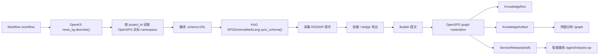
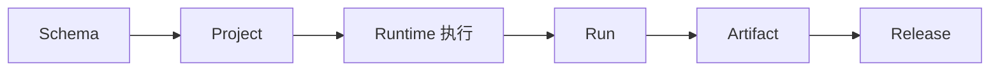
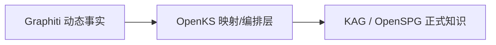
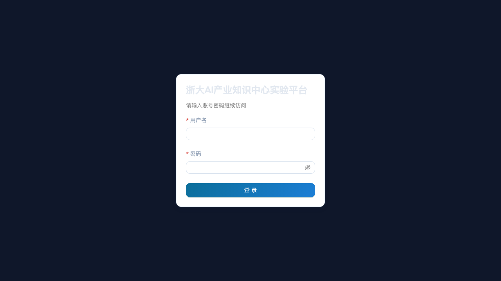

# 当前架构、OpenKS 作用与验证说明

更新时间：2026-03-17

## 1. 当前是否已经切到新链路

是。

当前前台主入口已经切到 `kag_openspg` 主链，旧的 `openks_direct` 仍保留在后端里，但不再作为主 UI 入口暴露。

当前线上主链实测链路为：

线上已验证的一次成功运行对象：

- workflow run: `wf_1773735676_0421b4a1`
- knowledge run: `KRUN_KAG_wf_1773735676_0421b4a1`
- artifact: `KART_KAG_wf_1773735676_0421b4a1`
- release: `KREL_KART_KAG_wf_1773735676_0421b4a1_draft`

## 2. 当前整体架构

当前平台可以分成 4 层：

### 2.1 产品层

- `整体概况`：解释链路和导航，不做操作。
- `数据汇聚`：看资源接入、治理和质量。
- `知识计算`：运行主链、管理 `Run / Artifact / Release`。
- `网链分析`：基于 `artifact_id` 消费知识产物。
- `智能服务`：基于 `release_id / release_version` 消费发布版本。

### 2.2 业务控制层

- `OpenKS`
- 承担模块注册、业务 schema、依赖编排、统一入口、运行时对象聚合。

### 2.3 执行编排层

- `KAG`
- 承担 schema 提交、project 绑定、builder/solver/retrieval 运行框架。

### 2.4 语义服务层

- `OpenSPG`
- 承担 schema/project、graph/search/reason 服务和正式知识图主存。

## 2.5 关键术语解释

这一组词在页面、接口和代码里都会出现，但它们不属于同一层。

### schema

- 含义：知识结构定义。
- 它回答的问题是：
  - 系统里有哪些类型？
  - 类型之间有哪些关系？
  - 每种类型有哪些属性？
- 在当前系统里：
  - 业务 schema 源头在 OpenKS 的 `describe()`
  - 运行时提交给 OpenSPG 的是编译后的 `.schema` DSL

可以把它理解成“知识世界的表结构 + 关系约束”。

### project

- 含义：OpenSPG 里的一个知识工程空间。
- 它回答的问题是：
  - 这套 schema 和图数据归属哪个空间？
  - 当前 namespace 是什么？
  - Builder / Search / Graph 应该操作哪个项目？

可以把它理解成“某个知识工程的项目容器”。

### runtime

- 含义：一条真正执行知识构建的运行路径。
- 它回答的问题是：
  - 这次构建是通过哪套执行体系跑出来的？
  - 是 OpenKS 直写，还是 KAG/OpenSPG 主链，还是未来的 Graphiti source？

当前主 runtime 是：

- `kag_openspg`

它代表：

- OpenKS 负责定义和编排
- KAG 负责 schema/runtime 编排
- OpenSPG 负责正式图谱服务

### Run

- 含义：一次具体的知识构建运行记录。
- 它回答的问题是：
  - 这次什么时候开始、什么时候结束？
  - 成功还是失败？
  - 对应哪个 artifact？

可以把它理解成“一次流水线执行批次”。

### Artifact

- 含义：某次 Run 产出的一个可消费知识产物版本。
- 它回答的问题是：
  - 这次跑出来的知识结果版本号是什么？
  - 包含多少实体、多少陈述、多少上下文？
  - 分析层应该消费哪一批结果？

可以把它理解成“构建好的知识产物包”。

### Release

- 含义：从 Artifact 中挑出来，正式交给下游服务消费的发布版本。
- 它回答的问题是：
  - 当前哪个知识版本已经进入问答/API 消费？
  - 它是 draft、review_pending、released 还是 active？
  - 审核和激活历史是什么？

可以把它理解成“面向下游正式启用的知识版本”。

### 它们的关系

更贴近业务地说：

- schema 定义“该怎么建”
- project 定义“建到哪里”
- runtime 定义“怎么跑”
- run 记录“这次怎么跑了”
- artifact 记录“跑出了什么版本”
- release 记录“哪个版本真正给下游用了”

## 3. OpenKS 在当前架构中的作用

### 3.1 OpenKS 现在负责什么

OpenKS 现在不是一个“可有可无的名字层”，而是当前系统里唯一的业务知识定义与控制平面。

它负责：

- 注册 KG 模块，并决定哪些模块在平台里可追踪、可展示。
- 用 Python `describe()` 维护业务 schema，而不是把业务本体直接散落在 OpenSPG 文本 DSL 里。
- 作为 workflow 的建模起点，把 `news_kg.describe()` 编译成可提交的 `.schema`。
- 在运行完成后统一回收 `KnowledgeRun / KnowledgeArtifact / ServiceRelease`。
- 维持产品层语义稳定：页面展示的是“知识计算”“产物版本”“发布版本”，而不是 OpenSPG 的底层术语拼装。

### 3.2 为什么 OpenKS 是必要的

如果没有 OpenKS，当前系统会直接退化成：

- 前台页面直接面向 OpenSPG project/schema/builder 这些底层概念。
- 业务 schema 和产品对象模型耦合在一起。
- 多个 KG 模块只能靠目录或人工约定管理，无法统一注册、发现和展示。
- `Run / Artifact / Release` 无法以统一业务口径回收，只能看零散的 builder/job/status。

OpenKS 的必要性在于：

- 它把“业务知识定义”从“底层语义执行”里分离出来。
- 它让未来从 `news_kg` 扩展到其他 KG 时，不必直接复制 OpenSPG/KAG 细节到产品层。
- 它为未来引入 Graphiti 这类新的 runtime source 留出了稳定接口，不需要重写产品层语义。

### 3.3 当前 OpenKS 不是做什么

当前 OpenKS 不再是主 UI 上默认的直写 runtime。

它还保留 `openks_direct` 兼容链，但现阶段它的主角色已经是：

- 业务 schema source
- 模块注册中心
- runtime 对象聚合器

不是前台主入口的图谱主存。

## 4. OpenKS / KAG / OpenSPG / Graphiti 各自功能

### 4.1 OpenKS

- 业务知识定义层
- 模块注册与发现
- schema-as-code
- 依赖与运行时编排
- `Run / Artifact / Release` 聚合

### 4.2 KAG

- schema / project / runtime 编排框架
- `SPGSchemaMarkLang.sync_schema()` 提交
- builder / solver / retrieval 运行框架
- 连接业务定义层与 OpenSPG 服务层

### 4.3 OpenSPG

- project / namespace / schema 主存
- graph / search / reason 服务
- 正式知识图与语义执行底座

### 4.4 Graphiti

当前仓库里还没有真正落地代码，定位是规划中的“动态图事实源”。

更准确地说：

- Graphiti 不替代 OpenKS。
- Graphiti 不替代 OpenSPG。
- 它适合做高频变化事实、事件过程、agent memory。
- 合理接法是：

也就是：

- Graphiti 负责动态事实生产
- OpenKS 负责业务语义映射和编排
- KAG/OpenSPG 负责正式知识落库与服务

## 5. 页面上是如何实现的

### 5.1 知识计算页

- 主任务：运行 `kag_openspg` 主链
- 页面对象：
  - OpenKS 定义层
  - latest workflow
  - latest run/artifact/release
  - 跳转到 workflow / graph / service

实现上：

- 前端：`frontend/src/pages/PlatformOverviewPage.jsx`
- 配置：`frontend/src/pages/platformTabs.mjs`
- Hub 文案：`frontend/src/pages/platformOverviewConfig.mjs`
- 后端聚合：`backend/app/api/platform_overview_routes.py`

### 5.2 Workflow 页

- 主任务：跑通 OpenKS -> KAG -> OpenSPG
- 页面步骤：
  - 建模：OpenKS schema 适配与提交
  - 采集
  - 处理
  - 抽取
  - 执行
  - 应用

实现上：

- 前端：`frontend/src/pages/WorkflowWorkbenchPage.jsx`
- 后端入口：`backend/app/api/workflow_routes.py`
- 异步执行：`backend/app/openspg_demo/routes.py`
- OpenKS schema runtime：`backend/app/services/openks_schema_runtime_service.py`

### 5.3 网链分析页

- 主任务：基于 `artifact_id` 消费某个知识产物
- 当前已补：
  - 带 `artifact_id` 进入时，前端会先拉当前批次可查询企业
  - 自动填入第一条可查企业作为默认查询种子
  - 快捷标签改为当前批次企业，而不是固定热词

实现上：

- 前端：`frontend/src/pages/GraphPage.jsx`
- 前端模型：`frontend/src/pages/graphPageModel.mjs`
- 后端接口：
  - `GET /api/v1/graph/company/{company_name}?artifact_id=...`
  - `GET /api/v1/graph/artifacts/{artifact_id}/companies`

## 6. 页面截图

### 6.1 知识计算页

说明：

- 当前页明确展示“运行 kag_openspg 主链”
- 同时展示 OpenKS 定义层与运行时对象

### 6.2 Workflow 页

说明：

- 页面顶部已经固定显示 `kag_openspg 主链`
- 六步文案已经是 OpenKS -> KAG -> OpenSPG 的主链口径

### 6.3 网链分析页

说明：

- 当前页已经能识别 `artifact_id` 上下文
- 下一步会让它默认带入当前批次可查询企业并自动查询

## 7. 你应该怎么验证

### 7.1 验证主链已切换

打开：

- `https://ai-zhilian.quant-chi.com/workflow`

检查：

- 顶部显示 `kag_openspg 主链`
- 没有 runtime profile 切换器
- Step1 是 OpenKS schema 适配与提交

### 7.2 验证知识计算对象已回收

查看：

- `GET /api/v1/platform/overview?stage=knowledge-computing`
- `GET /api/v1/runs?kg_name=news_kg&runtime_profile=kag_openspg`
- `GET /api/v1/artifacts?kg_name=news_kg&runtime_profile=kag_openspg`
- `GET /api/v1/releases?kg_name=news_kg&runtime_profile=kag_openspg`

检查：

- 同一批 `run / artifact / release` 可以互相对应
- `latest_release.status = draft`

### 7.3 验证跨板块消费

从知识计算页：

- 点“基于最新 Artifact 进入网链分析”
- 点“基于当前 Release 进入智能服务”

检查：

- `/graph` 带 `artifact_id`
- `/agent/industry-qa` 带 `release_id / release_version`

### 7.4 验证网链分析默认数据

带着 `artifact_id` 进入 `/graph` 后，检查：

- 搜索框是否自动带入当前批次的可查询企业
- 快捷标签是否优先显示当前批次企业
- 默认搜索结果是否不再是空白

## 8. 当前状态总结

当前系统已经具备：

- 前台主入口切到 `kag_openspg`
- OpenKS 作为业务定义与控制平面生效
- KAG 作为 schema/runtime 编排框架生效
- OpenSPG 作为正式知识服务层生效
- `Run / Artifact / Release` 能在线上真实生成并被页面读取

当前仍在继续优化：

- 网链分析页默认种子与布局细节
- release 审批链的完整实测
- Graphiti 的后续接入实现

