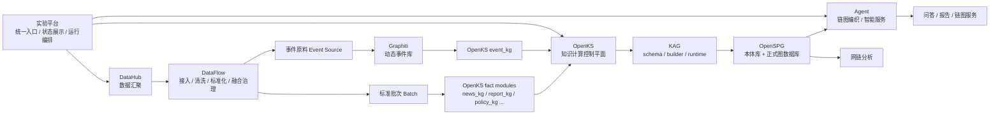
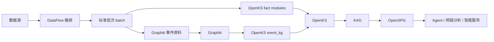

# 实验平台整体架构与实现方案

更新时间：2026-03-19

> 本文档以 2026-03-19 的讨论结论为准，覆盖此前“`supxmind-datahub` 同时承接数据汇聚、大图构建、链图编织三类工作台”的临时假设。最终口径调整为：
>
> - `DataHub = 数据汇聚系统`
> - `OpenKS + KAG + OpenSPG = 大图构建系统`
> - `Agent = 链图编织系统`
> - `实验平台 = 统一入口与总控台`

---

## 1. 背景与目标

当前实验平台已经完成 `kag_openspg` 主链验证，具备：

- OpenKS schema 编译与提交到 OpenSPG 的链路
- 资讯采集、bridge 导出、builder 提交、图物化链路
- `Run / Artifact / Release` 基本追踪对象

但平台仍存在以下问题：

- `DataHub`、`OpenKS`、`OpenSPG`、智能体的职责边界未完全收敛
- 数据汇聚、知识构建、链图编织在产品语义上仍有杂糅
- OpenSPG 正式大图已经写入，但部分展示仍停留在旧 Mongo 图投影或中间批次视图
- Graphiti 作为动态事件源尚未纳入统一主链

本文目标是给出一版统一架构：

1. 明确各系统职责边界
2. 明确页面归属与产品入口
3. 明确主对象流与输入输出契约
4. 明确 Graphiti 的接入位置
5. 给出分阶段实现方案

---

## 2. 最终架构结论

### 2.1 一句话定义

- `DataHub` 只做数据汇聚，不做正式大图构建主控，也不做链图编织主控
- `OpenKS + KAG + OpenSPG` 组成正式大图构建主链
- `Agent` 基于正式大图和事件知识源完成链图编织与智能服务
- `实验平台` 负责统一入口、统一上下文、统一状态和统一编排

### 2.2 总体架构图



### 2.3 分层说明

| 层 | 组件 | 核心职责 |
|---|---|---|
| 产品入口层 | 实验平台 | 统一入口、统一上下文、统一状态、统一跳转、统一编排 |
| 数据汇聚层 | DataHub + DataFlow | 数据源接入、标准化、融合治理、质量洞察、批次产出 |
| 动态事件层 | Graphiti | 资讯事件化、时态关系、证据链、动态事实维护 |
| 知识构建层 | OpenKS + KAG | schema-as-code、知识抽取、builder 编排、运行对象聚合 |
| 知识主存与消费层 | OpenSPG + Agent | 正式本体库、正式图数据库、推理检索、链图编织、问答服务 |

---

## 3. 各系统职责边界

### 3.1 实验平台

实验平台不是“纯展示页”，而是总控台。

负责：

- 统一产品入口
- 统一项目上下文
- 统一 `Run / Artifact / Release` 状态展示
- 统一模块跳转
- 统一主链编排入口
- 为分析和智能服务提供当前有效上下文

不负责：

- 具体数据治理操作
- 具体图谱建模编辑
- 具体链图设计操作细节

### 3.2 DataHub

DataHub 定位为数据汇聚系统。

负责：

- 数据源接入
- 批次采集
- 文档标准化
- 融合治理
- 数据质量洞察
- 为 Graphiti 和 OpenKS 提供干净输入

输出：

- `batch_id`
- `manifest_uri`
- `quality_report`
- `event_source_batch_id`

不负责：

- OpenKS schema 发布
- KAG builder 编排
- OpenSPG 正式图落库
- Agent 链图编织

### 3.3 DataFlow

如果集成到 DataHub，DataFlow 的定位是 DataHub 内部的数据流程编排层。

负责：

- 接入任务调度
- 清洗任务调度
- 标准化任务调度
- 融合治理任务调度
- 水位、重跑、失败恢复

不负责：

- 直接落 OpenSPG 正式图
- 直接充当全平台工作流中枢
- 直接承接链图编织逻辑

### 3.4 Graphiti

Graphiti 定位为动态事件知识源。

负责：

- 把资讯文本转成事件 episode
- 维护时态关系
- 维护事件证据链
- 提供动态事实演化能力

不负责：

- 正式本体库主存
- 正式图数据库主存
- 产品层主界面

### 3.5 OpenKS

OpenKS 定位为知识计算控制平面。

负责：

- KG 模块注册
- schema-as-code
- `news_kg / report_kg / event_kg / industry_chain` 等模块组织
- builder / solver / reasoner 统一编排
- `Run / Artifact / Release` 聚合

输入：

- DataHub 标准批次
- Graphiti 事件事实包

输出：

- 提交给 KAG 的构建任务
- 聚合后的运行对象

### 3.6 KAG

KAG 定位为执行编排层。

负责：

- schema 提交
- builder 运行
- runtime 组织
- OpenKS 到 OpenSPG 的执行桥接

### 3.7 OpenSPG

OpenSPG 定位为正式知识主存。

负责：

- project / namespace / schema
- 正式图谱节点与边
- 图检索、搜索、推理

它存的是：

- 正式 schema
- 正式大图

它不存的是：

- DataHub 的中间批次
- Graphiti 的原始 episode
- 实验平台的状态对象

### 3.8 Agent

Agent 定位为链图编织与知识消费层。

负责：

- 基于正式大图进行链图编织
- 输出链图视图
- 输出解释路径
- 输出专题报告
- 面向问答、推荐、链图服务消费

输入：

- `artifact_id / release_id`
- 用户意图
- 编织规则
- 模板

输出：

- `chain_id`
- `report`
- `qa answer`
- `service output`

---

## 4. 主对象流

### 4.1 核心对象流

统一对象链路定义为：

```text
source -> batch -> run -> artifact -> release -> chain/service
```

含义如下：

- `source`：数据源与采集配置
- `batch`：数据汇聚后的标准批次
- `run`：一次知识构建运行
- `artifact`：一次知识构建产物
- `release`：一个正式发布版本
- `chain/service`：链图编织和服务输出对象

### 4.2 主流程



---

## 5. 输入输出契约

### 5.1 数据汇聚输入输出

**输入**

```json
{
  "source_id": "SRC_NEWS_RSS_001",
  "source_type": "rss|api|db|file",
  "doc_type": "news|report|policy",
  "fetch_config": {},
  "mapping_profile": "news_standard_v1"
}
```

**输出**

```json
{
  "batch_id": "BATCH_20260319_001",
  "doc_type": "news",
  "record_count": 1280,
  "quality_score": 0.94,
  "manifest_uri": "s3://.../batch.jsonl",
  "event_source_batch_id": "EVSRC_20260319_001"
}
```

### 5.2 Graphiti 输入输出

**输入**

```json
{
  "group_id": "project_1_news",
  "episode_id": "NEWS_EVT_20260319_001",
  "content": "华为与某机器人公司签署战略合作协议",
  "reference_time": "2026-03-19T09:30:00+08:00",
  "source": "news"
}
```

**输出**

```json
{
  "event_id": "EVT_xxx",
  "entities": ["Company:华为", "Company:某机器人公司"],
  "edges": ["Partnership"],
  "valid_at": "2026-03-19T09:30:00+08:00",
  "provenance": ["episode:NEWS_EVT_20260319_001"]
}
```

### 5.3 大图构建输入输出

**输入**

```json
{
  "project_id": 1,
  "namespace": "zhilian_ai_center",
  "module_names": ["news_kg", "event_kg"],
  "batch_id": "BATCH_20260319_001",
  "runtime_profile": "kag_openspg"
}
```

**输出**

```json
{
  "run_id": "KRUN_KAG_xxx",
  "artifact_id": "KART_KAG_xxx",
  "release_id": "KREL_KAG_xxx",
  "schema_version": "news_kg:v1+event_kg:v1",
  "graph_stats": {
    "vertices": 18230,
    "edges": 46811
  }
}
```

### 5.4 链图编织输入输出

**输入**

```json
{
  "artifact_id": "KART_KAG_xxx",
  "release_id": "KREL_KAG_xxx",
  "goal": "编织具身智能产业链图并解释关键合作链路",
  "rule_set": ["上下游", "合作", "投资", "政策影响"],
  "template": "industry_chain_v1"
}
```

**输出**

```json
{
  "chain_id": "CHAIN_001",
  "version": "industry_chain:2026.03.19.1",
  "report_id": "REPORT_001",
  "service_output_id": "SERVICE_001"
}
```

---

## 6. 页面架构

### 6.1 实验平台页面

实验平台应承接以下页面：

- `整体概况`
- `数据汇聚`
- `知识计算 / 大图构建`
- `链图编织 / 智能体编排`
- `网链分析`
- `智能服务`

其中：

- `数据汇聚`：主要展示摘要并跳转到 DataHub
- `知识计算 / 大图构建`：实验平台主承接，底层调用 OpenKS/KAG/OpenSPG
- `链图编织 / 智能体编排`：实验平台主承接，底层调用 Agent

### 6.2 DataHub 页面

DataHub 页面应收缩成数据汇聚工作台：

```text
工作台首页
数据汇聚
  数据源接入
  标准化处理
  融合治理
  质量洞察
系统管理
```

应从 DataHub 主产品中移出的菜单：

- 本体模型
- 语义图谱
- 链图编织
- 链图服务

### 6.3 页面示意

#### 实验平台首页

```text
┌──────────────────────────────────────────────┐
│ 浙大AI产业知识中心实验平台                    │
│ 简介：只做导航、上下文和运行状态追踪          │
├──────────────────────────────────────────────┤
│ [数据汇聚] [知识计算] [链图编织] [网链分析]   │
│                                              │
│ 当前项目：project_1                          │
│ 最新运行：KRUN_KAG_xxx                       │
│ 最新产物：KART_KAG_xxx                       │
│ 最新发布：KREL_KAG_xxx                       │
└──────────────────────────────────────────────┘
```

#### DataHub 数据汇聚页

```text
┌──────────────────────────────────────────────┐
│ 数据汇聚                                      │
│ 简介：只看资源接入、融合治理、数据质量         │
├──────────────────────────────────────────────┤
│ 顶部：来源数 / 今日批次 / 成功率 / 质量分      │
│ 左侧：数据源列表                              │
│ 中间：最近接入批次                            │
│ 右侧：融合任务与异常                          │
│ 底部：质量洞察                                │
└──────────────────────────────────────────────┘
```

#### 实验平台大图构建页

```text
┌──────────────────────────────────────────────┐
│ 知识计算 / 大图构建                           │
│ 简介：只看 schema、构建任务、artifact/release │
├──────────────────────────────────────────────┤
│ 左：OpenKS 模块与 schema 版本                 │
│ 中：Run / Artifact / Release 时间线           │
│ 右：OpenSPG project / namespace / 图规模      │
└──────────────────────────────────────────────┘
```

#### 实验平台链图编织页

```text
┌──────────────────────────────────────────────┐
│ 链图编织 / 智能体编排                         │
│ 简介：基于 artifact/release 编织链图与报告    │
├──────────────────────────────────────────────┤
│ 左：编织目标 / 模板 / 规则                    │
│ 中：智能体任务 / 推理路径 / 链图预览          │
│ 右：报告 / 服务输出 / API                     │
└──────────────────────────────────────────────┘
```

---

## 7. OpenSPG 正式大图的定位

### 7.1 存储位置

OpenSPG 正式大图由两部分组成：

- `schema / project / namespace`：OpenSPG 元数据层
- `vertex / edge`：OpenSPG 管理的正式图存储层

当前主链已经通过：

- schema 提交
- `graph/upsertVertex`
- `graph/upsertEdge`

把正式数据写入 OpenSPG。

### 7.2 展现形式

OpenSPG 正式大图在产品层主要以三种形态展现：

1. `schema` 视图：模型结构、类型、关系、字段
2. `graph` 视图：节点边网络、关系图谱
3. `service` 视图：检索、问答、推理和智能体消费结果

### 7.3 当前遗留问题

当前平台中，部分 `/graph` 与 Open API 相关逻辑仍残留：

- 旧 Mongo 图投影
- JSONL batch fallback

这说明“正式大图已经写入 OpenSPG”，但“正式大图还没有完全成为唯一原生读路径”。

因此后续必须：

- 停止把旧 Mongo 图投影作为 artifact 正式读图路径
- 停止把 batch fallback 作为正式图读取兜底
- 将 artifact/release 相关正式读取逐步切到 OpenSPG 原生接口

---

## 8. 具体实现方案

### 8.1 阶段一：职责收敛与页面改版

目标：

- 收敛 DataHub 到“数据汇聚系统”
- 把实验平台明确为总控台
- 停止 DataHub 对大图构建、链图编织的产品语义占位

实施项：

1. DataHub 左侧菜单重构
   - 收缩为“数据汇聚”工作台
   - 下掉本体模型、语义图谱、链图服务等主入口

2. 实验平台页面重构
   - 增加“知识计算 / 大图构建”
   - 增加“链图编织 / 智能体编排”
   - 数据汇聚页只做摘要与跳转

3. 路由与入口统一
   - DataHub 通过统一入口或代理挂载
   - 用户不直接记忆底层系统路径

### 8.2 阶段二：Graphiti 接入主链

目标：

- 将 Graphiti 纳入统一主链
- 建立 `event_kg`

实施项：

1. DataFlow 产出 `event_source_batch_id`
2. 增加 `GraphitiAdapter`
3. 在 OpenKS 中新增 `event_kg`
4. 将 `news_kg + event_kg` 共同纳入构建流程

### 8.3 阶段三：大图构建主链增强

目标：

- 把大图构建的正式主链稳定在 `OpenKS -> KAG -> OpenSPG`
- 补齐运行时接口定义

实施项：

1. 为 OpenKS 增加明确的输入输出契约
2. 补齐 `RuntimeProfile / GraphRuntime / ArtifactStore` 抽象
3. 将 `Run / Artifact / Release` 与 OpenSPG project/namespace 显式关联

### 8.4 阶段四：链图编织智能体化

目标：

- 链图编织不再作为传统静态设计后台，而是升级为智能体能力

实施项：

1. Agent 接收 `artifact_id / release_id`
2. 基于正式图谱和事件事实做编织
3. 输出链图视图、解释路径、报告、服务对象

### 8.5 阶段五：正式图读路径收敛

目标：

- OpenSPG 成为正式图唯一主读路径

实施项：

1. 梳理 `/graph`、Open API、智能问答当前读路
2. 明确哪些仍在读旧 Mongo 投影
3. 新增 OpenSPG 原生读服务
4. 逐步下线旧 Mongo 图投影和 batch fallback

---

## 9. 推荐实施顺序

推荐按以下顺序推进：

1. 先完成页面职责与导航调整
2. 再接入 Graphiti 事件适配层
3. 再增强 OpenKS 大图构建运行时
4. 再把链图编织智能体化
5. 最后统一正式图读取到 OpenSPG

原因：

- 先收敛产品语义，避免边做边改口径
- 再接动态事件源，避免 Graphiti 成为游离系统
- 再收敛读路径，避免未建好新路径就断旧路径

---

## 10. 当前结论总结

最终架构口径为：

- `DataHub = 数据汇聚系统`
- `DataFlow = DataHub 内部流程编排层`
- `Graphiti = 动态事件知识源`
- `OpenKS + KAG + OpenSPG = 正式大图构建主链`
- `Agent = 链图编织与智能服务层`
- `实验平台 = 统一入口、统一上下文、统一状态、统一编排的总控台`

可以直接对外表述为：

> 当前平台采用“实验平台统一入口、DataHub 负责数据汇聚、Graphiti 负责动态事件沉淀、OpenKS+KAG+OpenSPG 负责正式大图构建、Agent 负责链图编织与智能服务”的分层架构。DataHub 只产出标准批次和事件原料，不直接承载正式图谱主存；OpenSPG 是正式本体库和图数据库；实验平台负责统一上下文、运行编排和状态展示。

