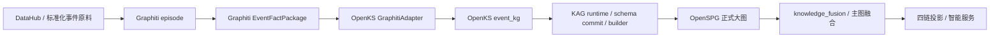

# Graphiti -> event_kg -> OpenSPG 输入输出契约设计

更新时间：2026-03-20

> 本文档用于补齐 `Graphiti -> OpenKS event_kg -> KAG/OpenSPG` 主链的对象契约。
>
> 当前仓库现状：
>
> - `Graphiti` 仍处于规划状态，仓库内没有真实落地代码
> - `event_kg` 尚未实现
> - `OpenSPG` 已具备 `schema` 提交与 `vertices/edges` 写入路径
>
> 因此本文档的目标不是描述“当前已实现行为”，而是定义后续实现应遵循的标准对象形态与边界。

---

## 1. 目标与原则

本链路的目标是：

- 把资讯、动态事件等高频变化事实先沉淀为 `Graphiti` 事件事实
- 通过 `OpenKS event_kg` 将动态事件语义化、结构化、可追踪化
- 最终进入 `OpenSPG` 正式大图，成为主图的一部分

必须遵守的原则：

- `Graphiti` 不直接替代 `OpenKS`
- `Graphiti` 不直接替代 `OpenSPG`
- `Graphiti` 不直接成为最终大图
- `event_kg` 是 `Graphiti` 和正式主图之间的语义适配层
- `OpenSPG` 只接收正式 schema 和标准化后的顶点边

---

## 2. 总体链路



统一对象主线：

```text
event_source -> episode -> event_fact_package -> event_kg_run -> artifact -> release
```

---

## 3. 分层职责

### 3.1 Graphiti

负责：

- 接收事件原料
- 生成 episode
- 抽取事件、主体、关系、时态、证据
- 输出 `EventFactPackage`

不负责：

- 正式 schema 管理
- OpenSPG 图落库
- 主图融合

### 3.2 OpenKS event_kg

负责：

- 接收 `EventFactPackage`
- 做业务语义映射
- 做稳定 ID、类型、关系、属性规范化
- 生成事件知识构建输入
- 输出可被 KAG/OpenSPG 接收的标准图对象

不负责：

- 直接充当前台事件服务
- 绕过 schema 直接向 OpenSPG 写原始事件对象

### 3.3 OpenSPG

负责：

- 接收 `event_kg` 提交的 schema
- 接收标准化后的 vertices / edges
- 将事件知识写入正式主图

---

## 4. 核心对象定义

本链路统一定义 5 类核心对象：

1. `EventSourceRecord`
2. `GraphitiEpisode`
3. `EventFactPackage`
4. `EventKgBuildInput`
5. `OpenSPGMaterializePayload`

---

## 5. EventSourceRecord 契约

`EventSourceRecord` 是进入 `Graphiti` 前的标准事件原料对象，通常来自 `DataHub` 标准化批次。

### 5.1 输入示例

```json
{
  "source_record_id": "SRCREC_20260320_0001",
  "batch_id": "BATCH_20260320_001",
  "doc_id": "DOC_NEWS_001",
  "doc_type": "news",
  "title": "华为与某机器人公司签署战略合作协议",
  "content": "......",
  "summary": "......",
  "publish_time": "2026-03-20T09:30:00+08:00",
  "source_name": "某资讯源",
  "source_url": "https://example.com/a/1",
  "language": "zh-CN",
  "tags": ["合作", "机器人", "产业"],
  "metadata": {
    "region": "CN",
    "channel": "news"
  }
}
```

### 5.2 必填字段

- `source_record_id`
- `batch_id`
- `doc_id`
- `doc_type`
- `content`
- `publish_time`
- `source_name`

### 5.3 输出去向

该对象不直接进入 OpenSPG，只作为 `GraphitiEpisode` 的输入。

---

## 6. GraphitiEpisode 契约

`GraphitiEpisode` 是 Graphiti 内部消费对象，用来表示一次可被事件化处理的动态事实输入。

### 6.1 输入示例

```json
{
  "group_id": "project_1_news",
  "episode_id": "NEWS_EVT_20260320_0001",
  "content": "华为与某机器人公司签署战略合作协议",
  "reference_time": "2026-03-20T09:30:00+08:00",
  "source": "news",
  "source_record_ref": {
    "batch_id": "BATCH_20260320_001",
    "doc_id": "DOC_NEWS_001"
  }
}
```

### 6.2 约束

- `episode_id` 在同一 `group_id` 下必须唯一
- `reference_time` 是事件的原始参考时间，不等同于最终事件生效时间
- `source_record_ref` 必须能追溯回标准化原始数据

---

## 7. EventFactPackage 契约

`EventFactPackage` 是 Graphiti 输出给 `OpenKS GraphitiAdapter` 的标准事件事实包。

它不是最终图谱，而是待映射的事件事实对象。

### 7.1 输出示例

```json
{
  "package_id": "EFP_20260320_0001",
  "graphiti_group_id": "project_1_news",
  "episode_id": "NEWS_EVT_20260320_0001",
  "event": {
    "event_id": "EVT_PARTNERSHIP_001",
    "event_type": "partnership",
    "event_label": "战略合作",
    "event_time": "2026-03-20T09:30:00+08:00",
    "valid_at": "2026-03-20T09:30:00+08:00",
    "description": "华为与某机器人公司签署战略合作协议",
    "confidence": 0.91
  },
  "entities": [
    {
      "entity_type": "Company",
      "entity_name": "华为",
      "entity_id_hint": "Company:华为",
      "role": "subject"
    },
    {
      "entity_type": "Company",
      "entity_name": "某机器人公司",
      "entity_id_hint": "Company:某机器人公司",
      "role": "object"
    }
  ],
  "facts": [
    {
      "fact_type": "Partnership",
      "subject": "Company:华为",
      "object": "Company:某机器人公司",
      "predicate": "collaborates_with",
      "confidence": 0.91
    }
  ],
  "provenance": [
    {
      "type": "episode",
      "ref": "NEWS_EVT_20260320_0001"
    },
    {
      "type": "document",
      "ref": "DOC_NEWS_001"
    }
  ],
  "evidence": [
    {
      "evidence_id": "EVID_001",
      "text": "华为与某机器人公司签署战略合作协议",
      "source_url": "https://example.com/a/1"
    }
  ]
}
```

### 7.2 必填字段

- `package_id`
- `episode_id`
- `event.event_id`
- `event.event_type`
- `event.valid_at`
- `entities`
- `facts`
- `provenance`

### 7.3 契约要求

- 一个 `EventFactPackage` 至少包含一个 `event`
- 至少包含一个主体实体
- `facts.subject/object` 必须能在 `entities` 中找到对应引用
- `provenance` 必须包含 `episode` 引用

---

## 8. EventKgBuildInput 契约

`EventKgBuildInput` 是 `OpenKS GraphitiAdapter` 将 `EventFactPackage` 映射后，交给 `event_kg builder` 的正式输入。

它比 `EventFactPackage` 更靠近业务主图语义。

### 8.1 输入示例

```json
{
  "kg_name": "event_kg",
  "runtime_profile": "kag_openspg",
  "project_id": 1,
  "namespace": "zhilian_ai_center",
  "source_package_id": "EFP_20260320_0001",
  "event_vertex": {
    "vertex_type": "IndustryEvent",
    "vertex_id": "evt::partnership::20260320::huawei::robot_company",
    "properties": {
      "name": "华为与某机器人公司战略合作",
      "eventType": "partnership",
      "eventLabel": "战略合作",
      "validAt": "2026-03-20T09:30:00+08:00",
      "description": "华为与某机器人公司签署战略合作协议",
      "confidence": 0.91,
      "source": "graphiti"
    }
  },
  "entity_vertices": [
    {
      "vertex_type": "Company",
      "vertex_id": "company::huawei",
      "properties": {
        "name": "华为",
        "source": "graphiti"
      }
    },
    {
      "vertex_type": "Company",
      "vertex_id": "company::robot_company_x",
      "properties": {
        "name": "某机器人公司",
        "source": "graphiti"
      }
    }
  ],
  "edges": [
    {
      "edge_type": "involvesCompany",
      "src_id": "evt::partnership::20260320::huawei::robot_company",
      "dst_id": "company::huawei",
      "properties": {
        "role": "subject"
      }
    },
    {
      "edge_type": "involvesCompany",
      "src_id": "evt::partnership::20260320::huawei::robot_company",
      "dst_id": "company::robot_company_x",
      "properties": {
        "role": "object"
      }
    },
    {
      "edge_type": "collaboratesWith",
      "src_id": "company::huawei",
      "dst_id": "company::robot_company_x",
      "properties": {
        "eventRef": "evt::partnership::20260320::huawei::robot_company",
        "confidence": 0.91
      }
    }
  ],
  "evidence_bindings": [
    {
      "evidence_id": "EVID_001",
      "event_vertex_id": "evt::partnership::20260320::huawei::robot_company",
      "text": "华为与某机器人公司签署战略合作协议",
      "source_url": "https://example.com/a/1"
    }
  ]
}
```

### 8.2 映射规则

`OpenKS GraphitiAdapter` 至少完成以下映射：

- `event.event_id` -> 主图事件顶点 ID
- `entities[].entity_type` -> schema 中的类型名
- `facts[].predicate` -> schema 中合法边类型
- `valid_at` -> 事件时间属性
- `provenance/evidence` -> 证据绑定对象

### 8.3 适配层职责

适配层必须补齐：

- 统一 ID
- 类型映射
- 关系映射
- 属性映射
- 证据绑定
- 幂等键

适配层不应做：

- 最终链图编织
- 面向前台的展示对象拼装

---

## 9. OpenSPGMaterializePayload 契约

`OpenSPGMaterializePayload` 是最终提交给 `OpenSPG` 的标准写图对象。

### 9.1 输入分两部分

#### 9.1.1 schema 输入

`event_kg` 必须先提交 schema，至少定义：

- `IndustryEvent`
- `EventEpisode`
- `Evidence`
- `Company`
- `Technology`
- `Organization`

以及关系类型：

- `involvesCompany`
- `involvesTechnology`
- `hasEvidence`
- `derivedFromEpisode`
- `collaboratesWith`
- `affectsIndustry`

#### 9.1.2 graph 输入

```json
{
  "projectId": 1,
  "vertices": [
    {
      "type": "zhilian_ai_center.IndustryEvent",
      "id": "evt::partnership::20260320::huawei::robot_company",
      "properties": {
        "name": "华为与某机器人公司战略合作",
        "eventType": "partnership",
        "validAt": "2026-03-20T09:30:00+08:00"
      }
    }
  ],
  "edges": [
    {
      "srcType": "zhilian_ai_center.IndustryEvent",
      "srcId": "evt::partnership::20260320::huawei::robot_company",
      "dstType": "zhilian_ai_center.Company",
      "dstId": "company::huawei",
      "label": "involvesCompany",
      "properties": {
        "role": "subject"
      }
    }
  ]
}
```

### 9.2 输出

OpenSPG 写图后，`event_kg` 应回收标准运行对象：

```json
{
  "run_id": "KRUN_EVENTKG_001",
  "artifact_id": "KART_EVENTKG_001",
  "release_id": "KREL_EVENTKG_001_DRAFT",
  "graph_stats": {
    "vertices": 120,
    "edges": 310
  },
  "schema_version": "event_kg:v1"
}
```

---

## 10. 字段映射总表

| Graphiti 输出 | event_kg 输入 | OpenSPG 落库对象 |
|---|---|---|
| `event.event_id` | `event_vertex.vertex_id` | `IndustryEvent.id` |
| `event.event_type` | `event_vertex.properties.eventType` | `IndustryEvent.eventType` |
| `event.valid_at` | `event_vertex.properties.validAt` | `IndustryEvent.validAt` |
| `entities[].entity_type` | `entity_vertices[].vertex_type` | 顶点类型 |
| `entities[].entity_name` | `entity_vertices[].properties.name` | 顶点属性 `name` |
| `facts[].predicate` | `edges[].edge_type` | 边 `label` |
| `provenance[].ref` | `episode/evidence binding` | `derivedFromEpisode` 等边 |
| `evidence[].text` | `evidence_bindings[].text` | `Evidence.text` |

---

## 11. 幂等与增量更新规则

为了支持高频动态事实，必须定义幂等规则。

### 11.1 episode 幂等

同一个 `episode_id` 重复到达时：

- 不应重复创建新的事件顶点
- 应根据内容 hash 判断是否更新已有事件事实

### 11.2 event 幂等

同一个业务事件应优先复用稳定事件 ID，而不是每次新建。

推荐主键生成要素：

- `event_type`
- 主体集合
- 参考时间窗口
- 来源归一化签名

### 11.3 边幂等

边唯一键建议为：

```text
src_type + src_id + edge_type + dst_type + dst_id
```

证据、置信度和时间作为属性更新，不作为主键拆分条件。

### 11.4 过期与修正

动态事实必须支持：

- 新证据补充
- 旧事件修正
- 事件失效

因此建议保留：

- `validAt`
- `expiredAt`
- `eventStatus`
- `sourceVersion`

---

## 12. 与主图和四链的关系

`event_kg` 写入 OpenSPG 后，并不直接等于“四链结果”。

关系应定义为：

- `event_kg` 是主图的动态事件子图
- `knowledge_fusion` 负责把 `event_kg` 和 `news_kg / report_kg / policy_kg / patent_kg` 等统一融合
- 四链模块消费融合后的主图，而不是直接消费 `Graphiti`

也就是说：

```text
Graphiti -> event_kg -> 主图 -> 四链投影
```

而不是：

```text
Graphiti -> 四链
```

---

## 13. 错误与回退契约

### 13.1 Graphiti 层错误

如果 `episode` 无法抽取为有效事件：

- 不进入 `event_kg`
- 返回 `invalid_episode`
- 保留原始 episode 供人工核查

### 13.2 event_kg 适配错误

如果无法完成类型映射或关系映射：

- 记录到 `event_kg_failed_records`
- 不应直接写 OpenSPG
- 必须返回明确失败原因

### 13.3 OpenSPG 写入错误

如果 schema 或图写入失败：

- 当前 `run` 标记为 `failed`
- 不生成 `active release`
- 可保留 `draft artifact` 供回放或重跑

---

## 14. 当前实现建议

基于当前仓库，后续建议新增以下最小实现对象：

- `backend/app/services/graphiti_adapter_service.py`
- `supxmind/supxmind-openks/openks/kg/fact/event_kg/`
- `backend/tests/graphiti_adapter_service_test.py`
- `backend/tests/event_kg_contract_test.py`

建议先落地：

1. `EventFactPackage` 数据类或 JSON contract
2. `GraphitiAdapter`，负责 `EventFactPackage -> EventKgBuildInput`
3. `event_kg schema`
4. `event_kg builder`
5. `event_kg -> KAG/OpenSPG` 写入链

---

## 15. 最终结论

一句话总结：

- `Graphiti` 产出的是动态事件事实包
- `event_kg` 负责把事件事实包映射成正式知识对象
- `OpenSPG` 接收的是 schema 和标准化后的 vertices / edges
- `Graphiti` 可以成为 OpenSPG 的上游输入源，但不能绕过 `event_kg` 直接落主图

这条契约一旦固定，后续 `Graphiti`、`event_kg`、`knowledge_fusion`、四链更新都可以围绕同一套对象模型实现。
