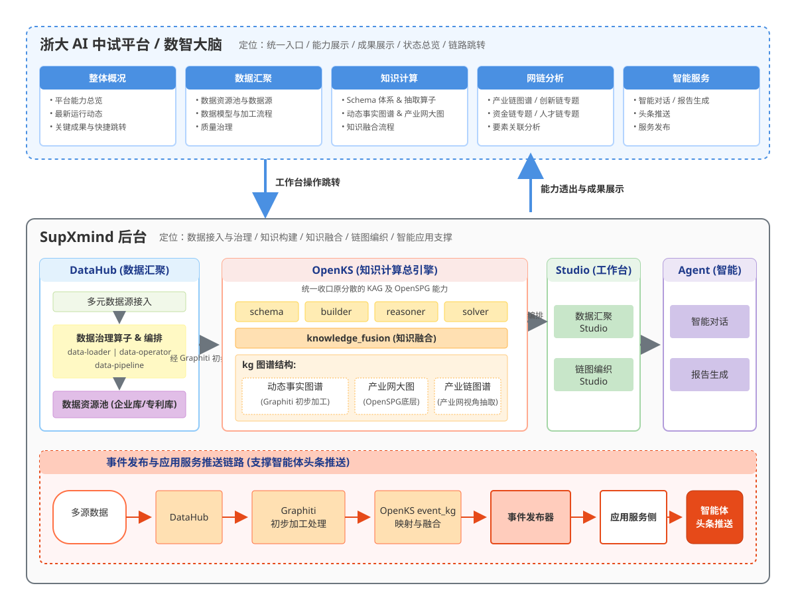
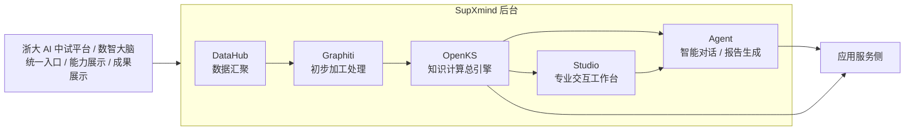
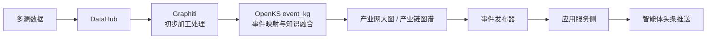

# 浙大 AI 中试平台与 SupXmind 后台一体化架构说明

更新时间：2026-03-20

> 本文档基于 2026-03-20 的最新口径整理，重点回答三个问题：
>
> 1. 当前“浙大 AI 中试平台”和 `SupXmind` 后台分别承担什么职责
> 2. `DataHub / OpenKS / Studio / Agent` 四类能力如何归并与展示
> 3. 事件发布如何推送到应用服务侧，支撑智能体头条推送

---

## 1. 总体结论

当前整体分为两个平台：

- 前台是浙大 AI 中试平台，负责统一入口、成果展示、能力透出和结果查看。
- 后台是 `SupXmind`，负责知识构建、知识融合、链图编织、智能应用支撑。

其中“数智大脑”是前台对后台能力的展示与调用入口，用户通过该入口看到 `SupXmind` 的能力、运行状态和结果产出。

后台架构口径统一为：

- `DataHub` 负责数据汇聚
- `OpenKS` 负责知识计算主引擎
- `Studio` 负责专业交互工作台
- `Agent` 负责智能对话与报告生成

并且要将原先偏分散的 `KAG` 和 `OpenSPG` 相关能力向 `OpenKS` 统一收口，形成“`OpenKS` 对外呈现知识计算总引擎，内部集成 schema、抽取、融合、构建、推理、求解、图存储适配”的产品口径。



---

## 2. 双平台职责边界

### 2.1 浙大 AI 中试平台

浙大 AI 中试平台是面向用户视角的统一入口，重点展示：

- 当前接入了哪些能力
- 当前产生了哪些结果
- 每类成果对应的数据、知识库、链图、报告和服务状态
- 需要时跳转到后台具体工作台查看详情

核心定位：

- 统一门户
- 能力展示
- 成果展示
- 状态总览
- 链路跳转

不承担：

- 具体数据治理操作
- 具体 schema 编辑
- 具体知识抽取编排
- 具体链图设计操作

### 2.2 SupXmind 后台

`SupXmind` 是真正承载知识计算与智能应用生产过程的平台，负责：

- 数据接入与治理
- schema 定义
- 信息抽取
- 知识库构建
- 知识融合
- 链图编织
- 智能问答与报告生成
- 事件发布与服务侧推送

---

## 3. 后台能力总图



---

## 4. DataHub 定位

`DataHub` 是数据汇聚层，负责把多元数据接入并沉淀为可复用的数据资源池。

### 4.1 能力边界

- 数据源接入
- 数据治理算子管理
- 针对具体数据资源进行编排形成 pipeline
- `data-loader / data-operator / data-pipeline` 运行
- 数据资源池沉淀

### 4.2 页面展示口径

中试平台和后台页面上应重点展示：

- 建了多少个数据资源池
- 数据资源池连接了哪些典型数据源
- 例如企业库、专利库等代表性资源
- 每个资源池可查看数据源情况
- 可查看数据模型
- 可查看数据加工流程
- 可查看数据详情
- 具体执行过程可跳转到对应平台地址

### 4.3 指标口径

`DataHub` 能力展示建议统一为：

- 支持接入的数据源数量
- 已接入的数据源类型分布
- 可用数据治理算子数量
- 已编排 pipeline 数量
- 已沉淀数据资源池数量

### 4.4 责任人标注

当前口径中，数据汇聚部分对应责任人为文韬、冬琛。

---

## 5. OpenKS 定位

`OpenKS` 是后台统一的知识计算总引擎，需要把原有分散的 `KAG` 和 `OpenSPG` 相关能力收拢到一个统一产品口径之下。

### 5.1 OpenKS 对外展示的能力组成

- 整体 schema，即本体论定义
- 信息抽取算子
- model 组件，例如事件抽取、实体抽取
- 具体知识库构建与管理
- 知识融合
- 推理与求解
- 图存储适配与结果输出

### 5.2 OpenKS 内部模块口径

统一展示为：

- `schema`
- `builder`
- `reasoner`
- `solver`
- `knowledge_fusion`
- `kg`

其中：

- `kg` 下承载事实知识库、动态事实图谱、产业网大图、产业链图谱和场景决策知识
- `DataHub` 的数据先经过 `Graphiti` 做初步加工处理，再进入 `OpenKS`
- `Graphiti` 在这里承接的是动态事实图谱，而不是面向前台的最终成果图
- 总体也归入 `kg` 体系内统一展示

### 5.3 知识库层次

`OpenKS` 下的图谱成果建议按三层展示：

1. 动态事实图谱
2. 产业网大图
3. 产业链图谱

其中：

- 动态事实图谱：来自 `DataHub` 数据经 `Graphiti` 初步加工处理后的事件与动态事实
- 产业网大图：融合事实知识和动态事实后的统一主图
- 产业链图谱：从产业网大图中按产业视角抽取出来的专题图谱

子知识库作为上述图谱层次的输入来源，可以包括：

- `fact`
- 场景决策知识

典型样例包括：

- 产业
- 政策
- 企业
- 专利
- 资讯

### 5.4 知识融合口径

`knowledge_fusion` 负责把前面形成的多个知识库和动态事实融合到产业网大图中。

统一要求：

- 融合前，子知识库和大图是并列建设对象
- 融合前，`Graphiti` 负责对 `DataHub` 数据做初步加工处理，形成动态事实图谱
- 融合后，进入统一产业网大图
- 大图底层按照 `OpenSPG` 的数据格式存储
- 产业链图谱不是独立主存，而是从产业网大图按产业视角抽取出的专题图谱

也就是说，子知识库不是大图的附属页面，而是独立输入成果；产业网大图是融合后的总成果；产业链图谱是进一步抽取后的专题成果。

### 5.5 图谱加工流程

针对图谱需要提供明确的加工流程展示，至少包含：

- 知识接入
- 信息抽取
- 知识融合
- 图谱构建
- 推理求解
- 成果发布

其中子知识库加工流程和大图加工流程应并列展示，不应混成单一黑盒。

---

## 6. 产业链图谱口径

产业链图谱不再只是单一图视图，而是 `OpenKS` 中基于产业网大图抽取出来的专题成果层。

### 6.1 产业链图谱定位

- 产业链图谱以产业网大图为基础
- 产业链图谱通过产业视角抽取相关主体、关系和证据
- 当前链图层建议先以产业链图谱为核心表达对象
- 后续可按同样机制扩展创新链、资金链、人才链专题视图

### 6.2 产业链图谱能力

产业链图谱需要提供：

- 对应 schema
- 要素定义
- 要素关联关系
- 关联探查结果
- 可视化链路结果

### 6.3 与产业网大图关系

- 子知识库和大图并列
- 产业链图谱以产业网大图为输入
- 产业链图谱不是独立知识主存，而是从产业网大图中抽取的专题图谱
- 创新链、资金链、人才链也可以按类似方式扩展

因此产业链图谱应保持原来的网链分析能力，不因为总图收口而被弱化。

---

## 7. Studio 定位

`Studio` 是具体交互页面层，负责承载专业操作工作台。

当前至少包含两类 studio：

- 数据汇聚 studio
- 链图编织 studio

它们的定位是：

- 面向专业运营和构建人员
- 承载具体编辑、编排、配置和运行操作
- 从中试平台的“看结果”跳转到后台的“做操作”

---

## 8. Agent 定位

`Agent` 负责知识消费和智能服务输出，当前重点承接：

- 智能对话
- 报告生成

后续与应用服务侧的关系应定义为：

- 基于知识库和链图结果提供问答
- 基于知识库和链图结果提供报告
- 基于事件发布机制提供头条推送能力

---

## 9. 成果展示口径

中试平台对“知识计算成果”的展示建议统一成三块。

### 9.1 动态事实图谱成果

重点展示：

- 形成了多少个动态事实图谱批次或版本
- 动态事实覆盖了多少事件、主体、关系
- 动态事实是否已完成初步加工处理
- 证据和来源是否可追溯

### 9.2 产业网大图成果

重点展示：

- 形成了多少个知识库
- 形成了多少个产业网大图版本
- 每个大图版本覆盖多少实体、关系、事件
- 形成过程是否经过知识接入、抽取、融合等流程

### 9.3 产业链图谱成果

重点展示：

- 已形成哪些产业链图谱
- 这些产业链图谱是基于哪些产业网大图视角抽取出来的
- 各产业链图谱覆盖的核心要素和关联数量
- 产业链图谱的服务入口和应用情况

---

## 10. 事件发布与应用服务推送

需要补齐从知识计算到应用消费的事件闭环。

### 10.1 目标

实现事件发布并推送到应用服务侧，支撑智能体头条推送。

### 10.2 建议链路



### 10.3 发布对象建议

事件发布至少要包含：

- 事件 ID
- 事件类型
- 涉及主体
- 时间
- 证据来源
- 影响链路
- 对应知识库或链图引用
- 面向应用侧的摘要文本

### 10.4 应用侧消费方式

应用服务侧可进一步消费为：

- 智能体头条推送
- 订阅提醒
- 风险预警
- 报告触发
- 问答上下文增强

---

## 11. 推荐的中试平台菜单结构

前台中试平台一级菜单保持现有结构，不改成后台工作台式分组，统一为：

```text
整体概况
数据汇聚
知识计算
网链分析
智能服务
```

各菜单建议按下面方式重组。

### 11.1 整体概况

整体概况负责统一展示全局状态，不承载专业操作。

建议内容：

- 平台能力总览
- 数据资源池总数
- 知识库总数
- 动态事实图谱更新数
- 产业网大图版本数
- 四链专题数量
- 智能问答、报告、头条推送等服务状态
- 最新运行动态与关键成果
- 到后台各平台的快捷跳转入口

### 11.2 数据汇聚

数据汇聚聚焦 `DataHub` 的成果摘要和过程可视。

建议内容：

- 数据资源池列表
- 数据源接入情况
- 企业库、专利库等典型资源展示
- 数据模型查看
- 数据加工流程查看
- pipeline 运行状态
- 数据质量与治理结果
- 跳转到数据汇聚 studio 或具体执行页

### 11.3 知识计算

知识计算聚焦 `OpenKS` 的知识构建主链，不把后台实现细节拆得过散。

建议内容：

- schema 体系
- 信息抽取算子与模型组件
- 子知识库列表
- 动态事实图谱构建成果
- 产业网大图构建成果
- 知识接入、抽取、融合、构建流程
- `knowledge_fusion` 融合结果
- `OpenKS` 模型能力与运行状态
- 跳转到后台知识计算详情页

### 11.4 网链分析

网链分析保持原来的独立一级菜单，重点承接产业链图谱和关联分析成果，并可逐步扩展四链专题。

建议内容：

- 产业链图谱
- 创新链专题
- 资金链专题
- 人才链专题
- 链图要素关联
- 网链结构洞察
- 重点主体与关系探查
- 链图结果与大图结果的联动查看

### 11.5 智能服务

智能服务承接 `Agent` 和应用服务侧的消费结果。

建议内容：

- 智能对话入口
- 报告生成入口
- 头条推送样例
- 事件发布与订阅状态
- 预警、推荐等服务结果
- Open API 或服务发布入口

### 11.6 推荐的菜单结构示意

```text
整体概况
  平台能力总览
  关键成果总览
  最新运行动态
  快捷跳转

数据汇聚
  数据资源池
  数据源情况
  数据模型
  数据加工流程
  质量治理

知识计算
  Schema 体系
  抽取算子
  模型组件
  子知识库
  动态事实图谱
  产业网大图
  知识融合流程

网链分析
  产业链图谱
  创新链专题
  资金链专题
  人才链专题
  要素关联分析

智能服务
  智能对话
  报告生成
  头条推送
  服务发布
```

---

## 12. 最终统一口径

一句话总结：

- 浙大 AI 中试平台负责“看能力、看成果、看状态、做跳转”
- `SupXmind` 后台负责“做数据、做知识、做链图、做智能体”
- `DataHub` 负责数据资源池
- `Graphiti` 负责对 `DataHub` 数据做动态事实的初步加工处理
- `OpenKS` 负责 schema、抽取、知识库、融合、产业网大图、产业链图谱、推理求解的统一知识计算口径
- `Studio` 负责专业工作台
- `Agent` 负责问答、报告和头条推送

这样可以把“平台展示”和“后台生产”明确拆开，同时又保证最终成果在中试平台统一可见。

产业头条和企业库链路打通
