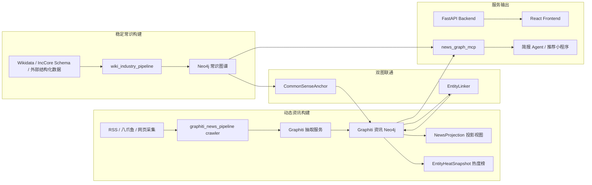

# 智链机器人项目架构说明

更新时间：2026-06-23

本文档是后续开发者和 agent 进入项目时优先阅读的架构入口。它描述当前实现口径，而不是早期规划口径。当前项目已经从“把资讯融合进常识大图”收敛为“常识图谱与 Graphiti 资讯图谱分离，通过锚点联通，并通过查询视图和投影层服务下游应用”。

## 1. 项目定位

本项目用于构建产业网链相关知识服务，核心目标是把稳定常识、动态资讯和 agent 查询工具组织成可持续更新的系统。

当前系统主要服务三类任务：

- 构建稳定的产业常识图谱，主要来自 Wikidata、IncCore schema 和后续可信结构化来源。
- 构建动态的产业资讯图谱，主要来自 RSS、八爪鱼、网页采集等资讯来源，经 Graphiti 抽取实体、关系和事件。
- 对外提供 MCP 工具和前端页面，让下游资讯简报 agent、推荐小程序和分析页面可以查询最新资讯、实体上下文、热度榜和证据链。

当前最重要的架构原则是：

- 常识图谱和资讯图谱分开存储。
- 高频资讯不直接覆盖低频常识。
- 两张图通过 `CommonSenseAnchor`、`refersTo`、`candidateRefersTo` 联通。
- 图谱展示需要更丰富关系时，在 Graphiti 资讯图内部生成 `NewsProjection` 投影视图，不回写常识图谱。

## 2. 总体架构



## 3. 仓库结构

| 路径 | 职责 |
| --- | --- |
| `backend/app/wiki_industry_pipeline/` | Wikidata 全产业常识图谱构建链路，负责候选过滤、claim 解析、schema 映射、图批次输出。 |
| `backend/app/incore_fusion_pipeline/` | IncCore 通用融合 DTO 和历史融合能力。当前仍保留 Wikidata、Neo4j v2、Graphiti 历史融合适配代码，但新资讯主链路不再把资讯 merge 回常识图谱。 |
| `backend/app/news_graph_pipeline/` | 当前新资讯图谱主链路的编排层，负责常识锚点导出、Graphiti 锚点同步、资讯实体链接和运行报告。 |
| `backend/app/news_graph_mcp/` | 面向下游 agent 的只读 MCP 查询服务，封装资讯时间线、企业上下文、订阅资讯流、推荐候选资讯等工具。 |
| `backend/scripts/run_news_graph_pipeline.py` | 当前新资讯图谱 pipeline 主入口。 |
| `backend/scripts/run_graphiti_news_big_graph_fusion.py` | 历史兼容入口。它会把 Graphiti 资讯结果融合/导入到主图，不再作为新主链路使用。 |
| `backend/scripts/run_news_graph_mcp.py` | MCP 服务启动入口。 |
| `graphiti_news_pipeline/` | 独立 Graphiti 资讯抽取项目，负责资讯采集、清洗、压缩、Graphiti 入图、热度计算、投影视图。 |
| `graphiti_news_pipeline/crawler/` | 资讯采集与前处理，包含 RSS、八爪鱼、去重、压缩、入图客户端。 |
| `graphiti_news_pipeline/services/graphiti_service.py` | Graphiti 服务封装，负责 `add_episode`、metadata 写入、锚点写入和链接关系写入。 |
| `graphiti_news_pipeline/schemas/knowledge_schema_v2.py` | Graphiti 抽取使用的实体 schema。 |
| `graphiti_news_pipeline/services/entity_heat_service.py` | 资讯实体热度榜计算和 `EntityHeatSnapshot` 快照写入。 |
| `graphiti_news_pipeline/services/news_graph_projection_service.py` | Graphiti 资讯图内部投影层，生成 `NewsProjection` 标签和 `PROJECTED_*` 可视化关系。 |
| `frontend/src/` | 主前端页面，包括知识计算工作台、资讯热度榜等页面。 |
| `docs/runbooks/` | 运行手册，适合执行任务时查看命令。 |
| `docs/reports/` | 项目技术方案和汇报型文档。 |

## 4. 图数据库职责

### 4.1 常识图谱 Neo4j

常识图谱保存低频稳定知识，例如企业、产品、产业、区域、技术、组织、常识关系和 Wikidata/IncCore 映射结果。

常识图谱的典型节点包括：

- `CommonSenseNode`
- `IncCore.Enterprise`
- `IncCore.ProductModel`
- `Enterprise`
- `ProductModel`
- `Technology`
- `Industry`
- `Region`

常识图谱应该被视为稳定骨架。它可以被版本化重建，但不应该被每批资讯字段直接覆盖。

本地常见访问方式：

```text
Neo4j Browser: http://localhost:7475/browser/
Bolt: neo4j://localhost:7688
User: neo4j
Password: password123
```

端口由 `.env` 和 compose 配置决定。如果端口不同，以实际 `docker ps` 输出为准。

### 4.2 Graphiti 资讯图谱 Neo4j

Graphiti 资讯图谱保存高频动态资讯事实，例如资讯 episode、资讯实体、动态关系、事件证据、常识锚点副本、实体链接决策、热度榜和投影视图。

Graphiti 资讯图谱的典型节点和关系包括：

- `Episodic`
- `Entity`
- `Enterprise`
- `Product`
- `ProductModel`
- `Technology`
- `Person`
- `Region`
- `CommonSenseAnchor`
- `NewsProjection`
- `EntityHeatSnapshot`
- `MENTIONS`
- `RELATES_TO`
- `refersTo`
- `candidateRefersTo`
- `PROJECTED_*`
- `RANKS_ENTITY`
- `EVIDENCED_BY`

本地常见访问方式：

```text
Neo4j Browser: http://localhost:7476/browser/
Bolt: neo4j://localhost:7689
User: neo4j
Password: password123
```

这里是当前资讯图谱主库。后续查看最新资讯抽取结果、资讯实体、Graphiti 关系、锚点联通和热度榜，应优先看这个库。

### 4.3 关于 `7475` 和 `7476` 的区别

`7475` 中可能存在早期批次生成的 `IncoreFusionNode` 数据，例如 `graphiti_news_100_all_20260607`。这些数据来自旧的 Graphiti 资讯到主图融合路径，会把 Graphiti 抽取结果投影成主图里的 `Enterprise`、`Product`、`Person` 等节点和业务关系。

`7476` 是当前新的 Graphiti 资讯图主库。它保留 Graphiti 原生 `Episodic -> Entity -> Relationship` 结构，并通过 `CommonSenseAnchor` 与常识图谱联通。为了让浏览效果更接近旧融合图，当前在 `7476` 内新增了 `NewsProjection` 投影层。

不要把两者的差异理解为 Graphiti 抽取能力丢失。差异主要来自是否执行了“投影/融合后处理”。

## 5. 核心数据流

### 5.1 Wikidata 常识图谱构建

Wikidata 常识图谱构建负责形成稳定骨架。

```text
Wikidata shard / dump
  -> 候选实体过滤
  -> claim 抽取
  -> claim 到 IncCore schema 路由
  -> 实体、产品、产业、区域、技术映射
  -> 图批次输出
  -> Neo4j / OpenSPG 导入
```

主要代码位置：

- `backend/app/wiki_industry_pipeline/candidate_filter.py`
- `backend/app/wiki_industry_pipeline/claim_extractor.py`
- `backend/app/wiki_industry_pipeline/claim_router.py`
- `backend/app/wiki_industry_pipeline/graph_mapper.py`
- `backend/app/wiki_industry_pipeline/sharded_export.py`
- `scripts/wiki_industry/import_wikidata_graph_batch_to_neo4j.py`

构建原则：

- 以 IncCore schema 为目标对象模型。
- 通过类型白名单控制全产业实体范围。
- 输出稳定 `graph_id`，后续作为 `CommonSenseAnchor.anchor_id`。
- 常识图谱低频更新，不跟随每条资讯变动。

### 5.2 资讯采集和 Graphiti 入图

资讯链路负责把原始资讯变成 Graphiti 动态图谱。

```text
RSS / 八爪鱼 / 网页来源
  -> fetch
  -> normalize
  -> relevance
  -> dedup
  -> compress
  -> ingest
  -> Graphiti add_episode
  -> Episodic / Entity / Relationship
```

主要代码位置：

- `graphiti_news_pipeline/crawler/connectors/`
- `graphiti_news_pipeline/crawler/pipeline/orchestrator.py`
- `graphiti_news_pipeline/crawler/pipeline/steps/`
- `graphiti_news_pipeline/crawler/services/ingest_service.py`
- `graphiti_news_pipeline/services/graphiti_service.py`
- `graphiti_news_pipeline/schemas/knowledge_schema_v2.py`

关键约束：

- 每次 crawler run 生成 `run_id`。
- `run_id` 会作为 Graphiti `group_id` 或 `fusion_batch_id` 透传。
- `source_url` 必须保留真实原文链接，不能使用 `example.com`、`localhost` 等占位链接。
- Graphiti 抽取结果先留在 Graphiti 资讯图，不直接写回常识图谱。

### 5.3 常识锚点同步和资讯实体链接

当前主链路不是字段 merge，而是链接式联通。

```text
Neo4j 常识图谱稳定节点
  -> CommonSenseAnchorExporter
  -> CommonSenseAnchorDTO
  -> 写入 Graphiti CommonSenseAnchor
  -> 读取本批 Graphiti 资讯实体
  -> EntityLinker 匹配
  -> refersTo / candidateRefersTo / unresolved
```

主要代码位置：

- `backend/app/news_graph_pipeline/anchor_exporter.py`
- `backend/app/news_graph_pipeline/entity_linker.py`
- `backend/app/news_graph_pipeline/graphiti_anchor_client.py`
- `backend/app/news_graph_pipeline/runner.py`
- `backend/scripts/run_news_graph_pipeline.py`

链接决策：

| 决策 | 含义 |
| --- | --- |
| `refersTo` | 高置信匹配，资讯实体可以认为指向该常识锚点。 |
| `candidateRefersTo` | 中置信匹配，只作为候选，不应自动升级为稳定常识。 |
| `unresolved` | 未匹配，资讯实体保留在 Graphiti，不丢弃。 |

### 5.4 Graphiti 资讯图投影层

Graphiti 原生图更偏向 `Episodic`、`Entity`、`MENTIONS`、`RELATES_TO`。为了让 Neo4j Browser 和下游查询更容易看懂，我们在 Graphiti 资讯库内部增加投影视图。

```text
Graphiti Entity / RELATES_TO
  -> normalize_projected_type
  -> NewsProjection 标签
  -> normalize_projected_relation_type
  -> PROJECTED_* 关系
```

主要代码位置：

- `graphiti_news_pipeline/services/news_graph_projection_service.py`
- `graphiti_news_pipeline/scripts/materialize_news_graph_projection.py`
- `graphiti_news_pipeline/api/graph_routes.py`

投影层特点：

- 只作用于 Graphiti 资讯图内部。
- 不 merge 回常识图谱。
- 可清理、可重跑、可按 `group_id` 限定。
- 通过白名单生成 `PROJECTED_RELEASES`、`PROJECTED_SUPPLIES_TO`、`PROJECTED_MANUFACTURES` 等关系，避免任意 LLM 文本直接变成 Neo4j relationship type。

常用命令：

```bash
cd /Users/caixudong/Desktop/zhilian-robot/graphiti_news_pipeline
NEO4J_URI=bolt://localhost:7689 NEO4J_USER=neo4j NEO4J_PASSWORD=password123 \
uv run python scripts/materialize_news_graph_projection.py --clear-existing --limit 5000
```

常用查询：

```cypher
MATCH p=(e:NewsProjection:Enterprise)-[r]-(m:NewsProjection)
WHERE type(r) STARTS WITH 'PROJECTED_'
RETURN p
LIMIT 100;
```

### 5.5 资讯实体热度榜

热度榜是 Graphiti 资讯图 pipeline 的副产物，用于支持每日榜、每周榜和小程序推荐。

核心对象：

- `EntityHeatSnapshot`
- `RANKS_ENTITY`
- `EVIDENCED_BY`

主要代码位置：

- `graphiti_news_pipeline/services/entity_heat_service.py`
- `graphiti_news_pipeline/api/graph_routes.py`
- `frontend/src/pages/NewsHeatRankingsPage.jsx`

当前公式版本：

```text
heat_score = 100 * (
  0.45 * mention_norm
+ 0.20 * news_hotness_norm
+ 0.15 * source_norm
+ 0.10 * freshness_norm
+ 0.10 * anchor_norm
)
```

其中：

- `mention_norm` 表示同周期同类型实体被多少篇资讯提到。
- `news_hotness_norm` 表示关联资讯自身热度总和。
- `source_norm` 表示来源覆盖度。
- `freshness_norm` 表示时间新鲜度。
- `anchor_norm` 表示是否链接到常识锚点。

### 5.6 MCP 查询服务

MCP 服务为下游简报 agent 和推荐小程序提供只读工具。下游不需要直接写 Cypher。

主要代码位置：

- `backend/app/news_graph_mcp/service.py`
- `backend/app/news_graph_mcp/server.py`
- `backend/app/news_graph_mcp/dto.py`
- `backend/scripts/run_news_graph_mcp.py`

当前对外核心工具：

| 工具 | 用途 |
| --- | --- |
| `query_entity_news_timeline` | 查询某个企业、产品或实体的资讯时间线。 |
| `query_enterprise_supply_chain_context` | 查询企业相关上下游、产品、事件和资讯证据。 |
| `query_news_by_source_industry` | 按时间、来源、产业过滤资讯，并返回摘要和原文。 |
| `query_recommended_news_candidates` | 根据产业、企业、产品、偏好标签生成推荐候选资讯。 |
| `query_subscription_news_feed` | 根据用户订阅视角生成资讯流。 |

当前架构要求 MCP 优先查询 Graphiti 资讯图和 Graphiti 内部 anchor 链接；需要稳定背景时，再通过 `canonical_graph_id` 或 `anchor_id` 回查常识图谱。

## 6. 运行入口

### 6.1 启动主项目

```bash
cd /Users/caixudong/Desktop/zhilian-robot
docker compose up -d
```

常用访问：

```text
主前端: http://localhost:8100/
后端 API: http://localhost:8000/
主 Neo4j Browser: http://localhost:7475/browser/
Graphiti Neo4j Browser: http://localhost:7476/browser/
OpenSPG: http://localhost:8887/
```

端口可能受 `.env` 影响，必要时使用：

```bash
docker ps --format 'table {{.Names}}\t{{.Ports}}\t{{.Status}}'
```

### 6.2 运行资讯图谱主链路

```bash
PYTHONPATH=backend python backend/scripts/run_news_graph_pipeline.py \
  --run-crawler \
  --ingest \
  --since-hours 24 \
  --max-items-per-source 5 \
  --process-limit 10 \
  --sync-anchors \
  --link-entities \
  --anchor-limit 5000 \
  --entity-limit 1000
```

只对已有批次做锚点联通：

```bash
PYTHONPATH=backend python backend/scripts/run_news_graph_pipeline.py \
  --group-id crawl_202606210001 \
  --sync-anchors \
  --link-entities
```

运行产物：

```text
tmp/news_graph_pipeline_runs/<run_id>/run_report.json
tmp/news_graph_pipeline_runs/<run_id>/link_decisions.json
```

### 6.3 启动 MCP

```bash
PYTHONPATH=backend python backend/scripts/run_news_graph_mcp.py --transport sse --port 3010
```

### 6.4 运行 Graphiti 资讯采集子项目

```bash
cd /Users/caixudong/Desktop/zhilian-robot/graphiti_news_pipeline
python -m crawler.cli run-once --since-hours 24 --max-items-per-source 20 --ingest
```

如果使用 `uv`：

```bash
cd /Users/caixudong/Desktop/zhilian-robot/graphiti_news_pipeline
uv run python -m crawler.cli run-once --since-hours 24 --max-items-per-source 20 --ingest
```

### 6.5 生成资讯图投影

```bash
cd /Users/caixudong/Desktop/zhilian-robot/graphiti_news_pipeline
NEO4J_URI=bolt://localhost:7689 NEO4J_USER=neo4j NEO4J_PASSWORD=password123 \
uv run python scripts/materialize_news_graph_projection.py --clear-existing --limit 5000
```

## 7. 前端页面

主前端基于 React + Vite + Ant Design。

当前与图谱相关的重点页面包括：

| 页面 | 说明 |
| --- | --- |
| 知识计算工作台 | 展示算子目录、自定义 pipeline 编排和发布 pipeline。 |
| 资讯热度榜 | 展示每日/每周人物、产品、公司、技术、区域热度榜。 |
| 网链分析 / 图谱相关页面 | 用于查看实体、关系、图谱结果和业务分析视图。 |

前端入口：

- `frontend/src/App.jsx`
- `frontend/src/components/Layout.jsx`
- `frontend/src/pages/NewsHeatRankingsPage.jsx`
- `frontend/src/services/newsGraphApi.js`

## 8. 新开发时的判断规则

### 8.1 什么时候改常识图谱

以下情况可以改常识图谱：

- 新增或修正稳定的企业、产品、产业、区域、技术 schema。
- 新增 Wikidata / IncCore 常识构建字段映射。
- 修正常识图谱中的实体解析、去重、稳定 ID。
- 重跑或升级常识图谱版本。

以下情况不要直接改常识图谱：

- 某条资讯提到了企业的新动态。
- 资讯中出现临时关系、传闻、未确认事件。
- 需要支持当天/本周热度、推荐和简报。

这些动态内容应该进入 Graphiti 资讯图。

### 8.2 什么时候改 Graphiti 资讯图

以下情况应该改 Graphiti 资讯图：

- 新增资讯来源。
- 改进资讯清洗、去重、压缩。
- 改进 Graphiti 抽取 schema。
- 增强动态事件、动态关系、证据链。
- 增加热度榜、时间线、推荐候选等动态视图。
- 增强 `NewsProjection` 可视化投影。

### 8.3 什么时候改 MCP

以下情况应该改 MCP：

- 下游 agent 需要新的稳定工具。
- 现有工具返回字段不够清楚。
- 需要新增推荐、订阅、简报、查证、上下文聚合视角。
- 需要屏蔽内部图结构，让 agent 只消费 DTO。

MCP 工具应保持只读，不负责采集、抽取、入图、融合。

### 8.4 什么时候使用历史融合脚本

`backend/scripts/run_graphiti_news_big_graph_fusion.py` 是历史兼容脚本。只有在需要复现旧批次、对比旧融合结果或做迁移验证时使用。新资讯图谱主流程不要默认使用它。

## 9. 常用 Neo4j 查询

查看 Graphiti 资讯实体类型：

```cypher
MATCH (n:Entity)
RETURN labels(n) AS labels, count(*) AS c
ORDER BY c DESC;
```

查看资讯 episode：

```cypher
MATCH (ep:Episodic)
RETURN ep.title, ep.news_source, ep.news_url, ep.group_id, ep.publish_time
ORDER BY coalesce(ep.publish_time, ep.valid_at, ep.created_at) DESC
LIMIT 50;
```

查看资讯实体到常识锚点的链接：

```cypher
MATCH p=(ep:Episodic)-[:MENTIONS|mentions]-(e)-[:refersTo|candidateRefersTo]->(a:CommonSenseAnchor)
RETURN p
LIMIT 50;
```

同时查看已匹配和未匹配资讯实体：

```cypher
MATCH (ep:Episodic)-[:MENTIONS|mentions]-(e:Entity)
OPTIONAL MATCH (e)-[r:refersTo|candidateRefersTo]->(a:CommonSenseAnchor)
RETURN
  e.name AS entity_name,
  labels(e) AS labels,
  type(r) AS link_type,
  a.name AS anchor_name,
  a.anchor_id AS anchor_id,
  ep.title AS evidence_title,
  ep.news_url AS source_url
LIMIT 100;
```

查看投影后的企业图：

```cypher
MATCH p=(e:NewsProjection:Enterprise)-[r]-(m:NewsProjection)
WHERE type(r) STARTS WITH 'PROJECTED_'
RETURN p
LIMIT 100;
```

查看投影关系分布：

```cypher
MATCH ()-[r]->()
WHERE r.projection_version = 'news_projection_v1'
RETURN type(r) AS rel, count(*) AS c
ORDER BY c DESC;
```

查看热度榜快照：

```cypher
MATCH (s:EntityHeatSnapshot)
RETURN s.entity_type, s.entity_name, s.heat_score, s.period_type, s.period_start
ORDER BY s.heat_score DESC
LIMIT 50;
```

查看旧融合批次来源：

```cypher
MATCH (n:IncoreFusionNode)
RETURN n.batchId AS batchId, labels(n) AS labels, count(*) AS c
ORDER BY c DESC
LIMIT 50;
```

## 10. DTO 和契约

项目中 DTO 的作用是约束阶段之间的数据交换，避免每个模块直接依赖对方内部实现。

重点 DTO：

| DTO | 位置 | 用途 |
| --- | --- | --- |
| `CommonSenseAnchorDTO` | `backend/app/news_graph_pipeline/dto.py` | 常识图谱节点同步到 Graphiti 的锚点对象。 |
| `EntityLinkDecisionDTO` | `backend/app/news_graph_pipeline/dto.py` | 资讯实体到常识锚点的链接决策。 |
| `NewsGraphRunReportDTO` | `backend/app/news_graph_pipeline/dto.py` | pipeline 运行报告。 |
| `GraphImportBatchDTO` | `backend/app/incore_fusion_pipeline/dto/graph_import_dto.py` | 通用图导入批次对象，主要用于常识/历史融合导入。 |
| `SourceRecordDTO` | `backend/app/incore_fusion_pipeline/dto/source_dto.py` | 通用源数据封装。 |
| MCP 返回 DTO | `backend/app/news_graph_mcp/dto.py` | 面向 agent 的资讯、实体、推荐和上下文返回结构。 |

后续新增模块时，优先定义 DTO，再写入图逻辑。不要让前端、MCP、pipeline 直接共享未约束的 Neo4j 原始属性。

## 11. 测试和验证

常用测试命令：

```bash
cd /Users/caixudong/Desktop/zhilian-robot
python -m pytest backend/tests/news_graph_pipeline_*.py
```

Graphiti 子项目测试：

```bash
cd /Users/caixudong/Desktop/zhilian-robot/graphiti_news_pipeline
uv run --with pytest pytest tests/test_news_graph_projection_service.py tests/test_news_graph_projection_routes.py -q
```

前端构建：

```bash
cd /Users/caixudong/Desktop/zhilian-robot/frontend
npm run build
```

容器状态：

```bash
docker ps --format 'table {{.Names}}\t{{.Ports}}\t{{.Status}}'
```

## 12. 当前已知边界

- `graphiti_news_pipeline/` 当前在仓库里是独立子项目，部分文件可能仍处于未跟踪状态。提交时需要确认是否显式加入。
- `test_*.py` 可能被根目录 `.gitignore` 规则忽略。如果要提交 Graphiti 子项目测试，需要使用 `git add -f`。
- 旧文档中仍可能出现“大图融合”“资讯融合入主图”等表述。当前实现口径以本文档和 `docs/runbooks/news_graph_pipeline.md` 为准。
- `news_graph_mcp` 的实际 Neo4j 连接由 `NEWS_GRAPH_NEO4J_URI` 控制。按当前架构，它应指向 Graphiti 资讯图；如果指向主图，只能读取旧融合视图。
- `NewsProjection` 是可重建投影视图，不是事实源。事实源仍是 Graphiti 原始 `Episodic`、`Entity`、原始关系和证据字段。
- `CommonSenseAnchor` 是常识节点在 Graphiti 中的镜像锚点，不是完整常识图谱副本。

## 13. 开发建议

后续 agent 或开发者处理需求时，建议按以下顺序判断：

1. 需求是稳定常识还是动态资讯。
2. 如果是稳定常识，优先看 `wiki_industry_pipeline` 和常识图谱导入链路。
3. 如果是动态资讯，优先看 `graphiti_news_pipeline` 和 `news_graph_pipeline`。
4. 如果是下游 agent 调用，优先看 `news_graph_mcp`。
5. 如果是前端展示，先确认需要直接查后端 API、MCP，还是只展示 Graphiti 投影结果。
6. 如果只是 Neo4j Browser 图形展示，优先增强 `NewsProjection`，不要改事实源。
7. 修改完后更新本文档，特别是新增入口、DTO、端口、运行命令、图谱对象和边界规则。
