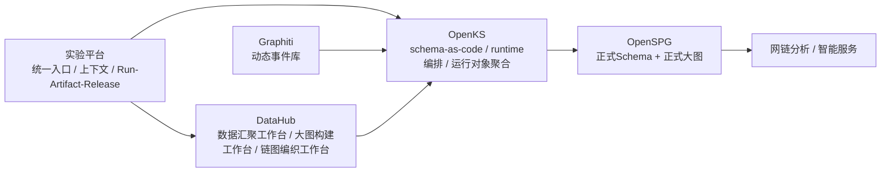

# DataHub OpenSPG Graphiti Integration Implementation Plan

> **For Claude:** REQUIRED SUB-SKILL: Use superpowers:executing-plans to implement this plan task-by-task.

**Goal:** 完成实验平台、`supxmind-datahub`、`supxmind-openks`、Graphiti、OpenSPG 的职责收敛与集成改版方案，明确页面归属、运行边界、输入输出契约，并为后续移除旧 Mongo 图投影与 batch fallback 留出独立实施任务。

**Architecture:** 实验平台保留统一入口、项目上下文、Run/Artifact/Release 编排与状态展示；`supxmind-datahub` 承接数据汇聚、大图构建、链图编织三类专业工作台；`supxmind-openks` 作为知识计算控制平面统一发布 schema、调度 builder、聚合运行时对象；Graphiti 作为产业资讯动态事件库，经 `event_kg` 适配后进入 OpenKS，再写入 OpenSPG 正式大图主存。

**Tech Stack:** FastAPI, React, Spring Boot, OpenKS, KAG, OpenSPG, Graphiti, MongoDB, Neo4j, MySQL, Mermaid, pytest, JUnit

---

## 1. 本次计划的结论摘要

### 1.1 模块职责结论

- 实验平台不是“纯展示页”，而是总控台。
- `supxmind-datahub` 不是“底层服务包”，而是三类专业工作台的主要承载体。
- `supxmind-openks` 不是单独前台产品，而是知识计算控制平面。
- Graphiti 不直接充当前台页面系统，也不直接替代 OpenSPG 主图存。
- OpenSPG 是正式 schema 与正式大图主存。

### 1.2 页面归属结论

- `数据汇聚`：主要放在 `supxmind-datahub`。
- `大图构建`：建模/图谱运营页面主要放在 `supxmind-datahub`，运行编排和 Run/Artifact/Release 摘要保留在实验平台。
- `链图编织`：主要放在 `supxmind-datahub`，实验平台保留入口、上下文和产物摘要。
- 实验平台首页只负责入口、上下文、状态、追踪对象，不直接承载专业操作页。

### 1.3 数据主线结论

统一对象链路为：

```text
source/batch -> run -> artifact -> release -> chain/service
```

- `batch`：数据汇聚产物
- `run/artifact/release`：大图构建产物
- `chain/service`：链图编织产物

Graphiti 只为 `run` 提供事件事实输入，不单独成为产品层中心对象。

### 1.4 Graphiti 接入结论

- Graphiti 作为“产业资讯动态事件库”存在。
- Graphiti 的接入位置在 `数据汇聚` 和 `大图构建` 之间。
- Graphiti 进入正式主链前，必须经 `supxmind-openks` 的 `event_kg` 或 `industry_event_kg` 适配层统一映射。
- Graphiti 输出的是 `EventFactPackage`，不是前台最终图谱。

### 1.5 旧图查询结论

- 当前 `/graph` 的 `artifact_id` 读图仍依赖旧 Mongo 图投影和 JSONL batch fallback，不属于 OpenSPG 正式大图原生读路径。
- 这部分不在本轮立即执行，但必须作为后续专项改造任务单列。

---

## 2. 改版后的产品结构

### 2.1 顶层结构



### 2.2 改版后的页面分组

```text
工作台总览
数据汇聚
  数据源接入
  接入批次
  融合治理
  质量洞察

大图构建
  本体模型
  构建任务
  语义图谱

链图编织
  链图设计
  编织任务
  服务发布

系统管理
```

### 2.3 DataHub 左侧菜单改版结论

当前 `supxmind-datahub` 左侧菜单把 `事实接入`、`融合治理` 错挂在 `大图构建` 下，把 `链图服务` 和 `链图编织` 并列，分组不符合数据流。

建议重构为：

```text
图谱工场工作台
数据汇聚
  数据源接入
  接入批次
  融合治理
  质量洞察

大图构建
  本体模型
  构建任务
  语义图谱

链图编织
  链图设计
  编织任务
  服务发布

系统管理
```

---

## 3. 输入输出契约

### 3.1 数据汇聚

**输入对象**

```json
{
  "source_id": "SRC_NEWS_RSS_001",
  "source_type": "rss|api|db|file",
  "doc_type": "news|report|policy",
  "fetch_config": {},
  "mapping_profile": "news_standard_v1"
}
```

**输出对象**

```json
{
  "batch_id": "BATCH_20260319_001",
  "doc_type": "news",
  "records": 1200,
  "quality_score": 0.93,
  "watermark": "2026-03-19T10:00:00+08:00",
  "manifest_uri": "s3://.../batch.jsonl"
}
```

**约束**

- 数据汇聚页不展示 `artifact_id`、`release_id`、链图服务对象。
- 数据汇聚只产出标准批次与治理结果。

### 3.2 Graphiti 事件接入

**输入对象**

```json
{
  "group_id": "project_1_news",
  "episode_id": "NEWS_EVT_20260319_001",
  "content": "华为与某机器人公司签署战略合作协议",
  "reference_time": "2026-03-19T09:30:00+08:00",
  "source": "news"
}
```

**输出对象**

```json
{
  "event_id": "EVT_xxx",
  "entities": ["Company:华为", "Company:某机器人公司"],
  "edges": ["Partnership"],
  "valid_at": "2026-03-19T09:30:00+08:00",
  "provenance": ["episode:NEWS_EVT_20260319_001"]
}
```

**约束**

- Graphiti 输出先进入 OpenKS 事件适配层。
- 不允许 Graphiti 直接成为正式发布大图主存。

### 3.3 大图构建

**输入对象**

```json
{
  "project_id": 1,
  "module_name": "news_kg|event_kg",
  "namespace": "zhilian_ai_center",
  "source_batch_id": "BATCH_20260319_001",
  "runtime_profile": "kag_openspg"
}
```

**输出对象**

```json
{
  "run_id": "KRUN_KAG_xxx",
  "artifact_id": "KART_KAG_xxx",
  "release_id": "KREL_KAG_xxx",
  "schema_version": "news_kg:v1",
  "graph_stats": {
    "vertices": 18230,
    "edges": 46811
  }
}
```

**约束**

- 正式图主存唯一写入目标是 OpenSPG。
- `knowledge_runs / knowledge_artifacts / service_releases` 只做追踪与产品对象，不承载正式图本体。

### 3.4 链图编织

**输入对象**

```json
{
  "artifact_id": "KART_KAG_xxx",
  "chain_template": "industry_chain_v1",
  "seed_entities": ["企业:华为", "技术:具身智能"],
  "ruleset": ["上下游", "合作", "投资", "政策影响"]
}
```

**输出对象**

```json
{
  "chain_id": "CHAIN_001",
  "version": "industry_chain:2026.03.19.1",
  "nodes": 320,
  "edges": 680,
  "evidence_refs": 1420,
  "service_entry": "/server/detail?id=CHAIN_001"
}
```

**约束**

- 链图编织必须以 `artifact_id/release_id` 为输入，而不是自持一套独立知识主存。
- `链图服务` 作为 `链图编织` 的最后一步输出，不再独立为一级菜单。

---

## 4. 页面示意

### 4.1 实验平台首页

```text
┌──────────────────────────────────────────────┐
│ 浙大AI产业知识中心实验平台                    │
│ 简介：只做导航、上下文和运行状态追踪          │
├──────────────────────────────────────────────┤
│ [数据汇聚] [大图构建] [链图编织] [网链分析]   │
│                                              │
│ 当前项目：project_1                          │
│ 最新运行：KRUN_KAG_xxx                       │
│ 最新产物：KART_KAG_xxx                       │
│ 最新发布：KREL_KAG_xxx                       │
│                                              │
│ 数据汇聚状态    大图构建状态    链图编织状态  │
└──────────────────────────────────────────────┘
```

### 4.2 DataHub 数据汇聚页

```text
┌──────────────────────────────────────────────┐
│ 数据汇聚                                      │
│ 简介：只看资源接入、融合治理、数据质量         │
├──────────────────────────────────────────────┤
│ 顶部：来源数 / 今日批次 / 成功率 / 质量分      │
│ 左侧：数据源列表                              │
│ 中间：最近接入批次                            │
│ 右侧：融合任务与异常                          │
│ 底部：质量洞察                                │
└──────────────────────────────────────────────┘
```

### 4.3 DataHub 大图构建页

```text
┌──────────────────────────────────────────────┐
│ 大图构建                                      │
│ 简介：只看建模、构建、正式图状态               │
├──────────────────────────────────────────────┤
│ 左：本体版本 / schema 状态                    │
│ 中：构建任务列表                              │
│ 右：artifact / release / 图规模               │
└──────────────────────────────────────────────┘
```

### 4.4 DataHub 链图编织页

```text
┌──────────────────────────────────────────────┐
│ 链图编织                                      │
│ 简介：只看链图设计、编织任务、服务发布         │
├──────────────────────────────────────────────┤
│ 左：链图模板 / 规则集                         │
│ 中：编织任务 / 结果预览                       │
│ 右：服务发布 / API / 导出                     │
└──────────────────────────────────────────────┘
```

---

## 5. 路由映射结论

### 5.1 DataHub 页面复用映射

| 新分组 | DataHub 现有页面 | 现有路由 |
|---|---|---|
| 数据源接入 | `fullGraph/manage` | `/fullGraph/kgeAdmin` |
| 融合治理 | `fullGraph/fusion` | `/fullGraph/knowledgeFuse` |
| 本体模型 | `fullGraph/modeling` | `/fullGraph/knowledgeModel` |
| 语义图谱 | `fullGraph/operation` | `/fullGraph/graphManage` |
| 链图设计 | `chainGraph/design` | `/atlas/knowledgesystem` |
| 服务发布 | `chainService/index` | `/server/index` |

### 5.2 实验平台到 DataHub 的挂接方式

MVP 建议采用反向代理挂载，而不是重写页面。

建议路径：

```text
/datahub/fullGraph/kgeAdmin
/datahub/fullGraph/knowledgeFuse
/datahub/fullGraph/knowledgeModel
/datahub/fullGraph/graphManage
/datahub/atlas/knowledgesystem
/datahub/server/index
```

---

## 6. 后续专项任务：移除旧 Mongo 图投影与 batch fallback

### Task 1: 明确 artifact 图查询的正式读路径

**Files:**
- Modify: `backend/app/api/graph_routes.py`
- Modify: `backend/tests/graph_routes_artifact_test.py`
- Reference: `backend/app/openspg_demo/openspg_client.py`
- Reference: `docs/2026-03-18-architecture-review-and-cleanup.md`

**Step 1: 写失败测试，定义 artifact 图查询不再读取 Mongo `entity_instances/inc_statement`**

示例测试目标：

```python
def test_artifact_graph_endpoint_no_longer_reads_mongo_projection():
    ...
    assert response.status_code == 409
```

**Step 2: 跑测试确认旧逻辑仍失败**

Run:

```bash
pytest backend/tests/graph_routes_artifact_test.py -q
```

Expected:
- 旧测试失败，暴露当前仍依赖 Mongo/batch 的行为

**Step 3: 最小实现**

- 删除 `graph_routes.py` 中 artifact-scoped Mongo 图投影
- 删除 JSONL batch fallback
- 未完成 OpenSPG artifact 原生查询前，显式返回“不支持 artifact 正式读图”的错误

**Step 4: 跑测试确认通过**

Run:

```bash
pytest backend/tests/graph_routes_artifact_test.py -q
```

Expected:
- PASS

**Step 5: Commit**

```bash
git add backend/app/api/graph_routes.py backend/tests/graph_routes_artifact_test.py
git commit -m "refactor: remove legacy artifact graph projection fallback"
```

### Task 2: 为 OpenSPG 正式图补 artifact 级读模型

**Files:**
- Modify: `backend/app/openspg_demo/graph_materializer.py`
- Modify: `backend/app/openspg_demo/openspg_client.py`
- Create: `backend/app/services/openspg_graph_read_service.py`
- Create: `backend/tests/openspg_graph_read_service_test.py`

**Step 1: 写失败测试，定义 artifact 级图查询协议**

**Step 2: 跑测试确认失败**

Run:

```bash
pytest backend/tests/openspg_graph_read_service_test.py -q
```

**Step 3: 最小实现**

- 设计正式 OpenSPG 图查询服务
- 明确 project/namespace/artifact 之间的过滤策略
- 只做正式图读，不回退旧 Mongo 或 batch

**Step 4: 跑测试确认通过**

Run:

```bash
pytest backend/tests/openspg_graph_read_service_test.py -q
```

**Step 5: Commit**

```bash
git add backend/app/openspg_demo/graph_materializer.py backend/app/openspg_demo/openspg_client.py backend/app/services/openspg_graph_read_service.py backend/tests/openspg_graph_read_service_test.py
git commit -m "feat: add openspg native artifact graph read path"
```

---

## 7. 分阶段实施计划

### Task 1: 重构 DataHub 左侧导航分组

**Files:**
- Modify: `supxmind/supxmind-datahub/web/config/router.config.js`
- Modify: `supxmind/supxmind-datahub/web/src/layouts/NewLayout*`
- Test: `supxmind/supxmind-datahub/web/src/pages/fullGraph/manage/service.test.js`
- Test: `supxmind/supxmind-datahub/web/src/pages/chainGraph/design/viewConfig.test.js`

**Step 1: 写失败测试，锁定新的菜单分组和路径**

**Step 2: 跑前端测试确认失败**

Run:

```bash
cd supxmind/supxmind-datahub/web && npm test -- --runInBand
```

Expected:
- 导航分组相关断言失败

**Step 3: 最小实现**

- 把 `事实接入/融合治理` 移到 `数据汇聚`
- 把 `链图服务` 收到 `链图编织 -> 服务发布`
- 把首页命名改成 `图谱工场工作台`

**Step 4: 跑测试确认通过**

Run:

```bash
cd supxmind/supxmind-datahub/web && npm test -- --runInBand
```

**Step 5: Commit**

```bash
git add supxmind/supxmind-datahub/web/config/router.config.js supxmind/supxmind-datahub/web/src
git commit -m "refactor: regroup datahub workspace navigation"
```

### Task 2: 增加实验平台到 DataHub 的统一入口与深链跳转

**Files:**
- Modify: `frontend/src/pages/platformTabs.mjs`
- Modify: `frontend/src/pages/platformOverviewConfig.mjs`
- Modify: `frontend/src/pages/PlatformOverviewPage.jsx`
- Create: `frontend/tests/platformOverviewDatahubIntegration.test.mjs`

**Step 1: 写失败测试，定义三个入口页的跳转行为**

**Step 2: 跑测试确认失败**

Run:

```bash
cd frontend && npm test -- platformOverviewDatahubIntegration.test.mjs
```

**Step 3: 最小实现**

- 每个一级页只保留摘要与入口
- 挂上 `/datahub/...` 深链

**Step 4: 跑测试确认通过**

Run:

```bash
cd frontend && npm test -- platformOverviewDatahubIntegration.test.mjs
```

**Step 5: Commit**

```bash
git add frontend/src/pages frontend/tests/platformOverviewDatahubIntegration.test.mjs
git commit -m "feat: add datahub workspace entry links"
```

### Task 3: 增加 OpenKS 事件适配层

**Files:**
- Create: `supxmind/supxmind-openks/openks/kg/fact/event_kg/module.toml`
- Create: `supxmind/supxmind-openks/openks/kg/fact/event_kg/schema/event_kg_schema.py`
- Create: `supxmind/supxmind-openks/openks/kg/fact/event_kg/builder/event_kg_builder.py`
- Create: `supxmind/supxmind-openks/openks/kg/fact/event_kg/tests/test_event_kg.py`
- Modify: `supxmind/supxmind-openks/tests/test_module_discovery.py`

**Step 1: 写失败测试，定义 `event_kg` 可被发现**

**Step 2: 跑测试确认失败**

Run:

```bash
cd supxmind/supxmind-openks && pytest tests/test_module_discovery.py -q
```

**Step 3: 最小实现**

- 新增事件模块骨架
- 定义 Graphiti -> OpenKS 事件事实映射

**Step 4: 跑测试确认通过**

Run:

```bash
cd supxmind/supxmind-openks && pytest tests/test_module_discovery.py openks/kg/fact/event_kg/tests/test_event_kg.py -q
```

**Step 5: Commit**

```bash
git add supxmind/supxmind-openks
git commit -m "feat: scaffold event kg for graphiti integration"
```

### Task 4: 增加 GraphitiAdapter 与事件事实包产出

**Files:**
- Create: `backend/app/services/graphiti_adapter_service.py`
- Create: `backend/tests/graphiti_adapter_service_test.py`
- Modify: `backend/app/api/workflow_routes.py`
- Modify: `backend/app/services/knowledge_runtime_service.py`

**Step 1: 写失败测试，定义 Graphiti episode 输入与事件包输出**

**Step 2: 跑测试确认失败**

Run:

```bash
pytest backend/tests/graphiti_adapter_service_test.py -q
```

**Step 3: 最小实现**

- 接收标准化资讯行
- 生成 episode 输入
- 输出 `EventFactPackage`

**Step 4: 跑测试确认通过**

Run:

```bash
pytest backend/tests/graphiti_adapter_service_test.py backend/tests/workflow_step_routes_test.py -q
```

**Step 5: Commit**

```bash
git add backend/app/services/graphiti_adapter_service.py backend/tests/graphiti_adapter_service_test.py backend/app/api/workflow_routes.py backend/app/services/knowledge_runtime_service.py
git commit -m "feat: add graphiti event adapter into workflow"
```

### Task 5: 打通 DataHub 三类页面的对象输入输出

**Files:**
- Modify: `supxmind/supxmind-datahub/knowledge/src/main/java/com/quantchi/business/controller/converge/*.java`
- Modify: `supxmind/supxmind-datahub/knowledge/src/main/java/com/quantchi/business/controller/fullGraph/*.java`
- Modify: `supxmind/supxmind-datahub/knowledge/src/main/java/com/quantchi/business/controller/concept/*.java`
- Test: `supxmind/supxmind-datahub/knowledge/src/test/java/com/quantchi/business/controller/graph/GraphControllerContractTest.java`

**Step 1: 写失败测试，定义统一输入输出对象**

**Step 2: 跑测试确认失败**

Run:

```bash
cd supxmind/supxmind-datahub/knowledge && mvn -Dtest='*ContractTest,*OntologyPersistenceTest' test
```

**Step 3: 最小实现**

- 接入页产出 `batch_id`
- 大图页消费 `batch_id` 并产出 `artifact_id/release_id`
- 链图页消费 `artifact_id` 并产出 `chain_id/service_id`

**Step 4: 跑测试确认通过**

Run:

```bash
cd supxmind/supxmind-datahub/knowledge && mvn -Dtest='*ContractTest,*OntologyPersistenceTest' test
```

**Step 5: Commit**

```bash
git add supxmind/supxmind-datahub/knowledge
git commit -m "refactor: align datahub controllers to unified object flow"
```

---

## 8. 验证清单

- `docs/plans/2026-03-19-datahub-openspg-graphiti-integration-plan.md` 已保存
- 页面职责和技术职责已经分离
- Graphiti 接入位置已明确为事件源适配层
- 旧 Mongo 图投影与 batch fallback 已列为独立后续任务
- DataHub、OpenKS、OpenSPG、实验平台的对象流已统一为 `batch -> run -> artifact -> release -> chain/service`

