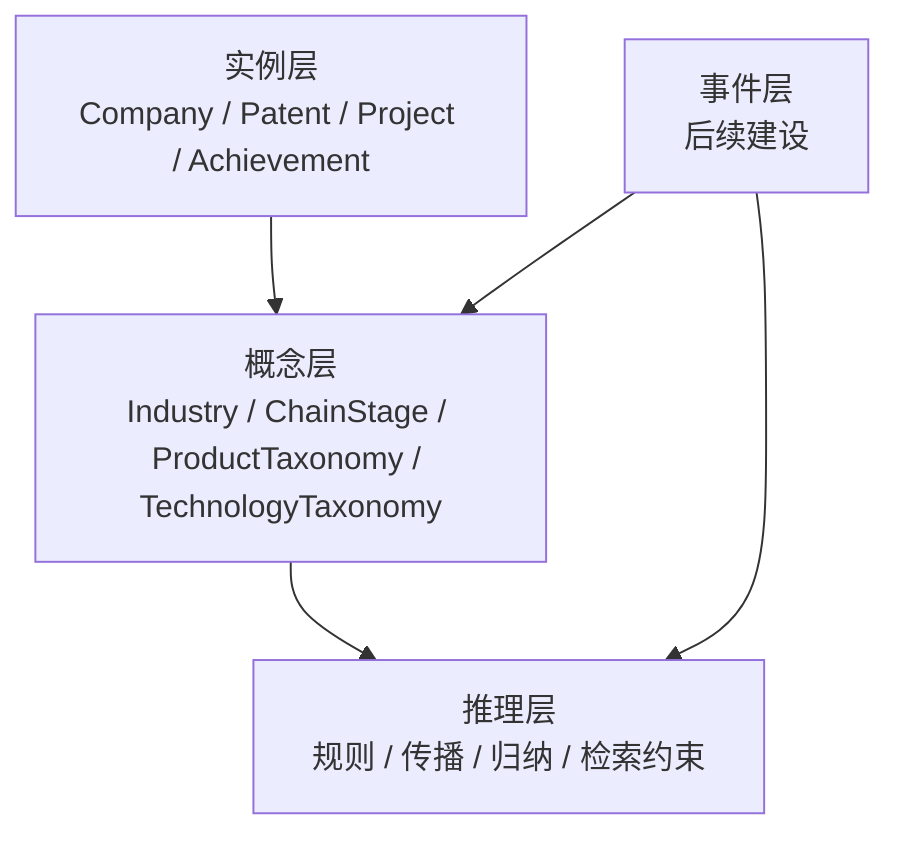

# FactLibrary 概念层建设方案

## 1. 背景

当前 `FactLibrary` 已经具备基础事实知识的结构化抽取能力，能够稳定产出：

- `entities/`：主实体
- `support/`：辅助表
- `texts/`：文本增强材料
- `relations/`：显式关系

当前实例层已经覆盖：

- `Company`
- `Institution`
- `Investor`
- `Person`
- `Project`
- `Patent`
- `Article`
- `Achievement`
- `StandardLocal`
- `StandardIndustry`
- `StandardNation`
- `RankingList`
- 派生实体 `Product`

现有实例层 schema 见 [FactLibrary.schema](/Users/caixudong/Downloads/zhilian-robot/modules/kag/kag/examples/fact_library/schema/FactLibrary.schema)。

当前问题是：

- 知识库仍以“事实实例”组织为主
- 大量分类信息仍以普通文本字段存在
- 不同数据源口径难统一
- 无法支撑产业网链中的分类检索、链路定位、影响传播和规则推理

因此，需要在现有实例层之上增加“概念层”。

## 2. 建设目标

配套的逐概念说明文档见：

- [2026-03-20-fact-library-concept-layer-catalog.md](/Users/caixudong/Downloads/zhilian-robot/docs/plans/2026-03-20-fact-library-concept-layer-catalog.md)

概念层建设的目标不是替换当前实例层，而是在现有基础上增加一层可复用、可约束、可推理的分类语义层。

本次建设目标包括：

1. 将现有实例字段中的分类信息沉淀为概念节点。
2. 建立实例到概念的归属关系。
3. 建立概念与概念之间的层级关系和语义关系。
4. 为后续产业网链推理提供稳定的概念骨架。
5. 为后续事件层、规则层、KAG/OpenKS 抽取增强提供统一的语义边界。

## 3. 设计原则

### 3.1 先轻后重

先建设静态概念层，不直接上复杂推理和动态概念派生。

### 3.2 复用当前实例层

不推翻现有实例 schema 和抽取 pipeline，以增强方式新增概念层。

### 3.3 先做高价值概念

优先建设与产业网链推理强相关、且数据来源稳定的概念。

### 3.4 先规则化再模型化

优先用结构化字段映射和标准词表构建概念；对难以规则化的概念，再引入 KAG/OpenKS 做文本抽取。

## 4. 总体分层结构

建议将知识库逐步演进为三层结构：

说明：

- 当前已完成的是实例层
- 本方案重点建设概念层
- 事件层作为下一阶段工作，与概念层联动建设

## 5. 概念层总体分类

建议将概念层分为三组。

### 5.1 通用概念层

用于统一基础分类口径。

- `RegionTaxonomy`
- `OrganizationTypeTaxonomy`
- `OrganizationStatusTaxonomy`
- `SubjectTaxonomy`
- `StandardStatusTaxonomy`
- `StandardLevelTaxonomy`
- `IPCTaxonomy`
- `ResearchFieldTaxonomy`

### 5.2 产业网链核心概念层

用于支撑产业网链推理，是本次建设重点。

- `IndustryTaxonomy`
- `IndustryChainTaxonomy`
- `ChainStageTaxonomy`
- `ChainRoleTaxonomy`
- `ProductTaxonomy`
- `TechnologyTaxonomy`
- `CapabilityTaxonomy`
- `ApplicationScenarioTaxonomy`

### 5.3 推理增强概念层

用于后续影响传播和规则表达。

- `RiskEventTaxonomy`
- `ImpactTaxonomy`
- `CompetitiveRelationTaxonomy`
- `QualificationTaxonomy`

## 6. 面向产业网链推理的重点概念

如果只建设最小可落地版本，建议优先做以下六类：

1. `IndustryTaxonomy`
2. `ChainStageTaxonomy`
3. `ProductTaxonomy`
4. `TechnologyTaxonomy`
5. `CapabilityTaxonomy`
6. `RegionTaxonomy`

原因：

- 直接支撑“企业属于哪个产业”
- 支撑“企业位于产业链哪个环节”
- 支撑“企业做什么产品”
- 支撑“企业掌握什么技术”
- 支撑“企业具备什么能力”
- 支撑“区域聚集、区域配套、区域传导”

## 7. 各概念层的获取方式

概念获取建议分为四类。

### 7.1 从结构化字段直接映射

这是第一阶段最稳妥的方式。

可直接映射的字段包括：

- `Company.status` -> `OrganizationStatusTaxonomy`
- `Company.province/city` -> `RegionTaxonomy`
- `Institution.type1/type2/domain/level` -> `OrganizationTypeTaxonomy` / `ResearchFieldTaxonomy`
- `Patent.mainIpc/patentType` -> `IPCTaxonomy` / `PatentTypeTaxonomy`
- `Article.subject` -> `SubjectTaxonomy`
- `Achievement.technicalField/applicationField/technologyMaturity` -> `TechnologyTaxonomy` / `ApplicationScenarioTaxonomy` / `CapabilityMaturityTaxonomy`
- `Standard*.status/standardLevel/standardType/domainName/industryClass` -> 各类标准概念

这部分主要来自当前实例字段，字段来源见 [specs.py](/Users/caixudong/Downloads/zhilian-robot/backend/app/fact_library_pipeline/specs.py)。

### 7.2 从标准词表和外部分类表补充

适合建设标准概念库。

建议引入：

- 行政区划表
- 国民经济行业分类
- 产业链分类目录
- IPC 分类体系
- 学科分类表
- 标准状态与标准层级表

这类数据适合做成概念主表，实例层只做挂载。

### 7.3 从文本字段抽取概念

对无法直接规则映射的概念，用文本抽取补充。

当前可用于概念抽取的文本字段主要来自：

- 企业：`business_scope`, `description`
- 机构：`domain`, `description`, `achievement`
- 人物：`research_fields`, `resume`
- 项目：`keywords`, `abstract_zh`
- 专利：`abstract_cn`
- 文献：`abstract`, `keywords`
- 成果：`technical_field`, `application_field`, `content`
- 标准：`details`

建议分工：

- `KAG`：做 schema 约束下的概念归类和概念挂载
- `OpenKS`：做技术、产品、应用场景、能力等领域概念抽取

### 7.4 从图结构归纳生成

这是第二阶段高价值能力。

例子：

- 企业关联大量同类产品，可反推其所属 `ProductTaxonomy`
- 企业关联专利、成果、标准，可归纳其 `TechnologyTaxonomy`
- 企业位于某类产品上游，可归纳其 `ChainStageTaxonomy`
- 企业具备多种技术和产品积累，可归纳其 `CapabilityTaxonomy`

这一步需要基于实例层现有关系和概念层做联合归纳。

## 8. 实例到概念的映射建议

### 8.1 Company

建议挂载：

- `OrganizationStatusTaxonomy`
- `RegionTaxonomy`
- `IndustryTaxonomy`
- `IndustryChainTaxonomy`
- `ChainStageTaxonomy`
- `ChainRoleTaxonomy`
- `ProductTaxonomy`
- `TechnologyTaxonomy`
- `CapabilityTaxonomy`
- `QualificationTaxonomy`

获取方式：

- `status/province/city` 直接映射
- `business_scope/description/main_product` 抽取产品、行业、能力
- 专利、成果、标准、榜单反推能力和行业定位

### 8.2 Institution

建议挂载：

- `OrganizationTypeTaxonomy`
- `RegionTaxonomy`
- `ResearchFieldTaxonomy`
- `TechnologyTaxonomy`
- `CapabilityTaxonomy`

获取方式：

- `type1/type2/domain/level` 直接映射
- `description/achievement` 抽取研究方向和技术能力

### 8.3 Person

建议挂载：

- `ResearchFieldTaxonomy`
- `SubjectTaxonomy`
- `CapabilityTaxonomy`

获取方式：

- `research_fields/prof_title/position/resume` 规则映射 + 文本抽取

### 8.4 Patent

建议挂载：

- `IPCTaxonomy`
- `TechnologyTaxonomy`
- `ProductTaxonomy`

获取方式：

- `main_ipc/patent_type` 直接映射
- `title_cn/abstract_cn` 抽取技术和产品概念

### 8.5 Article

建议挂载：

- `SubjectTaxonomy`
- `TechnologyTaxonomy`

获取方式：

- `subject` 直接映射
- `title/abstract/keywords` 抽取技术主题

### 8.6 Achievement

建议挂载：

- `TechnologyTaxonomy`
- `ApplicationScenarioTaxonomy`
- `CapabilityTaxonomy`

获取方式：

- `technical_field/application_field/technology_maturity` 直接映射
- `content/ipr` 抽取技术能力

### 8.7 Standard

建议挂载：

- `StandardStatusTaxonomy`
- `StandardLevelTaxonomy`
- `IndustryTaxonomy`
- `TechnologyTaxonomy`

获取方式：

- `status/standardLevel/standardType/domainName/industryClass` 直接映射
- `details` 抽取技术和应用方向

## 9. 概念层之间的关系设计

除了实例挂载概念外，还需要建设概念之间的语义关系。

建议优先增加：

- `IndustryChainTaxonomy -> containsStage -> ChainStageTaxonomy`
- `ChainStageTaxonomy -> upstreamOf -> ChainStageTaxonomy`
- `ChainStageTaxonomy -> downstreamOf -> ChainStageTaxonomy`
- `ProductTaxonomy -> belongsToStage -> ChainStageTaxonomy`
- `TechnologyTaxonomy -> enables -> ProductTaxonomy`
- `CapabilityTaxonomy -> supports -> ChainRoleTaxonomy`
- `IndustryTaxonomy -> includesProduct -> ProductTaxonomy`
- `RiskEventTaxonomy -> leadTo -> ImpactTaxonomy`

这组关系是产业网链推理的骨架。

## 10. 产业网链推理如何利用概念层

### 10.1 产业定位推理

目标：

- 判断企业位于哪个产业
- 位于产业链哪个环节
- 扮演什么角色

依赖概念：

- `IndustryTaxonomy`
- `ChainStageTaxonomy`
- `ChainRoleTaxonomy`
- `ProductTaxonomy`

### 10.2 技术能力推理

目标：

- 判断企业掌握哪些核心技术
- 企业在链上具备什么能力

依赖概念：

- `TechnologyTaxonomy`
- `CapabilityTaxonomy`
- `IPCTaxonomy`

### 10.3 供需与替代推理

目标：

- 分析上下游依赖
- 识别潜在替代关系

依赖概念：

- `ProductTaxonomy`
- `ChainStageTaxonomy`
- `CompetitiveRelationTaxonomy`

### 10.4 风险传播推理

目标：

- 当某类风险事件出现时，判断会影响哪些环节、哪些企业

依赖概念：

- `RiskEventTaxonomy`
- `ImpactTaxonomy`
- `IndustryChainTaxonomy`
- `ChainStageTaxonomy`

## 11. Schema 改造建议

当前 [FactLibrary.schema](/Users/caixudong/Downloads/zhilian-robot/modules/kag/kag/examples/fact_library/schema/FactLibrary.schema) 以实例类型为主。

建议在下一版 schema 中新增：

- `IndustryTaxonomy`
- `IndustryChainTaxonomy`
- `ChainStageTaxonomy`
- `ChainRoleTaxonomy`
- `ProductTaxonomy`
- `TechnologyTaxonomy`
- `CapabilityTaxonomy`
- `ApplicationScenarioTaxonomy`
- `RegionTaxonomy`
- `IPCTaxonomy`
- `SubjectTaxonomy`
- `StandardStatusTaxonomy`
- `StandardLevelTaxonomy`
- `QualificationTaxonomy`

并补充实例到概念的关系，如：

- `Company -> belongToIndustry -> IndustryTaxonomy`
- `Company -> locatedIn -> RegionTaxonomy`
- `Company -> belongsToStage -> ChainStageTaxonomy`
- `Company -> hasCapability -> CapabilityTaxonomy`
- `Patent -> belongsToIPC -> IPCTaxonomy`
- `Article -> belongsToSubject -> SubjectTaxonomy`

## 12. Pipeline 改造建议

当前 pipeline 输出目录为：

- `entities/`
- `support/`
- `texts/`
- `relations/`

建议新增：

- `concepts/`
- `concept_relations/`
- `instance_concept_relations/`

建议新增三个阶段：

1. `Concept Extraction`
   - 从结构化字段和标准词表生成概念节点
2. `Concept Mapping`
   - 建立实例到概念的挂载关系
3. `Concept Graph Building`
   - 建立概念间关系

## 13. 分阶段实施路径

### 阶段一：最小可落地版本

目标：

- 补最关键概念层
- 不动事件层
- 不做复杂推理

建设内容：

- `IndustryTaxonomy`
- `ChainStageTaxonomy`
- `TechnologyTaxonomy`
- `IPCTaxonomy`
- `RegionTaxonomy`

### 阶段二：产业网链增强

建设内容：

- `ProductTaxonomy`
- `CapabilityTaxonomy`
- `ApplicationScenarioTaxonomy`
- 实例到概念的全面挂载
- 概念间上游下游关系

### 阶段三：事件与规则联动

建设内容：

- `RiskEventTaxonomy`
- `ImpactTaxonomy`
- 事件层建设
- 概念驱动的影响传播规则

## 14. 预期收益

完成概念层后，预期获得以下收益：

- 检索更准：可按概念约束召回候选实体
- Schema 更稳：减少实例层字段堆积和类型膨胀
- 抽取更清晰：KAG/OpenKS 有明确概念边界
- 推理更强：可支撑产业网链定位、能力归纳、风险传播
- 解释性更好：从实例事实上升到概念逻辑，推理路径更清楚

## 15. 建议结论

建议按照“实例层保留、概念层增强、事件层后补”的路线推进。

本阶段最合理的落地顺序是：

1. 先补静态概念层
2. 再补实例到概念的挂载关系
3. 再做产业网链核心概念间关系
4. 最后再引入事件层和规则传播

一句话总结：

**当前事实库已经能回答“有什么”；增加概念层之后，知识库才能进一步回答“属于哪一类、位于哪一环、具备什么能力、会受什么影响”。**
