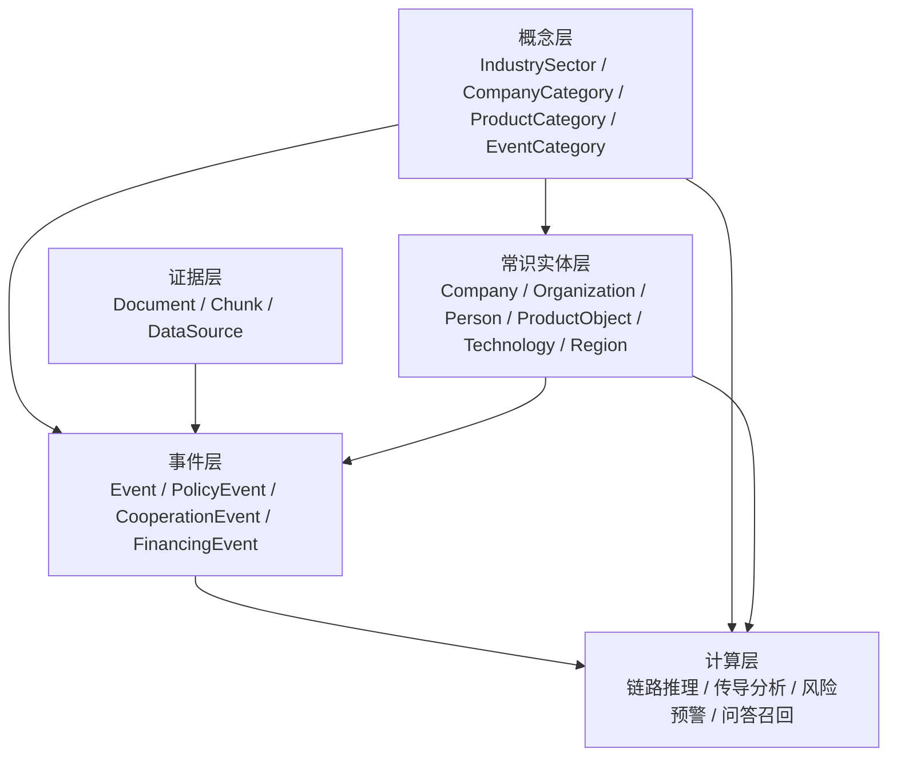
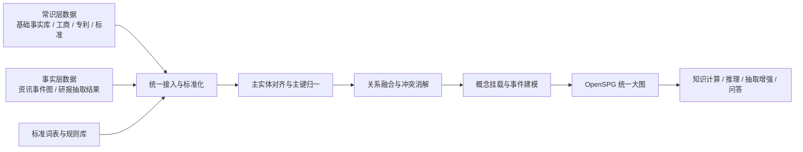

# IncCore 大图融合层图谱构建技术方案

## 1. 背景与目标

本方案面向 [IncCore.schema](/Users/caixudong/Downloads/zhilian-robot/IncCore.schema) 和总体技术方案 [面向全域产业资讯文本挖掘的知识计算技术方案.pdf](/Users/caixudong/Downloads/zhilian-robot/面向全域产业资讯文本挖掘的知识计算技术方案.pdf) 中定义的第三层“`大图融合层`”。

本方案的配套产物如下：

- 源数据映射表：[2026-03-22-incore-source-to-schema-mapping.md](/Users/caixudong/Downloads/zhilian-robot/docs/plans/2026-03-22-incore-source-to-schema-mapping.md)
- `v2` 扩展草案：[IncCore.v2.schema](/Users/caixudong/Downloads/zhilian-robot/IncCore.v2.schema)
- Pipeline DTO 与导入流程设计：[2026-03-22-incore-fusion-pipeline-dto-design.md](/Users/caixudong/Downloads/zhilian-robot/docs/plans/2026-03-22-incore-fusion-pipeline-dto-design.md)
- 变更说明：[2026-03-22-incore-v2-change-log.md](/Users/caixudong/Downloads/zhilian-robot/docs/plans/2026-03-22-incore-v2-change-log.md)

总体目标不是再建设一张新的孤立图谱，而是以 `IncCore.schema` 作为统一语义骨架，将下列两类知识统一融合进同一张 OpenSPG 大图中：

1. 常识层图谱  
   来自已构建的企业、机构、人物、产品、技术、区域、指标等相对稳定的背景知识。
2. 事实层图谱  
   来自资讯、研报、公告等文档中抽取出的事件、事实、时序变化和证据链。

本层要解决的核心问题有三个：

1. 如何让不同来源、不同粒度、不同可信度的数据落到同一套 schema 上。
2. 如何围绕主实体完成融合、去重、冲突消解和证据保留。
3. 如何在统一大图中引入概念层和事件层，为后续抽取增强、产业网链推理、传导分析和风险预警提供计算基础。

## 2. 设计边界

本方案只讨论大图融合层，不替代采集标化层和事件聚合层的职责。

各层职责边界如下：

- 采集标化层  
  负责原始资讯、研报、公告、数据库数据的接入、清洗、结构统一和基础标签补齐。
- 事件聚合层  
  负责从资讯文本中抽取事件要素、做事件归一和事件级聚合，产出“单场景事件图谱”。
- 大图融合层  
  负责将事件聚合层产物与常识层图谱、外部行业知识库共同融合，形成统一产业知识大图。
- 知识计算层  
  基于融合后的大图做规则推理、图遍历、链路传播、风险研判和问答支持。

因此，本层不是“再做一遍抽取”，而是“把抽取得到的事实知识和已有常识知识接入统一世界模型”。

## 3. IncCore.schema 对融合层的意义

当前 [IncCore.schema](/Users/caixudong/Downloads/zhilian-robot/IncCore.schema) 已经具备统一大图的三层主骨架。

### 3.1 概念层骨架

当前 schema 已定义多个 `ConceptType`，包括：

- `IndustrySector`
- `CompanyCategory`
- `ProductCategory`
- `TechnologyCategory`
- `PersonCategory`
- `OrganizationCategory`
- `RegionCategory`
- `TermCategory`
- `EventCategory`

见 [IncCore.schema](/Users/caixudong/Downloads/zhilian-robot/IncCore.schema#L4)。

这意味着 schema 已经不是单纯的实例层模型，而是天然允许“实例挂概念、概念承接推理”的建模方式。

### 3.2 实体层骨架

当前 schema 已定义核心产业实体：

- `IndustryNode`
- `Region`
- `IndustryActor`
- `Company`
- `Organization`
- `Person`
- `Technology`
- `ProductObject`
- `Document`
- `Chunk`
- `DataSource`
- `Index`

其中：

- `Company`、`Organization`、`Person` 统一继承自 `IndustryActor`
- `Document`、`Chunk`、`DataSource` 为文档证据链提供承载对象
- `Technology`、`ProductObject` 为产业网链中的技术和产品对象提供实体化承载

见 [IncCore.schema](/Users/caixudong/Downloads/zhilian-robot/IncCore.schema#L32)、[IncCore.schema](/Users/caixudong/Downloads/zhilian-robot/IncCore.schema#L61)、[IncCore.schema](/Users/caixudong/Downloads/zhilian-robot/IncCore.schema#L94)、[IncCore.schema](/Users/caixudong/Downloads/zhilian-robot/IncCore.schema#L111)、[IncCore.schema](/Users/caixudong/Downloads/zhilian-robot/IncCore.schema#L138)、[IncCore.schema](/Users/caixudong/Downloads/zhilian-robot/IncCore.schema#L155)、[IncCore.schema](/Users/caixudong/Downloads/zhilian-robot/IncCore.schema#L184)。

### 3.3 事件层骨架

当前 schema 已定义：

- 通用事件 `Event`
- `GovernmentPublishPolicyEvent`
- `CompanyCooperationEvent`
- `CompanyFinancingEvent`

见 [IncCore.schema](/Users/caixudong/Downloads/zhilian-robot/IncCore.schema#L215)。

这说明当前 schema 已具备“常识背景图 + 事件事实图”的统一建模起点。

## 4. 大图融合层的目标图结构

融合后的统一大图建议采用“四层协同”的知识结构。

四层的作用分别是：

- 概念层  
  负责分类、抽象、规则承接和推理约束。
- 常识实体层  
  负责承载稳定主体及其长期关系。
- 事件层  
  负责承载时态事实、动态变化和事件传播。
- 证据层  
  负责把结论绑定回原始资讯、研报和文本块，保证可追溯。

## 5. 融合层输入数据范围

融合层建议统一接收三类输入。

### 5.1 常识层输入

来自既有基础事实库和常识图谱，主要包括：

- 企业工商信息
- 股权、投资、分支机构
- 供应商、客户、上下游关系
- 机构、专家、人物履历
- 产品、技术、指标
- 行业目录、区域目录、标准目录

这些数据具有三个特点：

- 相对稳定
- 可长期复用
- 更适合作为产业背景图和主实体锚点

### 5.2 事实层输入

来自资讯、研报、公告、公众号等文本源抽取得到的事实知识，主要包括：

- 企业合作事件
- 融资事件
- 政策发布事件
- 产能扩张事件
- 投资建设事件
- 产品发布事件
- 技术突破事件
- 风险和异常事件

这些数据具有三个特点：

- 强时效性
- 多源重复
- 需要保留来源、时间和证据

### 5.3 词表与标准目录输入

来自标准词表、行业目录和规则库，主要用于支撑概念层建设：

- 十大产业粗粒度分类
- 行业分类表
- 产品分类表
- 技术分类表
- 事件分类表
- 地域标准表
- 企业分类和机构分类规则

## 6. 融合层总体架构

大图融合层建议拆为六个可独立演进的子模块。

六个子模块分别是：

1. 统一接入与标准化  
   把不同来源数据都转成 `IncCore.schema` 目标结构。
2. 主实体对齐与主键归一  
   完成跨源实体链接、别名归一和主节点确定。
3. 关系融合与冲突消解  
   处理重复关系、冲突事实和多源属性差异。
4. 概念挂载  
   把实体和事件接入概念层。
5. 事件建模  
   将资讯、研报中的动态事实落到统一事件层。
6. 大图落库  
   将融合后的统一图落入 OpenSPG，支撑后续查询与计算。

## 7. 多源数据如何融合

这是融合层的第一核心问题。

### 7.1 统一以 IncCore.schema 作为目标语义模型

所有来源数据都不直接按源字段入图，而是先映射到以下统一对象：

- 概念对象  
  如 `IndustrySector`、`CompanyCategory`、`EventCategory`
- 常识实体对象  
  如 `Company`、`Organization`、`Person`、`Technology`、`ProductObject`、`Region`
- 文档证据对象  
  如 `Document`、`Chunk`、`DataSource`
- 事件对象  
  如 `Event` 及其细分事件

因此，本层的第一原则是：

`源数据字段 -> 统一融合 DTO -> IncCore.schema 目标对象`

而不是：

`源数据字段 -> 直接写图`

### 7.2 统一主键体系

融合层必须先定义统一主键，否则跨源实体无法稳定融合。

建议主键策略如下：

- `Company`
  - 第一主键：统一社会信用代码
  - 第二主键：标准企业名称
- `Organization`
  - 第一主键：标准机构名称 + 区域
  - 第二主键：外部机构编码
- `Person`
  - 第一主键：姓名 + 机构 + 职务
  - 第二主键：外部人物编码
- `ProductObject`
  - 第一主键：标准产品名称 + 所属产业
  - 第二主键：品牌 + 型号
- `Technology`
  - 第一主键：标准技术名称
  - 第二主键：技术术语标准码
- `Region`
  - 第一主键：行政区划标准码
- `Document`
  - 第一主键：来源系统文档 ID
- `Chunk`
  - 第一主键：文档 ID + chunk 序号
- `Event`
  - 第一主键：事件类别 + 主体 + 核心客体 + 时间窗口 + 地点

在工程上，所有源系统 ID 都应保留为外部标识，但统一大图中必须有一个“图内 canonical id”。

### 7.3 主实体对齐流程

主实体对齐建议按“三段式”执行。

#### 第一段：规则对齐

适用于高置信度对象：

- 企业信用代码完全一致
- 行政区划编码一致
- 标准机构代码一致
- 产品品牌型号完全一致

这一步优先级最高，直接作为主锚点融合。

#### 第二段：名称归一与别名对齐

适用于中高置信度对象：

- 全称、简称、别名统一
- 英文名与中文名映射
- 企业名中的“有限公司”“股份有限公司”等尾缀标准化
- 产品和技术名中的符号、空格、全半角标准化

这一步的结果应写回实体的 `officialName` 和 `alias`。

#### 第三段：上下文辅助消歧

适用于弱结构化来源：

- 结合区域、行业、产品、合作对象、时间共同判定
- 对人物结合所属机构、职称、研究方向判定
- 对产品结合产业分类、制造商、技术关键词判定

这一步适合由规则和模型协同完成。

### 7.4 属性融合与冲突消解

多源融合时，不能简单“后写覆盖前写”，建议采用“主属性 + 来源证据 + 置信度”三元管理。

属性融合建议采用如下规则：

1. 身份型字段  
   如信用代码、标准编码、成立日期  
   以权威源优先，冲突时保留主值和冲突候选值。

2. 描述型字段  
   如企业简介、经营范围、技术描述  
   不做单值覆盖，应保留多来源摘要，并标记来源和时间。

3. 关系型字段  
   如供应商、合作、投资、所属行业  
   以边为中心管理，保留置信度、来源和时间。

4. 时态型字段  
   如状态、融资轮次、产能、估值  
   不建议回写成静态属性，应优先事件化。

冲突消解建议使用统一优先级：

1. 政务和监管来源
2. 官方公告和企业官网
3. 权威数据库
4. 主流财经媒体和行业媒体
5. 一般资讯和转载来源

所有冲突都不应直接删除原始来源，而应通过 `DataSource` 和 `Document` 追溯。

### 7.5 关系融合策略

关系融合建议分为三类：

1. 常识稳定关系  
   如 `shareholder`、`invest`、`branch`、`supplier`、`customer`  
   来自常识层数据库，作为长期背景关系。

2. 事件触发关系  
   如“合作”“融资”“政策影响”“供应受阻”  
   优先建事件节点，再由事件节点连接主体和客体。

3. 推导关系  
   如“潜在上游”“同类技术”“能力相似”“风险传导到”  
   不建议直接作为原始事实边写死，而应在知识计算层动态生成或单独标记为推导边。

## 8. 常识层与事实层的统一建图方式

建议采用“常识实体作为锚点、事件事实作为动态覆盖层”的统一建图方案。

### 8.1 常识层的角色

常识层是大图的背景骨架，用于回答：

- 这个主体是谁
- 它长期属于哪个行业、区域和分类
- 它和哪些主体长期存在结构关系

常识层中最关键的锚点是：

- `Company`
- `Organization`
- `Person`
- `ProductObject`
- `Technology`
- `Region`

### 8.2 事实层的角色

事实层是大图的动态增量，用于回答：

- 最近发生了什么
- 谁和谁因某事件产生了新的关联
- 某个主体的状态如何变化
- 某件事会向哪里传导

事实层最关键的对象是：

- `Event`
- 细分事件对象
- `Document`
- `Chunk`
- `DataSource`

### 8.3 推荐的统一融合模式

统一融合时，建议遵循以下模式：

1. 先有常识实体  
   例如企业、机构、产品、技术、区域。
2. 再挂事实事件  
   例如融资事件、合作事件、政策发布事件。
3. 再由事件回连证据  
   例如资讯原文、研报段落、公告片段。
4. 再由概念层把实体和事件统一抽象  
   形成分类与推理骨架。

这种模式的优点是：

- 不会让资讯噪声直接污染主实体
- 事实和证据可以长期追溯
- 静态知识和动态知识结构清晰
- 后续推理可以同时利用背景关系和动态事件

## 9. 概念层设计

这是融合层的第二核心问题。

### 9.1 概念层的定位

概念层不是普通标签层，而是统一大图中的抽象语义层，用来承接：

- 分类归一
- 层级组织
- 规则表达
- 推理约束
- 抽取边界

对融合层来说，概念层至少承担四个任务：

1. 统一不同来源的口径
2. 帮助实例对齐和分类约束
3. 为后续推理提供抽象节点
4. 反向约束 KAG/OpenKS 的抽取目标

### 9.2 基于当前 schema 可直接建设的概念层

基于当前 `IncCore.schema`，可以优先建设以下概念体系：

1. 产业概念  
   `IndustrySector`
2. 企业概念  
   `CompanyCategory`
3. 产品概念  
   `ProductCategory`
4. 技术概念  
   `TechnologyCategory`
5. 人物概念  
   `PersonCategory`
6. 机构概念  
   `OrganizationCategory`
7. 区域概念  
   `RegionCategory`
8. 事件概念  
   `EventCategory`
9. 术语概念  
   `TermCategory`

### 9.3 概念层的获取方式

概念层建议分四种来源构建。

#### 结构化字段映射

直接来自基础事实字段：

- 企业状态、行业、区域
- 产品所属产业
- 技术分类
- 机构类型
- 人物类别

#### 标准词表导入

来自人工维护或外部标准目录：

- 十大产业分类表
- 企业分类词表
- 机构分类词表
- 技术词表
- 产品词表
- 区域分类表
- 事件分类表

#### 文本抽取

来自资讯、研报、专利摘要、成果描述：

- 文本中抽产品概念
- 文本中抽技术概念
- 文本中抽产业概念
- 文本中抽术语概念

#### 图结构归纳

来自实例层关系反推：

- 企业长期关联某类产品，可归入相应 `ProductCategory`
- 企业关联大量某类技术，可归入相应 `TechnologyCategory`
- 事件频繁出现在某产业主体上，可反推其 `IndustrySector`

### 9.4 概念层怎么服务后续推理

概念层对后续推理有四类直接价值：

1. 候选过滤  
   先在概念层缩小范围，再落到实例层。
2. 抽象传播  
   在概念层上做产业链、技术链、风险链传播。
3. 归纳解释  
   把实例级事实上提为“某类企业”“某类技术”的共性知识。
4. 抽取约束  
   反向作为抽取体系的目标 schema，提高抽取稳定性。

## 10. 事件层设计

这是融合层的第三核心问题。

### 10.1 事件层的定位

事件层用于承接资讯、研报、公告等时态事实。

事件层的核心职责是：

- 记录动态变化
- 承载时态关系
- 组织传播链和因果链
- 把事实与证据绑定

相比直接把资讯抽成实体关系，事件层更适合融合层，因为它天然保留：

- 时间
- 地点
- 主体
- 客体
- 来源
- 置信度

这些都是产业推理必须保留的信息。

### 10.2 基于当前 schema 的事件建模

当前 `IncCore.schema` 已有：

- `Event`
- `GovernmentPublishPolicyEvent`
- `CompanyCooperationEvent`
- `CompanyFinancingEvent`

这一层可以先承载资讯中最常见、价值最高、最易抽取的事件。

建议第一阶段优先落地以下事件类别：

1. 政策发布事件
2. 企业合作事件
3. 企业融资事件
4. 投资建设事件
5. 产品发布事件
6. 技术突破事件
7. 产能扩张事件
8. 风险异常事件

其中前 3 类可以直接落在当前 schema 上，后 5 类建议作为下一轮 schema 扩展。

### 10.3 事件层与常识层如何协同

事件层不应替代常识层，而应“挂载在常识实体之上”。

建议关系模式如下：

- `CompanyFinancingEvent`
  - `subject -> Company`
  - `object -> Organization`
- `CompanyCooperationEvent`
  - `subject -> Company`
  - `object -> IndustryActor`
- `GovernmentPublishPolicyEvent`
  - `subject -> Organization`
  - `location -> Region`

同时建议事件与以下对象联动：

- 事件关联 `Document`
- 事件关联 `Chunk`
- 事件关联 `DataSource`
- 事件关联概念层 `EventCategory`

### 10.4 事件聚合与去重

资讯和研报中的事件会高度重复，因此融合层必须对事件做聚合。

建议事件唯一性规则按“软主键”生成：

- 事件类型
- 主体
- 客体
- 地点
- 时间窗口

例如：

`企业融资事件 + 宁德时代 + 红杉资本 + 北京 + 2026-03`

视为同一核心事件，再把多条资讯、研报片段挂成不同证据。

### 10.5 事件层如何服务后续推理

事件层是后续推理的动态输入，主要支撑：

- 事件传导分析
- 时序趋势分析
- 风险预警
- 证据链回溯
- 问答中的“最近发生了什么”

没有事件层，统一大图只能回答“谁和谁长期有关联”；有了事件层之后，才能回答“最近什么变化正在影响产业链”。

## 11. 文档与证据层设计

事实层融合后仍必须保留证据链，否则推理结果无法解释。

当前 schema 已有：

- `Document`
- `Chunk`
- `DataSource`

这三类对象建议按以下方式使用：

### 11.1 DataSource

`DataSource` 作为来源对象，统一记录：

- 来源名称
- 来源级别
- 来源可靠度
- 来源类型

建议扩展来源类型：

- 新闻网站
- 财经媒体
- 企业官网
- 政策官网
- 研报机构
- 微信公众号
- 数据库

### 11.2 Document

`Document` 作为原始文档对象，统一记录：

- 文档标题
- 文档摘要
- 文档来源
- 发布时间
- 文档类型
- URL
- 外部文档 ID

建议后续在 schema 中补充 `publishTime`、`docType`、`url`、`externalId`。

### 11.3 Chunk

`Chunk` 作为可检索、可引用的最小证据片段，统一记录：

- chunk 内容
- 向量索引
- 所属文档
- chunk 序号
- chunk 起止位置

这层对象对后续问答和证据引用非常关键。

## 12. 为后续抽取和推理预留的 schema 扩展建议

当前 `IncCore.schema` 已具备大图融合的主骨架，但如果要稳定支撑后续抽取增强和产业推理，建议补充以下 schema 扩展。

### 12.1 事件公共属性扩展

建议为 `Event` 及子事件补充：

- `name`
- `summary`
- `eventTime`
- `confidence`
- `polarity`
- `impactScope`
- `relatedProduct`
- `relatedTechnology`
- `industry`

原因是当前事件对象还缺少：

- 面向人展示的摘要
- 用于排序的时间和置信度
- 用于传导计算的影响对象

### 12.2 事件关系扩展

建议补充：

- `causedBy`
- `affect`
- `relatedEvent`
- `evidence`
- `mentionedIn`

这样才能支持事件链路、因果链和证据链统一管理。

### 12.3 概念关系扩展

当前概念层已有 `isA`，建议进一步补充概念间语义关系：

- `belongsToIndustry`
- `upstreamOf`
- `downstreamOf`
- `relatedTechnology`
- `appliesTo`
- `leadTo`

这类关系后续可用于产业网链推理和影响传播。

### 12.4 术语与标准名称扩展

建议让 `TermCategory` 承担术语归一和抽取词表功能，并增加：

- 术语标准名
- 别名
- 归属概念
- 使用范围

这样它可以直接服务 KAG/OpenKS 的抽取词表和对齐体系。

## 13. 面向产业网链推理的建图策略

统一大图建设的最终目标不是“存图”，而是“可计算”。

因此，大图融合层的建图方式必须天然服务后续推理。

### 13.1 产业网链推理需要的核心路径

建议优先支撑以下路径：

1. 企业 -> 产品 -> 技术 -> 产业
2. 企业 -> 区域 -> 产业
3. 企业 -> 事件 -> 风险/机会
4. 事件 -> 产业 -> 上下游主体
5. 政策事件 -> 区域/产业 -> 企业

### 13.2 推理用图的核心原则

1. 常识关系负责“背景约束”
2. 事件关系负责“动态变化”
3. 概念关系负责“抽象传播”
4. 证据关系负责“结果可解释”

如果没有概念层，只能在实例层上暴力检索。  
如果没有事件层，只能做静态关联分析。  
如果没有证据层，结果就无法回溯和校验。

## 14. 工程实施路径

建议分四期建设。

### Phase 1：统一骨架落图

目标：

- 确立 `IncCore.schema` 作为统一目标 schema
- 把常识层核心实体和概念先入图
- 把资讯事件最小集合接入事件层

范围：

- `Company`
- `Organization`
- `Person`
- `Region`
- `Technology`
- `ProductObject`
- `IndustrySector`
- `EventCategory`
- `GovernmentPublishPolicyEvent`
- `CompanyCooperationEvent`
- `CompanyFinancingEvent`

### Phase 2：主实体融合与证据贯通

目标：

- 完成企业、产品、机构、人物的跨源对齐
- 打通 `Document`、`Chunk`、`DataSource`
- 让每个事件、每条关键事实都能回溯证据

### Phase 3：概念层增强

目标：

- 建立产业、产品、技术、事件分类体系
- 将实例和事件挂接到概念层
- 初步支撑概念层过滤和归纳推理

### Phase 4：推理友好化扩展

目标：

- 扩展事件类型
- 引入事件链、因果链和传导链
- 支撑产业传导分析、风险预警和智能问答

## 15. 本方案的落地结论

基于当前 `IncCore.schema`，大图融合层完全可以采用“`概念层 + 常识实体层 + 事件层 + 证据层`”的统一图模型来建设。

这套方案的核心不是简单把不同来源的数据放到一起，而是：

1. 以 `IncCore.schema` 作为唯一语义边界
2. 以主实体对齐和主键归一作为融合入口
3. 以事件层承接资讯和研报中的动态事实
4. 以概念层承接分类、抽象和推理骨架
5. 以文档证据层保证后续问答、预警和推理可解释

最终形成的大图，不只是“统一存储层”，而是后续产业知识计算的统一语义底座。

## 16. 下一步建议

在本方案基础上，建议继续推进三项具体工作：

1. 基于 `IncCore.schema` 输出一版 `融合层对象映射表`
   - 明确“常识层字段 -> 统一实体属性”
   - 明确“资讯/研报抽取结果 -> 事件对象属性”
2. 输出一版 `IncCore.schema v2` 扩展草案
   - 重点补事件公共属性、事件关系和概念关系
3. 设计 `大图融合层 pipeline`
   - 输入 DTO
   - 主实体对齐规则
   - 冲突消解策略
   - OpenSPG 导入链路
