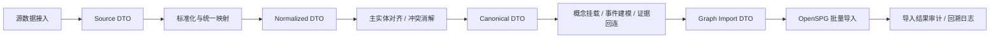

# 大图融合层 Pipeline 输入输出 DTO 与导入流程设计

## 1. 目标

本文件用于回答两个问题：

1. 大图融合层在工程上应该接收什么输入、产出什么输出。
2. 这些输入输出对象如何组织成一条可落地的 OpenSPG 导入流程。

配套文件：

- 总体方案：[2026-03-22-incore-big-graph-fusion-layer-design.md](/Users/caixudong/Downloads/zhilian-robot/docs/plans/2026-03-22-incore-big-graph-fusion-layer-design.md)
- 源数据映射表：[2026-03-22-incore-source-to-schema-mapping.md](/Users/caixudong/Downloads/zhilian-robot/docs/plans/2026-03-22-incore-source-to-schema-mapping.md)
- 收敛版 schema：[IncCore.v2.schema](/Users/caixudong/Downloads/zhilian-robot/IncCore.v2.schema)
- 变更说明：[2026-03-22-incore-v2-change-log.md](/Users/caixudong/Downloads/zhilian-robot/docs/plans/2026-03-22-incore-v2-change-log.md)

## 2. 设计原则

### 2.1 先 DTO，后入图

所有源数据都先进入统一 DTO，而不是直接写 OpenSPG。

### 2.2 先标准化，后对齐

先把不同来源变成统一结构，再做主实体对齐和冲突消解。

### 2.3 先常识锚点，后事件融合

先把稳定实体和概念层打稳，再把资讯和研报中的事件挂上去。

### 2.4 证据链必须单独保留

文档、chunk、来源必须作为独立对象进入融合 pipeline，不能只保留在离线日志里。

## 3. Pipeline 总体流程



## 4. 输入 DTO 设计

输入 DTO 负责承接不同来源的原始信息，但已经统一了最基本的外层结构。

## 4.1 通用外层 DTO

```json
{
  "source_system": "fact_library | mongo_news | graphiti | report_pipeline",
  "source_table": "dw_company_info_tyc",
  "record_id": "C_001",
  "record_type": "entity | relation | document | chunk | event | concept_seed",
  "payload": {},
  "ingest_time": "2026-03-22T10:00:00+08:00"
}
```

说明：

- `source_system`
  - 数据来自哪条链路。
- `source_table`
  - 原始表或原始集合。
- `record_id`
  - 源记录 ID。
- `record_type`
  - 记录属于实体、关系、文档、chunk、事件还是概念种子。
- `payload`
  - 具体业务字段。

## 4.2 结构化实体输入 DTO

用于常识层结构化输入，如企业、机构、人物、产品、技术。

```json
{
  "source_system": "fact_library",
  "source_table": "dw_company_info_tyc",
  "record_id": "91310000XXXXXX",
  "record_type": "entity",
  "payload": {
    "entity_type": "Company",
    "name": "某某科技有限公司",
    "aliases": ["某某科技", "某某股份"],
    "code": "91310000XXXXXX",
    "province": "上海",
    "city": "上海",
    "status": "存续",
    "website": "https://example.com",
    "description": "企业简介",
    "business_scope": "经营范围"
  }
}
```

## 4.3 结构化关系输入 DTO

用于承接结构化关系源。

```json
{
  "source_system": "fact_library",
  "source_table": "company_supplier",
  "record_id": "REL_001",
  "record_type": "relation",
  "payload": {
    "subject_type": "Company",
    "subject_key": "91310000A",
    "predicate": "supplier",
    "object_type": "Company",
    "object_key": "91310000B",
    "confidence": 0.92,
    "effective_time": "2026-03-01"
  }
}
```

## 4.4 文档输入 DTO

用于资讯、研报、公告原文。

```json
{
  "source_system": "mongo_news",
  "source_table": "news_documents",
  "record_id": "news_20260322_001",
  "record_type": "document",
  "payload": {
    "doc_type": "news",
    "title": "某企业完成新一轮融资",
    "summary": "摘要",
    "content": "正文全文",
    "publish_time": "2026-03-22T09:30:00+08:00",
    "url": "https://example.com/news/1",
    "source_name": "某财经媒体",
    "source_type": "media",
    "authority_level": 0.75
  }
}
```

## 4.5 Chunk 输入 DTO

用于文档切分后的证据片段。

```json
{
  "source_system": "chunk_pipeline",
  "source_table": "news_chunks",
  "record_id": "chunk_001",
  "record_type": "chunk",
  "payload": {
    "doc_id": "news_20260322_001",
    "chunk_index": 3,
    "start_offset": 1200,
    "end_offset": 1650,
    "content": "融资金额为 5 亿元……"
  }
}
```

## 4.6 事件输入 DTO

用于承接 Graphiti 或抽取链产出的事件结果。

```json
{
  "source_system": "graphiti",
  "source_table": "graphiti_events",
  "record_id": "evt_001",
  "record_type": "event",
  "payload": {
    "event_type": "CompanyFinancingEvent",
    "name": "某企业完成 B 轮融资",
    "summary": "某企业完成 B 轮融资，金额 5 亿元。",
    "subject_name": "某某科技有限公司",
    "object_name": "某投资机构",
    "event_time": "2026-03-20T00:00:00+08:00",
    "publish_time": "2026-03-22T09:30:00+08:00",
    "location": "上海",
    "financing_amount": 500000000,
    "financing_round": "B轮",
    "confidence": 0.87,
    "trigger_terms": ["融资", "B轮"],
    "source_doc_id": "news_20260322_001",
    "source_chunk_ids": ["chunk_001", "chunk_002"]
  }
}
```

## 4.7 概念种子输入 DTO

用于标准词表、规则库和人工维护概念目录。

```json
{
  "source_system": "taxonomy_seed",
  "source_table": "industry_sector_seed",
  "record_id": "sector_new_energy",
  "record_type": "concept_seed",
  "payload": {
    "concept_type": "IndustrySector",
    "name": "新能源",
    "parent_name": "能源",
    "aliases": ["新能源产业"],
    "description": "新能源相关产业"
  }
}
```

## 5. 标准化 DTO 设计

这一层的目标是把源数据统一成与 schema 更贴近的标准结构。

## 5.1 `NormalizedEntityDTO`

```json
{
  "canonical_type": "Company",
  "source_refs": [
    {
      "source_system": "fact_library",
      "source_table": "dw_company_info_tyc",
      "record_id": "91310000XXXXXX"
    }
  ],
  "primary_name": "某某科技有限公司",
  "aliases": ["某某科技"],
  "external_keys": {
    "credit_code": "91310000XXXXXX"
  },
  "properties": {
    "website": "https://example.com",
    "status": "存续",
    "businessScope": "经营范围",
    "description": "企业简介"
  },
  "concept_candidates": [
    {
      "concept_type": "IndustrySector",
      "concept_name": "新能源",
      "score": 0.88
    }
  ]
}
```

## 5.2 `NormalizedDocumentDTO`

```json
{
  "document_id": "news_20260322_001",
  "doc_type": "news",
  "name": "某企业完成新一轮融资",
  "description": "摘要",
  "content": "正文全文",
  "publish_time": "2026-03-22T09:30:00+08:00",
  "url": "https://example.com/news/1",
  "source": {
    "name": "某财经媒体",
    "source_type": "media",
    "authority_level": 0.75
  }
}
```

## 5.3 `NormalizedChunkDTO`

```json
{
  "chunk_id": "news_20260322_001#3",
  "document_id": "news_20260322_001",
  "chunk_index": 3,
  "start_offset": 1200,
  "end_offset": 1650,
  "content": "融资金额为 5 亿元……"
}
```

## 5.4 `NormalizedEventDTO`

```json
{
  "event_type": "CompanyFinancingEvent",
  "name": "某企业完成 B 轮融资",
  "summary": "某企业完成 B 轮融资，金额 5 亿元。",
  "subject_ref": {
    "type": "Company",
    "match_key": "某某科技有限公司"
  },
  "object_ref": {
    "type": "Organization",
    "match_key": "某投资机构"
  },
  "location_ref": {
    "type": "Region",
    "match_key": "上海"
  },
  "category_ref": {
    "type": "EventCategory",
    "match_key": "企业融资"
  },
  "source_document_ids": ["news_20260322_001"],
  "source_chunk_ids": ["news_20260322_001#3"],
  "properties": {
    "financingAmount": 500000000,
    "financingRound": "B轮",
    "eventTime": "2026-03-20T00:00:00+08:00",
    "publishTime": "2026-03-22T09:30:00+08:00",
    "confidence": 0.87
  },
  "concept_candidates": [
    {
      "concept_type": "IndustrySector",
      "concept_name": "新能源",
      "score": 0.76
    }
  ]
}
```

## 5.5 `NormalizedRelationDTO`

```json
{
  "subject_ref": {
    "type": "Company",
    "match_key": "91310000A"
  },
  "predicate": "supplier",
  "object_ref": {
    "type": "Company",
    "match_key": "91310000B"
  },
  "properties": {
    "confidence": 0.92
  },
  "source_refs": [
    {
      "source_system": "fact_library",
      "source_table": "company_supplier",
      "record_id": "REL_001"
    }
  ]
}
```

## 6. 主实体对齐输出 DTO

这一层的目标是把所有对象统一到图内的 canonical id。

## 6.1 `CanonicalEntityDTO`

```json
{
  "graph_id": "Company:91310000XXXXXX",
  "entity_type": "Company",
  "primary_name": "某某科技有限公司",
  "official_name": "某某科技有限公司",
  "aliases": ["某某科技"],
  "external_keys": {
    "credit_code": "91310000XXXXXX"
  },
  "merged_sources": [
    {
      "source_system": "fact_library",
      "record_id": "91310000XXXXXX"
    },
    {
      "source_system": "graphiti",
      "record_id": "entity_evt_001_subject"
    }
  ],
  "properties": {
    "website": "https://example.com",
    "status": "存续"
  },
  "concept_bindings": [
    {
      "concept_type": "IndustrySector",
      "concept_name": "新能源",
      "confidence": 0.88
    }
  ]
}
```

## 6.2 `CanonicalEventDTO`

```json
{
  "graph_id": "CompanyFinancingEvent:某某科技有限公司:某投资机构:2026-03:上海",
  "event_type": "CompanyFinancingEvent",
  "name": "某企业完成 B 轮融资",
  "summary": "某企业完成 B 轮融资，金额 5 亿元。",
  "subject_graph_id": "Company:91310000XXXXXX",
  "object_graph_id": "Organization:某投资机构@上海",
  "location_graph_id": "Region:上海",
  "category_name": "企业融资",
  "properties": {
    "financingAmount": 500000000,
    "financingRound": "B轮",
    "eventTime": "2026-03-20T00:00:00+08:00",
    "publishTime": "2026-03-22T09:30:00+08:00",
    "confidence": 0.87
  },
  "evidence": {
    "document_ids": ["news_20260322_001"],
    "chunk_ids": ["news_20260322_001#3"]
  }
}
```

## 6.3 `ConflictRecordDTO`

```json
{
  "graph_id": "Company:91310000XXXXXX",
  "field": "status",
  "winning_value": "存续",
  "losing_values": ["在业"],
  "resolution_rule": "authority_priority",
  "source_details": [
    {
      "source_system": "fact_library",
      "value": "存续",
      "authority_level": 0.95
    },
    {
      "source_system": "media_extract",
      "value": "在业",
      "authority_level": 0.45
    }
  ]
}
```

## 7. Graph 导入 DTO 设计

这一层的目标是把已对齐对象转成适合批量写入 OpenSPG 的结构。

## 7.1 `GraphNodeUpsertDTO`

```json
{
  "type_name": "Company",
  "graph_id": "Company:91310000XXXXXX",
  "name": "某某科技有限公司",
  "properties": {
    "officialName": "某某科技有限公司",
    "code": "91310000XXXXXX",
    "status": "存续",
    "website": "https://example.com"
  }
}
```

## 7.2 `GraphEdgeUpsertDTO`

```json
{
  "subject_graph_id": "Company:91310000XXXXXX",
  "predicate": "supplier",
  "object_graph_id": "Company:91310000YYYYYY",
  "properties": {
    "confidence": 0.92
  }
}
```

## 7.3 `GraphImportBatchDTO`

```json
{
  "project": "IncCore",
  "namespace": "IncCore",
  "batch_id": "batch_20260322_001",
  "concept_nodes": [],
  "entity_nodes": [],
  "event_nodes": [],
  "document_nodes": [],
  "chunk_nodes": [],
  "edges": []
}
```

说明：

- `concept_nodes`
  - 概念节点 upsert。
- `entity_nodes`
  - 常识实体节点 upsert。
- `event_nodes`
  - 事件节点 upsert。
- `document_nodes`
  - 文档节点 upsert。
- `chunk_nodes`
  - chunk 节点 upsert。
- `edges`
  - 包含实体关系、概念挂载关系、事件-证据关系。

## 8. 导入流程设计

## 8.1 导入顺序

建议按以下顺序导入：

1. schema
2. 概念节点
3. 区域节点
4. 常识实体节点
5. 常识稳定关系
6. 数据来源节点
7. 文档节点
8. chunk 节点
9. 事件节点
10. 事件到实体、概念、证据的关系
11. 冲突日志和导入审计

原因：

- 概念和主实体必须先存在，事件才能挂接。
- 文档和 chunk 必须先存在，事件证据关系才能落地。

## 8.2 Pipeline 阶段设计

### Stage 1：Source Loader

输入：

- 原始结构化表
- Mongo 文档
- Graphiti 事件结果
- 词表种子

输出：

- 通用外层 DTO

### Stage 2：Schema Mapper

输入：

- 通用外层 DTO
- 源数据映射表

输出：

- `NormalizedEntityDTO`
- `NormalizedDocumentDTO`
- `NormalizedChunkDTO`
- `NormalizedEventDTO`
- `NormalizedRelationDTO`

### Stage 3：Canonical Resolver

输入：

- 各类 normalized DTO

处理：

- 名称标准化
- 主键优先匹配
- 别名匹配
- 上下文辅助消歧
- 冲突记录

输出：

- `CanonicalEntityDTO`
- `CanonicalEventDTO`
- `ConflictRecordDTO`

### Stage 4：Concept Binder

输入：

- `CanonicalEntityDTO`
- `CanonicalEventDTO`
- 概念词表

处理：

- 概念挂载
- 层级概念补齐
- 术语到概念映射

输出：

- 带概念绑定的 canonical DTO

### Stage 5：Graph Batch Builder

输入：

- 所有 canonical DTO

处理：

- 生成节点 upsert
- 生成关系 upsert
- 切批
- 幂等排序

输出：

- `GraphImportBatchDTO`

### Stage 6：OpenSPG Importer

输入：

- `GraphImportBatchDTO`

处理：

- 分批提交 builder/import job
- 失败重试
- 状态轮询

输出：

- 导入成功 / 失败明细

### Stage 7：Audit Logger

输入：

- 导入结果
- 冲突日志
- 批次信息

输出：

- 导入审计报告
- 未对齐实体列表
- 冲突字段列表
- 未映射概念列表

## 9. 推荐的工程目录结构

```text
backend/app/incore_fusion_pipeline/
├── dto/
│   ├── source_dto.py
│   ├── normalized_dto.py
│   ├── canonical_dto.py
│   └── graph_import_dto.py
├── mappers/
│   ├── source_mapper.py
│   ├── concept_mapper.py
│   └── event_mapper.py
├── resolvers/
│   ├── entity_resolver.py
│   ├── event_resolver.py
│   └── conflict_resolver.py
├── builders/
│   ├── concept_batch_builder.py
│   ├── entity_batch_builder.py
│   ├── event_batch_builder.py
│   └── evidence_batch_builder.py
├── importers/
│   └── openspg_importer.py
└── runners/
    └── fusion_pipeline_runner.py
```

## 10. 第一阶段建议优先实现的 DTO

第一阶段不建议一次把所有 DTO 都做满，建议优先实现以下最小闭环：

1. `NormalizedEntityDTO`
2. `NormalizedDocumentDTO`
3. `NormalizedChunkDTO`
4. `NormalizedEventDTO`
5. `CanonicalEntityDTO`
6. `CanonicalEventDTO`
7. `GraphNodeUpsertDTO`
8. `GraphEdgeUpsertDTO`
9. `GraphImportBatchDTO`

这 9 个对象足够先跑通：

- 常识层核心实体
- 文档证据层
- 三类核心事件
- OpenSPG 大图导入

## 11. 一句话结论

大图融合层 pipeline 的本质，是把“多源数据接入问题”拆成四个可工程化的问题：

1. 统一输入 DTO
2. 标准化映射
3. 主实体与事件对齐
4. 批量导入 OpenSPG

这样实现后，统一大图建设就不再依赖某一条单独的数据链，而可以稳定接纳后续不断增加的新来源。
