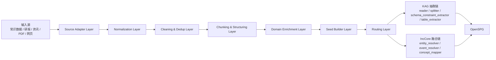

# 面向 OpenSPG/KAG 的前置处理层总体设计方案

## 1. 文档目标

本文档定义 `zhilian-robot` 在知识抽取与图谱构建之前的一层统一前置处理体系。该体系需要同时满足以下目标：

1. 复用 `DataFlow` 的算子化思想，将原始数据处理过程拆分为可组合、可复用、可观测的算子。
2. 服务于后续 `KAG` 的 schema 驱动抽取、`IncCore fusion pipeline` 的实体融合与概念挂载、`OpenSPG` 的统一落图。
3. 支持后续接入类似 `DataFlow-Agent` 的 agent 编排能力，使 agent 可以按任务动态选择算子与组合流水线。
4. 覆盖当前三类核心输入：
   - 常识数据
   - 研报数据
   - 资讯数据

## 2. 现状与问题

当前系统已经形成三条相对独立的链路：

- 常识层结构化处理链：
  [backend/app/fact_library_pipeline/pipeline.py](/Users/caixudong/Downloads/zhilian-robot/backend/app/fact_library_pipeline/pipeline.py)
- 资讯抽取链：
  [backend/app/news_pipeline/service.py](/Users/caixudong/Downloads/zhilian-robot/backend/app/news_pipeline/service.py)
- 统一大图融合链：
  [backend/app/incore_fusion_pipeline/runners/fusion_pipeline_runner.py](/Users/caixudong/Downloads/zhilian-robot/backend/app/incore_fusion_pipeline/runners/fusion_pipeline_runner.py)

同时，仓库中已经引入了两类可复用能力：

- `DataFlow`：擅长文档接入、清洗、切块、过滤、评估、数据生成，见
  [DataFlow/dataflow/operators](/Users/caixudong/Downloads/zhilian-robot/DataFlow/dataflow/operators)
- `KAG/OpenSPG`：擅长 schema 驱动的知识抽取、结构化映射和图谱落库，见
  [modules/kag/kag/builder/component](/Users/caixudong/Downloads/zhilian-robot/modules/kag/kag/builder/component)

当前问题在于：

1. 原始输入进入知识抽取前缺少统一治理层。
2. 资讯、研报、常识数据前置处理方式不统一。
3. 可复用的数据治理动作还没有被抽象为标准算子。
4. 后续如果接入 agent，目前没有一层明确的“算子目录”和“算子契约”供 agent 调度。

## 3. 设计定位

前置处理层的定位不是替代 `KAG` 或 `OpenSPG`，而是位于它们之前，专门负责“原始数据治理与抽取准备”。

职责边界如下：

- `DataFlow-style preprocessing`
  - 文档接入
  - 文本清洗
  - 格式规范化
  - 去重与质量过滤
  - 切块与结构化中间件生成
  - 概念/事件种子生成
- `KAG`
  - schema 驱动的实体/关系/事件抽取
  - 结构化映射导图
- `IncCore fusion pipeline`
  - 主实体对齐
  - 概念挂载
  - 事件归一
  - 多源融合
- `OpenSPG`
  - schema 承载
  - 图存储
  - 图查询与推理

## 4. 总体架构



## 5. 设计原则

### 5.1 算子优先

所有前置处理动作都应被表达为清晰的算子，而不是隐藏在脚本中的不可复用逻辑。

### 5.2 统一中间件

前置层不直接输出最终图，而输出统一中间格式，以便：

- 一部分交给 `KAG`
- 一部分交给 `IncCore fusion pipeline`

### 5.3 面向 agent 编排

算子必须具备：

- 可注册
- 可发现
- 可描述
- 可路由
- 可观测

### 5.4 与现有链路兼容

不推翻现有事实库、资讯链和融合链，而是在它们之前增加一层统一输入治理。

## 6. 输入数据分型

### 6.1 常识数据

来源：

- 企业、机构、人物、专利、项目、标准、成果等结构化表

特点：

- 结构稳定
- 字段明确
- 核心问题是筛选、规范化、别名归一和结构化关系物化

### 6.2 研报数据

来源：

- PDF 研报
- 研报元数据
- 研报网页与附件

特点：

- 长文档
- 大量章节、目录、表格
- 文本质量不稳定
- 需要先做格式解析和清洗

### 6.3 资讯数据

来源：

- 新闻资讯
- 公告
- 快讯
- 公众号文章等

特点：

- 短文本或中短文本为主
- 重复转载多
- 噪声多
- 强事件性

## 7. 前置层统一输入输出

### 7.1 统一输入

所有输入先适配为 `PreprocessRecord`：

- 表示单条待处理源数据
- 同时兼容结构化记录与文档记录

### 7.2 统一输出

前置层统一输出三类中间对象：

1. `DocumentRecord`
2. `ChunkRecord`
3. `SeedRecord`

其中 `SeedRecord` 分为：

- `EntitySeed`
- `RelationSeed`
- `EventSeed`
- `ConceptSeed`

这三类中间对象是前置层与下游知识层的解耦关键。

## 8. 算子分层设计

### 8.1 Source Adapter Layer

职责：

- 把不同来源数据统一包装为 `PreprocessRecord`

代表算子：

- `NewsAdapterOperator`
- `ReportAdapterOperator`
- `FactTableAdapterOperator`

### 8.2 Normalization Layer

职责：

- 标题、来源、时间、URL、别名、编码标准化

代表算子：

- `DocumentNormalizeOperator`
- `EntityAliasNormalizeOperator`

### 8.3 Cleaning & Dedup Layer

职责：

- 文本清洗
- 去重
- 低质量数据过滤

可复用 DataFlow 思想：

- `TextNormalizationRefiner`
- `HashDeduplicateFilter`
- `MinHashDeduplicateFilter`
- `SimHashDeduplicateFilter`
- `RuleBasedFilter`

建议新增：

- `QualityFilterOperator`
- `IndustryNoiseFilter`

### 8.4 Chunking & Structuring Layer

职责：

- 长文切块
- 保留章节结构
- 抽离表格结构

可复用 DataFlow / KAG：

- `KBCChunkGenerator`
- `semantic_splitter`
- `outline_splitter`

建议新增：

- `OutlineStructuringOperator`
- `TableStructuringOperator`

### 8.5 Domain Enrichment Layer

职责：

- 在正式知识抽取前先给文档、chunk、主体打上业务候选标签

建议新增：

- `DocumentClassificationOperator`
- `CompanyCategoryPreBinder`
- `IndustrySectorPreBinder`
- `EventImpactPreClassifier`

### 8.6 Seed Builder Layer

职责：

- 构造后续知识抽取和融合的统一种子对象

建议新增：

- `ChunkToEntitySeedOperator`
- `ChunkToEventSeedOperator`
- `StructuredRowToSeedOperator`
- `DocumentToSourceRecordConverter`

## 9. 三类输入的推荐前置链路

### 9.1 常识数据前置链

```text
FactTableAdapter
-> StructuredNormalize
-> StructuredDeduplicate
-> EntityAliasNormalize
-> StructuredRowToSeed
-> IncCore fusion / KAG structured mapping
```

判断：

- 常识数据应以现有
  [backend/app/fact_library_pipeline/pipeline.py](/Users/caixudong/Downloads/zhilian-robot/backend/app/fact_library_pipeline/pipeline.py)
  为主
- DataFlow 思想主要用在“算子抽象”和“前置治理动作标准化”

### 9.2 研报前置链

```text
ReportAdapter
-> FileToMarkdown
-> TextCleaning
-> OutlineStructuring
-> TableStructuring
-> Chunking
-> ChunkToEntitySeed
-> ChunkToEventSeed
-> IndustrySectorPreBinder
-> KAG / IncCore
```

判断：

- 研报是最适合接入 DataFlow 思想的一类输入
- 尤其适合文档接入、Markdown 转换、清洗、切块

### 9.3 资讯前置链

```text
NewsAdapter
-> DocumentNormalize
-> Deduplicate
-> QualityFilter
-> Chunking
-> ChunkToEventSeed
-> EventImpactPreClassifier
-> IncCore fusion
```

判断：

- 资讯场景更偏事件 seed 构造
- 不建议用前置层替代当前 `IncCore` 的事件解析和实体融合

## 10. 与 DataFlow 的结合方式

不是直接把 `DataFlow` 整体嵌入现有主线，而是借用它的两个核心思想：

1. `Operator` 思想  
   每一步处理都明确为一个算子，定义输入、输出、参数、说明和统计

2. `Pipeline` 思想  
   用一条可编排的流水线组织算子，而不是在单个脚本里堆叠逻辑

可优先复用的 DataFlow 现有能力：

- 文档接入
- 文本清洗
- 去重过滤
- 切块
- Prompt 驱动改写

但这层不直接复用 DataFlow 原生 pipeline 作为主干，而是参考它的抽象方式，在我们自己的业务体系内实现兼容版本。

## 11. Agent 兼容要求

若后续要支持类似 `DataFlow-Agent` 的 agent 自动编排，前置处理层必须补齐以下能力：

### 11.1 算子注册表

统一登记：

- 算子名称
- 类别
- 输入类型
- 输出类型
- 参数定义
- 描述
- 适用条件

### 11.2 可发现接口

提供程序化接口让 agent 查询：

- 有哪些算子
- 某算子解决什么问题
- 某类输入可走哪些算子

### 11.3 路由规则

按输入特征分流：

- `content_type`
- `source_type`
- `doc_category`
- `record_schema`

### 11.4 运行反馈

每个算子都输出：

- 输入数
- 输出数
- 丢弃数
- 异常数
- 样本示例

这决定 agent 能否在未来做自动试错和算子重排。

## 12. 推荐的实施分期

### Phase 1：先打通前置层骨架

实现：

- 统一 DTO
- 算子注册机制
- 三类输入的 adapter
- 去重、规范化、切块、seed 构造的最小链路

### Phase 2：补研报重处理能力

实现：

- PDF 转 Markdown
- 大纲结构化
- 表格结构化
- 研报到 entity/event seed 的前置生成

### Phase 3：补概念前置能力

实现：

- 企业分类预绑定
- 行业概念预绑定
- 事件影响预分类

### Phase 4：接 agent 编排

实现：

- 算子目录接口
- 动态 pipeline 选择
- 执行反馈与可解释运行记录

## 13. 结论

前置处理层的核心价值，不是“替代知识抽取”，而是把原始数据变成“适合被知识抽取和图谱融合消费的中间件”。

这一层采用 `DataFlow` 的算子化思想后，可以得到三方面收益：

1. 输入治理统一化
2. 抽取链前移与质量提升
3. 后续 agent 编排的基础设施

最终建议是：

**在 `zhilian-robot` 中新建一条独立前置处理层，以 `Document / Chunk / Seed` 作为统一中间对象；以算子注册、算子元数据和算子统计作为基础设施；以常识、研报、资讯三条前置链路为首批落地对象。**
