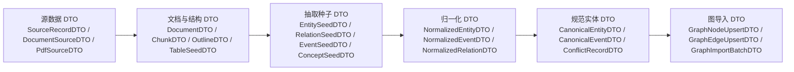

# 知识计算工作台 DTO 设计说明

## 1. 文档目的

这份文档重点说明当前项目中的 DTO 体系，回答四个问题：

1. DTO 在这个项目里到底承担什么职责
2. 现有 DTO 具体分成哪几层
3. 当前 DTO 设计已经做到什么、还存在哪些问题
4. 后续知识计算工作台、KAG 集成、OpenSPG 落图应该如何继续收敛 DTO

这里的结论不是抽象的软件工程描述，而是基于当前代码中的真实定义整理出来的。

核心文件包括：

- [knowledge_extraction_operators/dto.py](/Users/caixudong/Downloads/zhilian-robot/backend/app/knowledge_extraction_operators/dto.py)
- [incore_fusion_pipeline/dto/source_dto.py](/Users/caixudong/Downloads/zhilian-robot/backend/app/incore_fusion_pipeline/dto/source_dto.py)
- [incore_fusion_pipeline/dto/normalized_dto.py](/Users/caixudong/Downloads/zhilian-robot/backend/app/incore_fusion_pipeline/dto/normalized_dto.py)
- [incore_fusion_pipeline/dto/canonical_dto.py](/Users/caixudong/Downloads/zhilian-robot/backend/app/incore_fusion_pipeline/dto/canonical_dto.py)
- [incore_fusion_pipeline/dto/graph_import_dto.py](/Users/caixudong/Downloads/zhilian-robot/backend/app/incore_fusion_pipeline/dto/graph_import_dto.py)

---

## 2. 先说结论：这个项目里的 DTO 是什么

在这个项目里，DTO 不是简单的“接口传参结构”，而是整条知识计算链路的**阶段边界**。

它的核心作用有四个：

1. **隔离不同阶段的处理逻辑**
   - 原始接入
   - 文档解析
   - 知识抽取
   - 归一融合
   - 图构建

2. **为算子化提供稳定输入输出契约**
   - 每个算子知道自己“吃什么、吐什么”
   - 前端工作台可以基于 DTO 自动校验 pipeline

3. **把业务语义从实现细节中抽出来**
   - 例如 `EntitySeedDTO` 表示“抽取出来但尚未归一的实体”
   - `CanonicalEntityDTO` 表示“已经完成主实体归并后的实体”
   - 这比直接在 `dict` 里塞各种字段要清晰得多

4. **为后续 KAG / OpenSPG / agent 调用预留标准接口**
   - KAG 可以作为“抽取算子”的一种实现
   - OpenSPG 作为“图导入终点”
   - 工作台和 agent 只需要理解 DTO 契约，不需要理解每个实现细节

一句话概括：

**DTO 是这个项目里“知识计算流水线的标准托盘”。**

---

## 3. 当前 DTO 体系的总体结构

当前代码里已经形成了一个比较清晰的 6 层 DTO 结构。

此外，在知识计算工作台中还单独存在一组**工作台编排 DTO**：

- `PipelineValidationRequestDTO`
- `PipelineValidationResultDTO`
- `PipelineExecutionPreviewRequestDTO`
- `PipelineExecutionPreviewResultDTO`
- `PipelineNodeDTO`
- `PipelineEdgeDTO`
- `PublishedPipelineDTO`

这组 DTO 不属于知识本身，而属于**工作流编排与发布控制面**。

---

## 4. 第一层：源数据 DTO

### 4.1 代表 DTO

定义位置：
- [source_dto.py](/Users/caixudong/Downloads/zhilian-robot/backend/app/incore_fusion_pipeline/dto/source_dto.py)
- [dto.py](/Users/caixudong/Downloads/zhilian-robot/backend/app/knowledge_extraction_operators/dto.py)

代表对象：

- `SourceRecordDTO`
- `SourceReferenceDTO`
- `DocumentSourceDTO`
- `PdfSourceDTO`
- `WebPageSourceDTO`
- `DocxSourceDTO`
- `MarkdownSourceDTO`
- `RssFeedDTO`
- `StructuredRowDTO`
- `StructuredTableRowDTO`

### 4.2 职责

这一层 DTO 的职责是：

- 描述“原始输入是什么”
- 不做知识判断
- 只做来源标准化

例如：

- `PdfSourceDTO` 说明这是一个 PDF 来源
- `WebPageSourceDTO` 说明这是一个网页来源
- `SourceRecordDTO` 说明这是已经统一封装后的源记录

### 4.3 设计特点

这层 DTO 的特点是：

- 贴近输入源
- 业务语义弱
- 主要用于接入与初始封装

### 4.4 当前评价

这一层已经基本合理。  
但现在有一个结构上的重复：

- 一套是 `DocumentSourceDTO / PdfSourceDTO / WebPageSourceDTO`
- 另一套是 `SourceRecordDTO`

这说明目前项目里存在两种入口：

1. 文档型入口
2. 通用源记录入口

这不是错误，但需要在后续设计中明确：

**到底谁是知识计算工作台的“统一入口 DTO”。**

建议结论：

- 工作台面向“算子编排”时，保留多种源 DTO
- 融合链内部统一收敛到 `SourceRecordDTO`

---

## 5. 第二层：文档与结构 DTO

### 5.1 代表 DTO

定义位置：
- [knowledge_extraction_operators/dto.py](/Users/caixudong/Downloads/zhilian-robot/backend/app/knowledge_extraction_operators/dto.py)

代表对象：

- `DocumentDTO`
- `ChunkDTO`
- `ChunkListDTO`
- `OutlineSectionDTO`
- `OutlineDTO`
- `TableSeedDTO`
- `TableSeedListDTO`

### 5.2 职责

这一层 DTO 的职责是：

- 把原始文档转成可处理文本对象
- 把长文拆成 chunk
- 把结构信息独立出来

例如：

- `DocumentDTO` 表示“已经文本化的文档”
- `ChunkDTO` 表示“文档中的一个可抽取块”
- `OutlineDTO` 表示“章节结构”
- `TableSeedDTO` 表示“表格结构的轻量种子”

### 5.3 为什么这一层重要

因为知识抽取不是直接面对原始 PDF、网页 HTML、docx 二进制，而是面对：

- 标准化后的文档文本
- 结构化后的 chunk
- 可定位的章节与表格

没有这一层，后面的抽取算子就会同时承担：

- 文件解析
- 文档清洗
- 结构整理
- 知识识别

职责会彻底混在一起。

### 5.4 当前评价

这一层设计方向正确，而且已经和“算子化”天然对齐。

后续可以继续补强两点：

1. `DocumentDTO` 里可以进一步区分
   - `raw_content`
   - `clean_content`
   - 当前只有一个 `content`

2. `ChunkDTO.metadata` 需要逐步标准化
   - 现在是 `Dict[str, object]`
   - 后续可以逐步固化常用字段，例如：
     - `page_no`
     - `section_path`
     - `char_range`
     - `source_locator`

---

## 6. 第三层：抽取种子 DTO

### 6.1 代表 DTO

定义位置：
- [knowledge_extraction_operators/dto.py](/Users/caixudong/Downloads/zhilian-robot/backend/app/knowledge_extraction_operators/dto.py)

代表对象：

- `EntitySeedDTO`
- `RelationSeedDTO`
- `EventSeedDTO`
- `ConceptSeedDTO`
- 各自对应的 List DTO

### 6.2 职责

这层 DTO 是当前项目最关键的一层。

它的职责是：

- 承接“抽取出来但尚未融合”的知识结果
- 表示候选知识，不表示最终图谱对象

例如：

- `EntitySeedDTO` 里的 `name` 只是抽出来的名称，不等于最终主实体
- `EventSeedDTO` 里的 `subject_name` 还只是名字，不等于最终 `subject_graph_id`
- `ConceptSeedDTO` 只是概念候选，不等于最终概念绑定

### 6.3 这层为什么设计得对

因为“抽取”和“归一”必须分开。

如果抽取一步就直接输出 `CanonicalEntityDTO` 或图节点：

- 会把抽取器和融合器耦死
- 不利于替换抽取引擎
- 不利于保留抽取原始证据

现在用 `SeedDTO`，是合理的中间层。

### 6.4 当前问题

这一层当前还有两个问题：

1. `SeedDTO` 里缺少更统一的证据字段  
   例如：
   - 来自哪个文档
   - 来自哪个 chunk
   - 原文 span 是什么

现在这些信息在部分链路里通过上下文维护，不够稳定。

2. `RelationSeedDTO` 和 `EventSeedDTO` 的引用方式还是纯名字
   - `subject_name`
   - `object_name`

这对初期够用，但后续如果要做多候选对齐，建议逐步升级为：

- `MatchReferenceDTO`
- 或统一的 `EntityPointerDTO`

---

## 7. 第四层：归一化 DTO

### 7.1 代表 DTO

定义位置：
- [normalized_dto.py](/Users/caixudong/Downloads/zhilian-robot/backend/app/incore_fusion_pipeline/dto/normalized_dto.py)

代表对象：

- `NormalizedEntityDTO`
- `NormalizedDocumentDTO`
- `NormalizedChunkDTO`
- `NormalizedEventDTO`
- `NormalizedRelationDTO`
- `NormalizedConceptSeedDTO`
- `ConceptCandidateDTO`
- `MatchReferenceDTO`

### 7.2 职责

这一层的职责是：

- 把抽取结果或结构化源记录映射到统一 schema 语义
- 但还不做最终主实体合并

这里要特别注意：

`Normalized*` 不是“最终规范对象”，而是“进入融合前的统一语义对象”。

例如：

- `NormalizedEntityDTO.primary_name`
- `NormalizedEntityDTO.external_keys`
- `NormalizedEntityDTO.concept_candidates`

这些都说明它已经比 `EntitySeedDTO` 更强，但还没有最终确定图主键。

### 7.3 当前评价

这一层设计得比较专业，已经明显比很多直接落图的系统更稳。

它的价值在于：

- 抽取层和融合层彻底解耦
- 支持不同来源都先映射到同一个中间层

### 7.4 当前问题

当前问题主要有两个：

1. `NormalizedDocumentDTO` / `NormalizedChunkDTO` 与工作台里的 `DocumentDTO` / `ChunkDTO` 有一定概念重叠
   - 前者更偏融合链内部对象
   - 后者更偏工作台通用对象

这不是 bug，但以后需要明确：

**工作台 DTO 和融合 DTO 是否保持双层，还是继续收敛。**

2. `MatchReferenceDTO` 目前语义偏轻
   - `type`
   - `match_key`

后续如果要做更强的消歧，可以考虑补：
   - `match_strategy`
   - `confidence`
   - `source_text`

---

## 8. 第五层：规范实体 DTO

### 8.1 代表 DTO

定义位置：
- [canonical_dto.py](/Users/caixudong/Downloads/zhilian-robot/backend/app/incore_fusion_pipeline/dto/canonical_dto.py)

代表对象：

- `CanonicalEntityDTO`
- `CanonicalEventDTO`
- `ConceptBindingDTO`
- `CanonicalEvidenceDTO`
- `ConflictRecordDTO`
- `ConflictSourceDetailDTO`

### 8.2 职责

这一层表示：

**已经完成主实体归并和事件归一之后的规范对象。**

例如：

- `CanonicalEntityDTO.graph_id`
- `CanonicalEventDTO.subject_graph_id`
- `CanonicalEventDTO.object_graph_id`

这些字段说明对象已经可以直接参与图构建。

### 8.3 当前评价

这层 DTO 是当前项目里最成熟的一层之一。

优点很明确：

- 规范对象和冲突记录分开
- 证据对象单独建模
- 概念绑定显式存在

这意味着后续做：

- 图谱写入
- 证据追溯
- 冲突审计

都会比较稳。

### 8.4 当前建议

后续建议继续补一个统一习惯：

- 所有 `Canonical*DTO` 都明确使用 `graph_id`
- 不再混用 `id / graph_id / key`

当前整体上做得还不错，但工作台编排 DTO 里还有 `key`，会造成概念混杂。

---

## 9. 第六层：图导入 DTO

### 9.1 代表 DTO

定义位置：
- [graph_import_dto.py](/Users/caixudong/Downloads/zhilian-robot/backend/app/incore_fusion_pipeline/dto/graph_import_dto.py)

代表对象：

- `GraphNodeUpsertDTO`
- `GraphEdgeUpsertDTO`
- `GraphImportBatchDTO`
- `GraphImportResultDTO`

### 9.2 职责

这一层的职责是：

- 把规范知识对象转成真正的图导入批次
- 与 OpenSPG 写图接口衔接

这是很标准的“落图 DTO”。

### 9.3 当前评价

这一层设计清晰，边界明确。

优点：

- 已经和业务 DTO 分开
- 体现出“节点 upsert / 边 upsert / batch / result”四类角色

建议保留。

---

## 10. 第七层：工作台编排 DTO

### 10.1 代表 DTO

定义位置：
- [knowledge_extraction_operators/dto.py](/Users/caixudong/Downloads/zhilian-robot/backend/app/knowledge_extraction_operators/dto.py)

代表对象：

- `PipelineValidationRequestDTO`
- `PipelineValidationIssueDTO`
- `PipelineValidationResultDTO`
- `PipelineExecutionPreviewRequestDTO`
- `PipelineExecutionPreviewResultDTO`
- `PipelineNodeDTO`
- `PipelineEdgeDTO`
- `PublishedPipelineDTO`
- `PublishPipelineRequestDTO`

### 10.2 职责

这一层不是知识 DTO，而是：

**知识计算工作台的控制面 DTO。**

它的作用包括：

- 编排校验
- 执行预览
- pipeline 发布
- 已发布 pipeline 管理

### 10.3 当前评价

这一层目前是必须存在的，而且方向正确。

因为工作台需要两类对象：

1. 业务知识对象
2. 工作流控制对象

不能混成一层。

### 10.4 当前建议

后续建议把这层继续独立命名，不要和知识 DTO 混在一个文件里。

建议后续物理拆分为：

- `dto_pipeline_runtime.py`
- `dto_pipeline_publish.py`

避免 `knowledge_extraction_operators/dto.py` 继续变大。

---

## 11. 当前 DTO 设计的整体优点

### 11.1 分层意识已经形成

当前项目不是“一个大 dict 从头跑到尾”，而是已经形成：

- 源数据
- 文档结构
- 抽取种子
- 归一化对象
- 规范对象
- 落图对象
- 工作台控制对象

这点是正确的，而且是后续算子化、agent 化的基础。

### 11.2 工作台和融合链已经通过 DTO 对齐

工作台并不是单纯展示页面，它现在已经能基于 DTO 做：

- 输入输出检查
- pipeline 预览
- 节点合法性校验

说明 DTO 已经进入系统核心，而不是停留在文档层。

### 11.3 DTO 对 KAG / OpenSPG 结合是有利的

当前结构天然支持：

- `KAG` 作为抽取层实现
- `IncCore fusion pipeline` 作为对齐融合层
- `OpenSPG` 作为落图层

因为三者之间有中间 DTO 作为边界。

---

## 12. 当前 DTO 设计的主要问题

### 12.1 工作台 DTO 和融合 DTO 混在一个总文件里

当前 [knowledge_extraction_operators/dto.py](/Users/caixudong/Downloads/zhilian-robot/backend/app/knowledge_extraction_operators/dto.py) 里同时放了：

- 工作台输入对象
- 文档对象
- 抽取种子对象
- 融合输入输出对象
- pipeline 控制对象

这对初期开发方便，但长期会膨胀。

### 12.2 有些概念层级还不够统一

例如：

- `DocumentSourceDTO`
- `SourceRecordDTO`

这两个都可以被视为“入口 DTO”，但当前并没有一个统一说明：

**工作台到底以谁为主入口，融合链又以谁为标准入口。**

### 12.3 某些 DTO 还偏“轻量占位”

例如：

- `RelationSeedDTO`
- `EventSeedDTO`
- `ConceptSeedDTO`

现在足够用于第一版，但如果后续要接正式 KAG 抽取和更复杂的对齐，这些 DTO 的证据字段和引用字段还要增强。

---

## 13. 我建议的 DTO 收敛方案

后续建议把 DTO 体系收敛成四个包，而不是继续塞在一个大文件里。

### 13.1 `dto_source.py`

负责：

- 输入源 DTO
- 文档来源 DTO
- 结构化行 DTO

典型对象：

- `SourceRecordDTO`
- `DocumentSourceDTO`
- `PdfSourceDTO`
- `StructuredRowDTO`

### 13.2 `dto_knowledge.py`

负责：

- 文档结构 DTO
- 抽取种子 DTO
- 归一化 DTO
- 规范 DTO

典型对象：

- `DocumentDTO`
- `ChunkDTO`
- `EntitySeedDTO`
- `NormalizedEntityDTO`
- `CanonicalEntityDTO`

### 13.3 `dto_graph.py`

负责：

- 图导入批次
- 图导入结果

典型对象：

- `GraphNodeUpsertDTO`
- `GraphEdgeUpsertDTO`
- `GraphImportBatchDTO`
- `GraphImportResultDTO`

### 13.4 `dto_workbench.py`

负责：

- pipeline 校验
- pipeline 预览
- pipeline 发布

典型对象：

- `PipelineValidationRequestDTO`
- `PipelineExecutionPreviewResultDTO`
- `PublishedPipelineDTO`

---

## 14. 对后续实现的直接建议

### 14.1 保持“Seed -> Normalized -> Canonical -> Graph”这条主线不变

这是当前 DTO 设计里最正确的一条主线，不建议推翻。

### 14.2 工作台编排继续用 DTO 做校验，而不是回退到字符串规则

工作台未来越复杂，越应该继续坚持：

- 算子输入类型
- 算子输出类型
- DTO schema

来做自动校验。

### 14.3 KAG 接入时，不要直接让 KAG 输出图导入 DTO

更合理的方式是：

- KAG 输出 `SeedDTO` 或 `NormalizedDTO`
- 融合链再负责收敛成 `CanonicalDTO`
- 最后统一转 `GraphImportBatchDTO`

这样职责清晰，也便于替换 KAG 抽取实现。

### 14.4 后续要控制 `metadata/properties` 的野生扩张

现在很多 DTO 都有：

- `metadata: Dict[str, object]`
- `properties: Dict[str, Any]`

这在早期是合理的，但后期必须逐步收敛常用字段，否则 DTO 形式统一了，语义仍然会失控。

---

## 15. 最后的结论

当前项目的 DTO 设计，整体上已经具备比较好的分层意识，尤其是：

- `Seed`
- `Normalized`
- `Canonical`
- `Graph`

这四层已经构成了知识计算主链的骨架。

真正需要继续加强的，不是重新发明 DTO，而是做三件事：

1. 把工作台控制 DTO 和业务知识 DTO 物理拆开
2. 明确统一入口 DTO 的定位
3. 补强 `SeedDTO` 和 `metadata/properties` 的规范化程度

一句话总结：

**这个项目的 DTO 体系已经不是“有没有 DTO”的问题，而是“如何把现有 DTO 继续收敛成一套长期可维护、可算子化、可接 KAG/OpenSPG 的标准体系”。**
