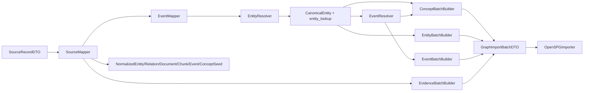

# IncCore 融合 Pipeline：从原始数据到图谱的构建过程说明

## 1. 这份文档解决什么问题

这份文档用于解释当前 `IncCore` 融合 pipeline 是如何把原始数据一步步处理成图谱节点和边，并最终写入 OpenSPG / Neo4j 的。

重点回答 4 个问题：

1. 这条 pipeline 的输入到底是什么。
2. 它从原始数据里“抽取”了哪些信息。
3. 它是如何把这些信息组织成实体、关系、概念、事件的。
4. 它最后是如何把这些数据写成图谱的。

相关入口与代码：

- 运行入口：[run_incore_fusion_pipeline.py](/Users/caixudong/Downloads/zhilian-robot/backend/scripts/run_incore_fusion_pipeline.py)
- 主流程：[fusion_pipeline_runner.py](/Users/caixudong/Downloads/zhilian-robot/backend/app/incore_fusion_pipeline/runners/fusion_pipeline_runner.py)
- 当前 schema：[IncCore.v2.schema](/Users/caixudong/Downloads/zhilian-robot/IncCore.v2.schema)
- 运行说明：[incore_fusion_pipeline.md](/Users/caixudong/Downloads/zhilian-robot/docs/runbooks/incore_fusion_pipeline.md)

## 2. 先说结论：这条 pipeline 做的不是“任意原始数据直接建图”

当前这条 `IncCore` pipeline 的定位，是**统一融合建图 pipeline**，不是“直接读取 PDF / 网页 / 原始 CSV 后自动理解一切”的总抽取器。

它更准确的工作方式是：

1. 上游先把不同来源的数据整理成统一的 `SourceRecordDTO` 记录。
2. 这条 pipeline 再把这些记录转换成：
   - 标准化实体
   - 标准化关系
   - 标准化文档 / chunk
   - 标准化事件
   - 概念 seed
3. 再做主实体对齐、区域生成、概念分类、事件绑定、证据回连。
4. 最后统一写成 OpenSPG 图谱。

也就是说，这条 pipeline 的强项是：

- 多源数据统一建模
- 实体融合
- 概念挂载
- 事件建模
- 图谱导入

而不是替代所有上游采集与基础抽取。

## 3. 输入数据长什么样

当前输入格式是统一的 `SourceRecordDTO` 外层结构，定义在 [source_dto.py](/Users/caixudong/Downloads/zhilian-robot/backend/app/incore_fusion_pipeline/dto/source_dto.py)。

每条输入至少包含：

```json
{
  "source_system": "fact_library | mongo_news | graphiti | report_pipeline",
  "source_table": "dw_company_info_tyc",
  "record_id": "91310000X",
  "record_type": "entity | relation | document | chunk | event | concept_seed",
  "payload": {}
}
```

其中 `record_type` 决定这条数据会走哪条抽取支路。

当前支持 6 类输入：

- `entity`
- `relation`
- `document`
- `chunk`
- `event`
- `concept_seed`

示例输入文件：

- [sample_records.jsonl](/Users/caixudong/Downloads/zhilian-robot/backend/app/incore_fusion_pipeline/examples/sample_records.jsonl)

## 4. “从原始数据里抽取信息”在这条 pipeline 中具体是什么意思

在这条 pipeline 里，“抽取信息”主要分成两层：

### 4.1 第一层：字段抽取

也就是把上游原始记录里的关键字段提取出来，放进标准 DTO。

例如：

- 企业记录里抽：
  - `name`
  - `credit_code`
  - `status`
  - `province / city`
  - `website`
  - `description`
  - `business_scope`
- 事件记录里抽：
  - `event_type`
  - `name`
  - `summary`
  - `subject_name`
  - `object_name`
  - `location`
  - `publish_time`
  - `trigger_terms`

### 4.2 第二层：语义抽取 / 推断

也就是在标准字段基础上继续推断：

- 这条企业属于什么分类
- 它属于什么行业
- 这个事件属于什么事件类别
- 它可能带来什么影响
- 这个地点是不是一个区域节点
- 事件里出现但实体层没显式给出的主体，要不要补成一个最小实体

这一层不是简单搬字段，而是规则化理解。

## 5. 第一阶段：SourceMapper 做标准化抽取

实现文件：

- [source_mapper.py](/Users/caixudong/Downloads/zhilian-robot/backend/app/incore_fusion_pipeline/mappers/source_mapper.py)

它的职责是把 `SourceRecordDTO` 转成内部统一的 `Normalized*DTO`。

### 5.1 如果输入是 `entity`

`SourceMapper` 会抽出：

- 主名称 `name`
- 别名 `aliases`
- 外部主键 `credit_code / code`
- 一组基础属性：
  - `status`
  - `website`
  - `description`
  - `business_scope`
  - `province`
  - `city`

最终生成 `NormalizedEntityDTO`。

### 5.2 如果输入是 `relation`

会抽出：

- 主体匹配键 `subject_key`
- 谓词 `predicate`
- 客体匹配键 `object_key`
- 关系属性 `properties`

最终生成 `NormalizedRelationDTO`。

### 5.3 如果输入是 `document`

会抽出：

- 文档标题
- 文档摘要
- 正文
- 发布时间
- URL
- 来源信息

最终生成 `NormalizedDocumentDTO`。

### 5.4 如果输入是 `chunk`

会抽出：

- 归属文档 ID
- chunk 序号
- 偏移位置
- chunk 内容

最终生成 `NormalizedChunkDTO`。

### 5.5 如果输入是 `event`

会抽出：

- 事件类型
- 事件名
- 摘要
- 主体名
- 客体名
- 地点
- 事件时间 / 发布时间
- 触发词
- 事件特有属性

例如融资事件会带：

- `financing_amount`
- `financing_round`
- `financing_purpose`

最终生成 `NormalizedEventDTO`。

### 5.6 如果输入是 `concept_seed`

会抽出：

- 概念类型
- 概念名称
- 父概念名称
- 别名
- 描述

最终生成 `NormalizedConceptSeedDTO`。

## 6. 第二阶段：EventMapper 做轻量事件补齐

实现文件：

- [event_mapper.py](/Users/caixudong/Downloads/zhilian-robot/backend/app/incore_fusion_pipeline/mappers/event_mapper.py)

这一步不是复杂推理，而是给事件补最基本的缺省值。

它当前会做：

- 如果事件没有显式分类，按事件类型补默认 `EventCategory`
  - `GovernmentPublishPolicyEvent -> 政策发布`
  - `CompanyCooperationEvent -> 企业合作`
  - `CompanyFinancingEvent -> 企业融资`
- 如果 `location_ref` 为空，但事件属性里有 `location`，补上地点引用
- 对不同事件类型修正客体类型
  - 融资事件的客体默认视为 `Organization`
- 如果没有摘要，用事件名兜底

这一步的作用是让后面的 resolver 看到的是“结构更完整的事件”。

## 7. 第三阶段：EntityResolver 做实体融合与企业分类

实现文件：

- [entity_resolver.py](/Users/caixudong/Downloads/zhilian-robot/backend/app/incore_fusion_pipeline/resolvers/entity_resolver.py)
- [conflict_resolver.py](/Users/caixudong/Downloads/zhilian-robot/backend/app/incore_fusion_pipeline/resolvers/conflict_resolver.py)
- [company_classifier.py](/Users/caixudong/Downloads/zhilian-robot/backend/app/incore_fusion_pipeline/taxonomy/company_classifier.py)

这一阶段是整条 pipeline 最核心的一步。

### 7.1 主实体对齐

不同来源里，同一个企业可能会出现多次。`EntityResolver` 会先给实体生成稳定 `graph_id`。

对企业来说，主键优先级是：

1. `credit_code`
2. `code`
3. 企业名称

所以一个企业最终会被合并到类似这样的图主键上：

```text
Company:91310000X
```

### 7.2 构建弱匹配索引

为了让事件、关系能回连到实体，`EntityResolver` 还会生成 lookup key。

例如企业会同时保留：

- 全名
- 别名
- 标准名
- 统一代码
- 弱化后的核心名

这里用到的名称标准化逻辑在：

- [normalization.py](/Users/caixudong/Downloads/zhilian-robot/backend/app/incore_fusion_pipeline/utils/normalization.py)

### 7.3 多源属性冲突消解

如果同一个实体有多个来源，属性值可能冲突。

当前策略是：

- 按来源权威性排序
- 权威性高的值优先保留
- 同时保留冲突审计记录

来源权威性当前大致是：

- `fact_library` 最高
- `report_pipeline / report_extract` 次之
- `graphiti / mongo_news / media_extract` 再次之

### 7.4 从事件反向补最小实体

如果事件里出现了主体或客体，但结构化实体层没有显式提供该实体，resolver 会先补一个最小实体，使事件能落图。

例如融资新闻只给了：

- 主体企业名
- 投资机构名

那 resolver 会先临时生成：

- 一个 `Company`
- 一个 `Organization`

然后再继续建图。

### 7.5 区域实体生成

对企业里的 `province / city`，resolver 会自动生成 `Region` 节点，并附带：

- `RegionCategory`
  - `省级行政区`
  - `地市级行政区`

### 7.6 企业分类与行业分类

这是当前新增强的一部分。

企业在 resolver 阶段会基于：

- 企业名称
- 经营范围 `business_scope`
- 企业简介 `description`

自动推断：

- `CompanyCategory`
- `IndustrySector`

例如会生成：

- `科技企业`
- `软件信息企业`
- `高端装备企业`
- `工程建设企业`
- `企业服务企业`

以及：

- `电子信息`
- `高端装备`
- `建筑建材`
- `现代服务`

这些推断结果会先存到 `concept_bindings`，后续交给概念层 builder 落图。

## 8. 第四阶段：EventResolver 做事件对齐与事件概念抽取

实现文件：

- [event_resolver.py](/Users/caixudong/Downloads/zhilian-robot/backend/app/incore_fusion_pipeline/resolvers/event_resolver.py)

这一步主要解决 4 件事。

### 8.1 事件主体 / 客体 / 地点解析

事件里原本只是名字：

- `subject_name`
- `object_name`
- `location`

resolver 会用前面实体阶段生成的 lookup 去找对应的图节点 ID。

例如：

- 企业名对齐到 `Company:91310000X`
- 地点对齐到 `Region:上海`

### 8.2 生成稳定事件 ID

事件图 ID 会综合：

- 事件类型
- 主体
- 客体
- 时间
- 地点

这样同一类事件重复导入时更容易做幂等。

### 8.3 事件概念抽取 / 继承

事件当前主要会挂 3 类概念：

- `EventCategory`
- `ImpactCategory`
- `IndustrySector`

其中：

- `EventCategory` 主要来自事件类型或输入字段
- `ImpactCategory` 主要根据事件名、摘要、触发词里的关键词推断
- `IndustrySector` 可从主体或客体实体继承

例如：

- 含“融资、领投、跟投”会倾向命中 `资本支持`
- 含“合作、签约、共建”会倾向命中 `产业协同`

### 8.4 事件证据绑定

事件会保留：

- 来源文档 ID
- 来源 chunk ID

为后面的 `Document / Chunk` 回连做准备。

## 9. 第五阶段：ConceptMapper 把分类结果变成概念图

实现文件：

- [concept_mapper.py](/Users/caixudong/Downloads/zhilian-robot/backend/app/incore_fusion_pipeline/mappers/concept_mapper.py)

这一步会把前面得到的概念 seed 和实例 / 事件上的概念绑定，真正变成概念节点和概念边。

### 9.1 概念节点生成

会生成：

- `CompanyCategory`
- `IndustrySector`
- `OrganizationCategory`
- `PersonCategory`
- `RegionCategory`
- `EventCategory`
- `ImpactCategory`

### 9.2 概念层级生成

通过默认父类映射，自动补 `isA` 关系。

例如：

- `科技企业 -> 科技创新企业 -> 企业分类`
- `商贸企业 -> 商贸流通企业 -> 企业分类`
- `高端装备 -> 制造业`

### 9.3 实例 / 事件到概念的绑定边

根据来源类型不同，会生成不同谓词：

- 企业到企业分类：`category`
- 企业到行业：`industry`
- 事件到影响概念：`impactCategory`
- 事件到行业：`relatedIndustry`

也就是说，概念层不是单独存着，而是会和实例层、事件层连起来。

## 10. 第六阶段：Builder 把数据拼成图节点和边

这一步的目标是把各种 canonical DTO 变成统一的 `GraphNodeUpsertDTO / GraphEdgeUpsertDTO`。

### 10.1 实体 builder

实现文件：

- [entity_batch_builder.py](/Users/caixudong/Downloads/zhilian-robot/backend/app/incore_fusion_pipeline/builders/entity_batch_builder.py)

它会做两件事：

- 把 canonical entity 变成实体节点
- 把 `relation` 记录解析成边

此外它还会自动补：

- `Company -> region -> Region`

### 10.2 事件 builder

实现文件：

- [event_batch_builder.py](/Users/caixudong/Downloads/zhilian-robot/backend/app/incore_fusion_pipeline/builders/event_batch_builder.py)

它会生成：

- 事件节点
- `subject` 边
- `object` / `relatedActor` 边
- `location` 边
- `category` 边
- `impactCategory` 边
- `relatedIndustry` 边

### 10.3 证据 builder

实现文件：

- [evidence_batch_builder.py](/Users/caixudong/Downloads/zhilian-robot/backend/app/incore_fusion_pipeline/builders/evidence_batch_builder.py)

它会生成：

- `Document` 节点
- `Chunk` 节点
- `Chunk -> source -> Document`
- `Event -> mentionedIn -> Document`
- `Event -> evidenceChunk -> Chunk`

## 11. 第七阶段：Runner 汇总整批图数据

实现文件：

- [fusion_pipeline_runner.py](/Users/caixudong/Downloads/zhilian-robot/backend/app/incore_fusion_pipeline/runners/fusion_pipeline_runner.py)

它串起整个流程：



最后 runner 会把所有节点和边合并成一个 `GraphImportBatchDTO`，再交给 importer。

## 12. 第八阶段：Importer 把图写进 OpenSPG

实现文件：

- [openspg_importer.py](/Users/caixudong/Downloads/zhilian-robot/backend/app/incore_fusion_pipeline/importers/openspg_importer.py)

它会做：

- 给类型自动补 namespace
  - 例如 `Company -> IncCore.Company`
- 把节点按类型分组
- 把边按 `(srcType, predicate, dstType)` 分组
- 去重
- 分批提交

实际使用的 OpenSPG 接口是：

- `/public/v1/graph/upsertVertex`
- `/public/v1/graph/upsertEdge`

所以这条 pipeline 最终不是生成本地静态文件，而是**直接写入 OpenSPG / Neo4j 图库**。

## 13. 最终写出来的图里有什么

当前图谱主要分 4 层：

### 13.1 实例层

- `Company`
- `Organization`
- `Person`
- `Region`
- `Technology`
- `ProductObject`

### 13.2 概念层

- `CompanyCategory`
- `IndustrySector`
- `RegionCategory`
- `EventCategory`
- `ImpactCategory`

### 13.3 事件层

- `Event`
- `CompanyFinancingEvent`
- `CompanyCooperationEvent`
- `GovernmentPublishPolicyEvent`

### 13.4 证据层

- `Document`
- `Chunk`
- `DataSource`

这些类型定义在：

- [IncCore.v2.schema](/Users/caixudong/Downloads/zhilian-robot/IncCore.v2.schema)

## 14. 一个最小例子：一条融资新闻是怎么进图的

假设原始事件记录里有：

- 事件类型：`CompanyFinancingEvent`
- 主体：`上海某某机器人科技有限公司`
- 客体：`某产业基金`
- 地点：`上海`
- 触发词：`融资`

这条数据进入 pipeline 后，会依次变成：

1. `SourceMapper` 抽出事件字段  
2. `EventMapper` 补上 `EventCategory=企业融资`  
3. `EntityResolver` 找到或补出：
   - `Company`
   - `Organization`
   - `Region`
4. `EntityResolver` 给企业补概念：
   - `CompanyCategory=科技企业 / 高端装备企业`
   - `IndustrySector=高端装备`
5. `EventResolver` 给事件补概念：
   - `ImpactCategory=资本支持`
   - `IndustrySector=高端装备`
6. `ConceptMapper` 生成概念节点与 `isA` 关系  
7. `EventBatchBuilder` 生成：
   - `event -> subject -> company`
   - `event -> object -> organization`
   - `event -> location -> region`
   - `event -> impactCategory -> 资本支持`
   - `event -> relatedIndustry -> 高端装备`
8. `Importer` 把它们全部写入 OpenSPG

## 15. 当前这条 pipeline 的边界

当前要特别注意 3 点：

### 15.1 它不是万能原始数据解析器

它要求上游已经把数据封装成 `SourceRecordDTO`，并按 `record_type` 区分好。

### 15.2 它现在主要依赖规则

当前企业分类、行业分类、事件影响分类仍主要依赖规则和关键词，还没有全面引入模型推断。

### 15.3 它现在已经能建图，但还不是最终生产版

当前更像“第一版可用融合链路”，已经能做到：

- 实体融合
- 概念挂载
- 事件建模
- 证据回连
- OpenSPG 写图

但还可以继续增强：

- 更强别名消歧
- 更细的概念层
- 更完整的事件抽取
- 更稳定的事实层导入适配器

## 16. 如果你要复现这条 pipeline

运行说明见：

- [incore_fusion_pipeline.md](/Users/caixudong/Downloads/zhilian-robot/docs/runbooks/incore_fusion_pipeline.md)

最小命令：

```bash
PYTHONPATH=/Users/caixudong/Downloads/zhilian-robot/backend \
/Users/caixudong/Downloads/zhilian-robot/.venv-kag/bin/python \
/Users/caixudong/Downloads/zhilian-robot/backend/scripts/run_incore_fusion_pipeline.py \
  --input /Users/caixudong/Downloads/zhilian-robot/backend/app/incore_fusion_pipeline/examples/sample_records.jsonl \
  --project IncCore \
  --namespace IncCore \
  --project-id 3 \
  --batch-id incore_cli_live \
  --live
```

## 17. 一句话总结

这条 pipeline 的本质是：

**先把多源原始数据统一抽成标准记录，再做实体对齐、概念分类、事件融合和证据绑定，最后统一写成 `IncCore` 大图。**
