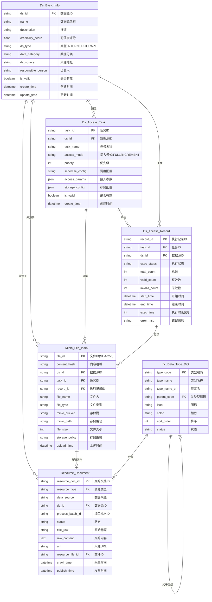
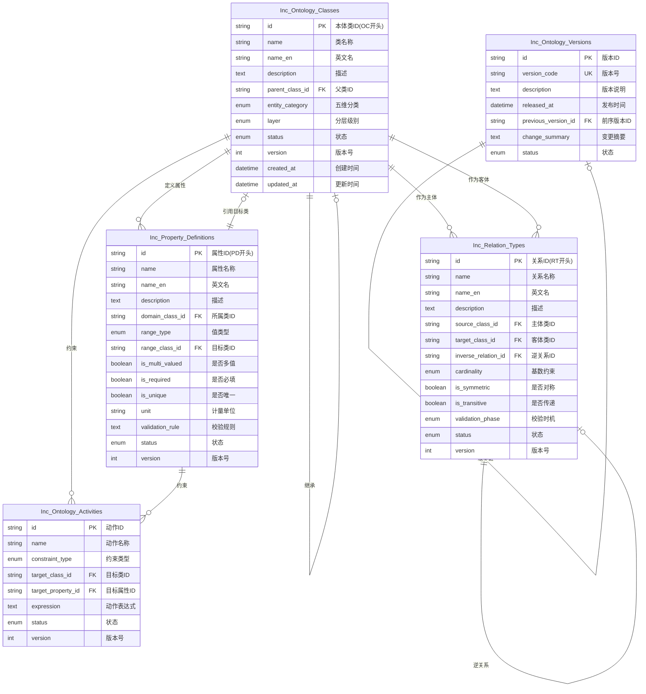
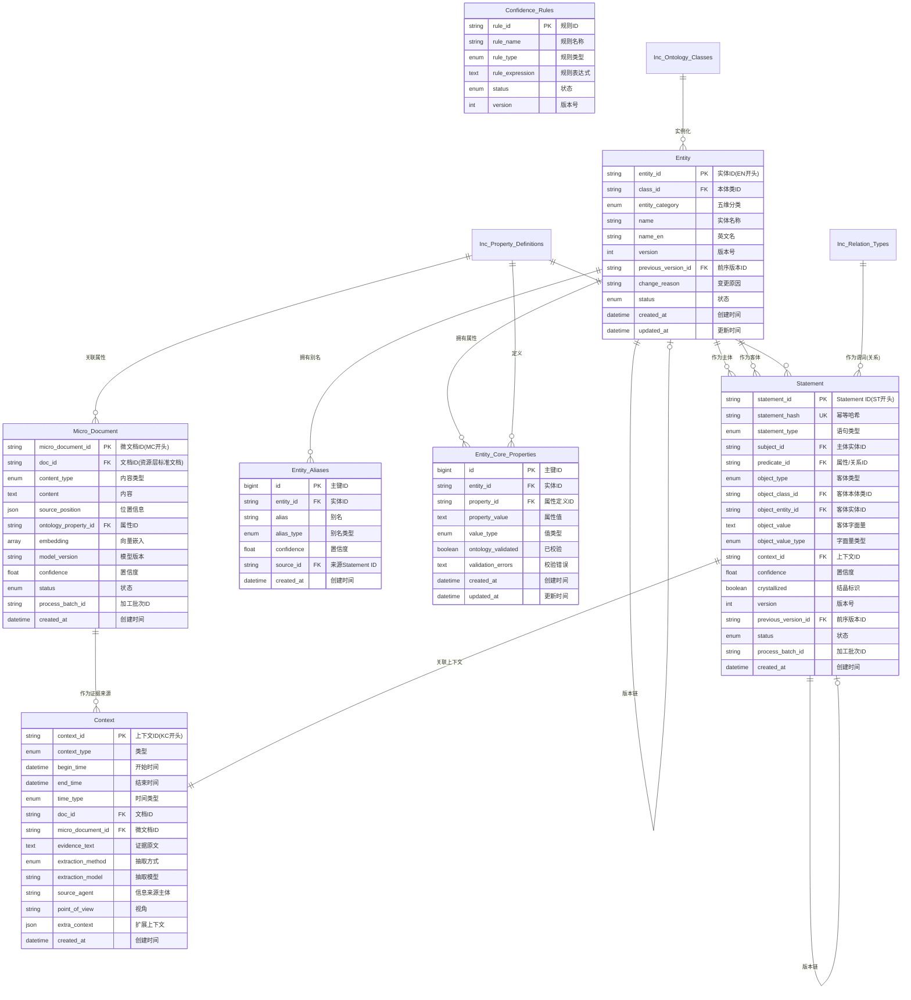
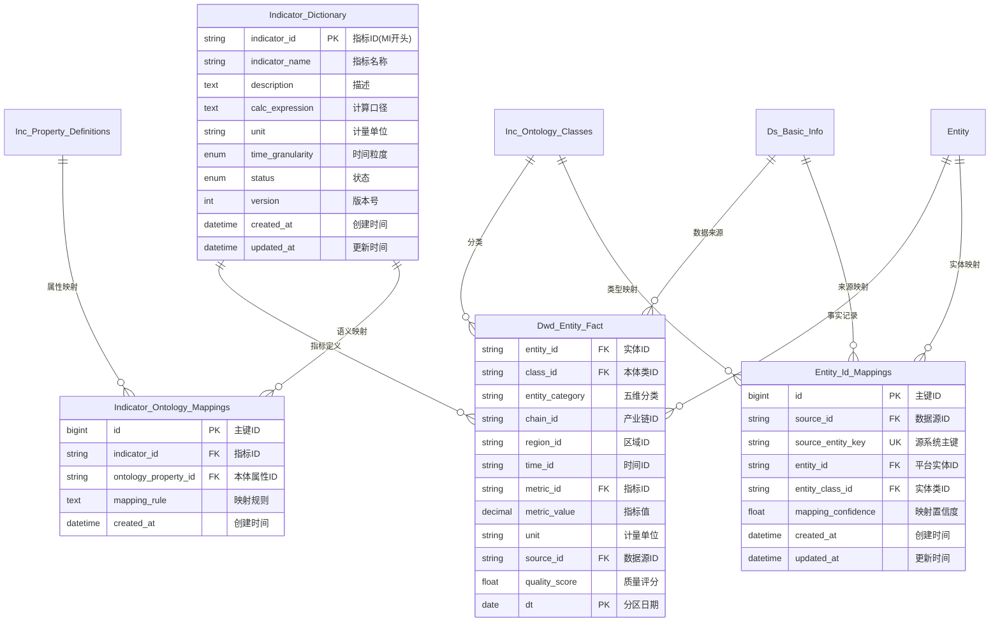
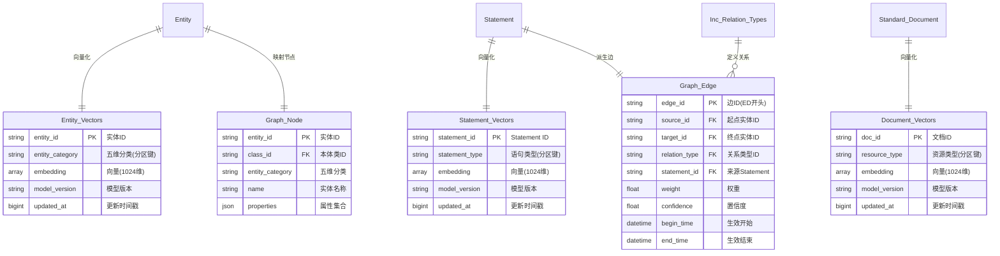
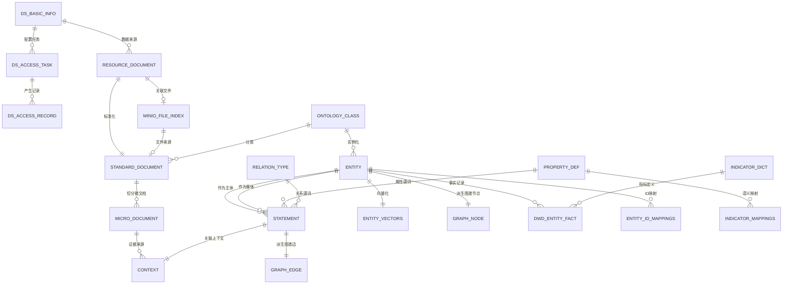

# 产业网链数据海平台 ER 图

> 本文档使用 Mermaid erDiagram 语法描述平台各层表间关系，可在支持 Mermaid 的 Markdown 编辑器中渲染。

---

## 1. 数据资源层 ER 图



---

## 2. 本体模型 ER 图



---

## 3. 知识网络 ER 图（5大核心）



---

## 4. 主题数仓 ER 图



---

## 5. 向量库与图谱库 ER 图



---

## 6. 全局表间关系总览



---

## 图例说明

|      符号      |        含义        |
|--------------|------------------|
| `\|\|--\|\|` | 一对一关系            |
| `\|\|--o{`   | 一对多关系            |
| `o{--o{`     | 多对多关系            |
| `\|\|--o\|`  | 一对零或一关系          |
| `PK`         | 主键 (Primary Key) |
| `FK`         | 外键 (Foreign Key) |
| `UK`         | 唯一键 (Unique Key) |

---

## 核心数据流向

```
数据采集 → 资源层(贴源存储) → 标准化文档 → 微文档切分
                                    ↓
                          知识网络(Entity/Statement/Context)
                                    ↓
              ┌─────────────────────┼─────────────────────┐
              ↓                     ↓                     ↓
         图谱库(Neo4j)         向量库(Milvus)         主题数仓(Doris)
              ↓                     ↓                     ↓
              └─────────────────────┼─────────────────────┘
                                    ↓
                            数据服务层(ES/Redis/API)
```

