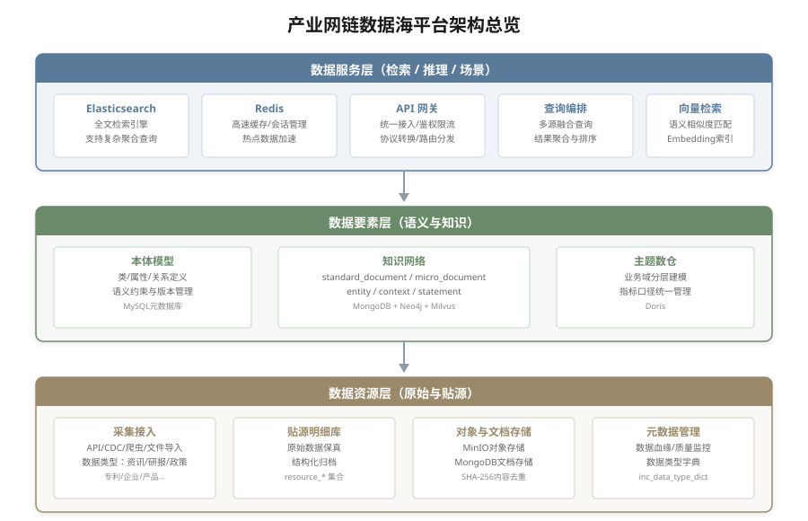
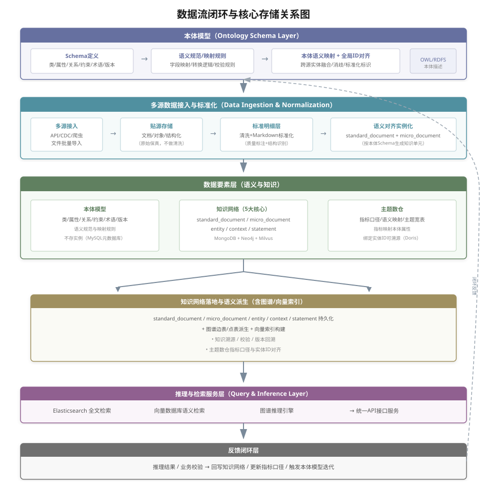

# 产业网链数据海平台架构设计文档

## 1. 设计目标与范围

### 1.1 设计目标

围绕产业网链“规范-实例-分析”的三位一体闭环，构建可落地的三层平台架构：

- 明确三库边界与职责：本体模型（规范层）/知识网络（实例层）/主题数仓（分析层）协同但不混存；
- 坚持本体先行：先定义语义规范与约束，再实例化沉淀，最后按语义映射加工分析，形成规范→实例→分析闭环；
- 三个统一：统一ID体系、统一语义标准、统一同步机制，确保跨库可溯源与一致性；
- 兼容既有主题数仓：最小改造接入，完成指标口径与本体属性对齐；
- 轻量闭环优先：先保证检索/推理/分析最小可用，提供清晰的迭代升级路径。

### 1.2 适用范围

- AI+产业经济领域数据集建设
- 产业知识服务与产业决策支撑
- 数仓/图谱/知识库一体化平台落地

---

## 2. 总体架构与数据流

### 2.1 架构总览



```
┌──────────────────────────────────────────────────────────────┐
│                    数据服务层（检索/推理/场景）                │
│ ES / Redis / API网关 / 查询编排 / 向量检索                     │
└──────────────────────────────────────────────────────────────┘
                          ▲
                          │
┌──────────────────────────────────────────────────────────────┐
│                    数据要素层（语义与知识）                    │
│ 本体模型 / 知识网络（含图谱/向量索引） / 主题数仓                     │
└──────────────────────────────────────────────────────────────┘
                          ▲
                          │
┌──────────────────────────────────────────────────────────────┐
│                     数据资源层（原始与贴源）                  │
│ 采集接入 / 贴源明细 / 对象与文档存储 / 元数据管理             │
└──────────────────────────────────────────────────────────────┘
```

### 2.1.1 数据流闭环与核心存储关系图



```
┌─────────────────────────────────────────────────────────────────────────────────────────────────────────────┐
│ 本体模型（类/属性/关系/约束/术语/版本）→ 语义规范/映射规则 → 本体语义映射+全局ID对齐                            │
└─────────────────────────────────────────────────────────────────────────────────────────────────────────────┘
                                  │
                                  ▼
┌─────────────────────────────────────────────────────────────────────────────────────────────────────────────┐
│ 多源接入 → 文档/对象/结构化贴源库 → 标准明细宽表/文档集合 → 实例化(Entity)+Statement(含证据/来源)+Context │
│        (原始保真)             (标准明细)                      (语义对齐)                                      │
└─────────────────────────────────────────────────────────────────────────────────────────────────────────────┘
                                  │
                                  ▼
┌─────────────────────────────────────────────────────────────────────────────────────────────────────────────┐
│ 数据要素层（知识网络 / 实例知识库承载）                                                                        │
│ - Entity：实体主表                                                                                             │
│ - Statement：事实/关系/属性/约束（关联Context，含证据/来源）                                                   │
│ - 图谱/向量索引：由 Statement 派生（知识网络索引层）                                                            │
└─────────────────────────────────────────────────────────────────────────────────────────────────────────────┘
                                  │
                                  ▼
┌──────────────────────────────────────────┐
│ 知识网络（实例知识库承载）               │
│ 知识沉淀，支撑溯源与校验（Context独立，含图谱/向量索引）│
└──────────────────────────────────────────┘
                                  │
                                  ▼
┌─────────────────────────────────────────────────────────────────────────────────────────────────────────────┐
│ 推理与检索服务：ES/向量检索/图谱推理 → 场景输出                                                                │
└─────────────────────────────────────────────────────────────────────────────────────────────────────────────┘
                                  │
                                  ▼
┌─────────────────────────────────────────────────────────────────────────────────────────────────────────────┐
│ 反馈闭环：推理结果与业务校验回写知识网络/指标口径                                                              │
└─────────────────────────────────────────────────────────────────────────────────────────────────────────────┘
```

### 2.2 三库关系说明（规范-实例-分析闭环）

- **本体模型（规范层）**：系统"设计图纸/宪法"，存储领域本体概念模型（TBox），定义结构、词汇与规则；采用 MySQL 元数据库，可服务化对外提供语义规范与映射规则；
- **知识网络（实例层）**：系统"运行数据/事实记录"，依据本体模型存储具体实体与事实（ABox）；以 Entity/Statement/Context（关联）表达产业实例知识与语义关联；Statement 使用自增ID+幂等hash，证据/来源信息内聚，承载溯源与校验，并派生图谱/向量索引；
- **主题数仓（分析层）**：存主题化结构化指标与维度，指标口径映射本体属性，并绑定知识库实例ID以便溯源；需显式建设指标口径与映射表（如 `indicator_dictionary` / `indicator_ontology_mappings` / `entity_id_mappings`）作为知识网络到数仓的语义桥接层。
- **正向链路**：本体模型定义语义规范 → 知识网络实例化沉淀 → 主题数仓按语义映射加工与分析；
- **反向链路**：主题数仓分析发现新规律 → 审核后回写知识网络 → 触发本体模型迭代与版本发布；
- **三层映射**：三库逻辑上位于数据要素层，与数据资源层的贴源数据、数据服务层的检索/推理/分析联动。

### 2.2.1 定位说明/层级映射

- **逻辑定位**：本体模型、知识网络、主题数仓三库均属于数据要素层的"语义与知识载体"，不与数据资源层或数据服务层并列；
- **数据资源层关系**：资源层提供贴源数据与标准明细，作为三库实例化与指标加工的输入来源；
- **数据服务层关系**：服务层统一编排检索/推理/分析能力，对三库提供的语义、实例与指标进行消费与输出。

### 2.2.2 核心定义与关键区分（实操指导）

**本体模型（ontology_schema_registry）**
- 存储内容：领域概念/关系词汇表、概念层级/逻辑关系、公理与约束（TBox）。
- 数据性质：低频变化、稳定、规模小；面向建模专家与标准制定。
- 核心操作：建模、版本控制、发布/回滚、校验与映射规则生成。

**知识网络（knowledge_network）**
- 存储内容：标准化文档、微内容、具体实体、事实三元组/Statement、带上下文的动态记录（ABox）。
- 数据性质：高频变化、规模大；面向业务应用与分析。
- 核心操作：高吞吐写入、幂等插入、溯源查询、图谱/向量派生索引。

**关键区分**
- 变化频率：本体模型低频、知识网络高频。
- 规模：本体模型小、知识网络大。
- 使用者：本体模型面向领域专家，知识网络面向业务与应用系统。
- 目标：本体模型保证语义一致性，知识网络保证事实可追溯与可计算。

**设计建议**
- 本体模型建议命名 `ontology_schema_registry`，支持版本控制；可存储 OWL/RDF 文件或支持版本的元数据库（含本体ID、类/属性URI、版本号等关键字段）。
- 知识网络建议命名 `knowledge_network`，采用 MongoDB + Neo4j 混合存储；实例需关联本体模型类/属性URI，可按领域/时间分区提升性能。

### 2.3 数据流闭环

- 原始保真：多源接入后进入文档/对象/结构化贴源库；
- 标准明细：形成可治理的宽表/文档集合；
- 语义对齐：本体模型驱动映射与全局ID对齐，生成 Entity/Statement/Context 并进入知识网络；
- 知识沉淀：知识网络沉淀实例与关系，并派生图谱/向量索引；
- 推理与检索：ES/向量检索与图谱推理服务面向场景输出；
- 反馈闭环：推理结果和业务校验回写知识库/指标口径。

### 2.4 与既有主题数仓兼容策略

- **不改造既有DWD/ADS结构**：现有数仓继续作为业务底座；
- **新增“语义对齐层”**：
  - 指标口径字典与本体模型属性一一映射；
  - 维度与知识网络实体全局ID绑定；
  - 质量规则（完整性、唯一性、口径一致性）与指标聚合联动，并记录本体版本。
- **落地方式**：通过视图或同步任务将DWD明细拉入语义对齐流程，ADS按本体指标定义校验与落地，并保留实例ID用于溯源。

### 2.5 基于 OpenSPG 的 SPG 化升级方案（分阶段）

> 设计结论：不建议重写 OpenSPG；建议采用“OpenSPG 独立部署 + 当前平台适配接入”的方式，以低侵入改造获得语义治理、推理和演进能力。

#### 2.5.1 架构定位与能力边界

- **OpenSPG 作为语义控制平面**：承载 Schema（本体/谓词/约束）、任务编排（Controller）、规则与推理运行时。
- **现有数据海作为数据执行平面**：继续承载资源接入、知识存储、索引检索和业务服务编排。
- **适配层解耦**：通过 `SPG Adapter` 对接 OpenSPG 能力，避免业务服务直接依赖 OpenSPG 内部模型。

#### 2.5.2 与白皮书能力的分层映射

|    OpenSPG 分层     |   数据海对应层    |               本次改造重点                |
|-------------------|-------------|-------------------------------------|
| Schema Layer      | 本体模型（规范层）   | 增加标准类型、谓词、约束、事件类型和规则定义              |
| Engine Layer      | 知识网络/索引构建链路 | 增加 Translator/Builder/Executor 适配接口 |
| Controller Layer  | 数据服务层编排     | 增加任务解析、执行计划、运行追踪                    |
| Programming Layer | 语义映射与规则 DSL | 映射规则统一注册、版本化、可回放                    |
| LLM Layer         | 语义问答与检索增强   | 将规则推理结果回流检索与问答链路                    |

#### 2.5.3 一阶段（映射兼容）落地

- **目标**：先把现有库表“映射到 SPG 语义模型”，不大改现网数据结构。
- **策略**：
  - 保持 `Entity/Statement/Context` 作为事实主存；
  - 新增映射规则与语义元数据表，把“字段语义”显式化；
  - 通过离线/准实时任务，生成可被 OpenSPG 理解的 Schema 与事实增量。
- **收益**：最小改造成本接入 OpenSPG 的约束校验、任务编排和基础推理能力。

#### 2.5.4 二阶段（语义原生）落地

- **目标**：从“映射兼容”升级到“语义原生驱动”，让知识生产与服务查询都由语义层主导。
- **策略**：
  - 引入规则绑定与算子注册，统一推理执行入口；
  - 以任务计划/运行实例驱动数据构建与索引更新；
  - 对关系、事件、约束采用 SPG 原生表达并持续演进（Evolving + Reasoning）。
- **收益**：实现跨源语义一致性、可解释推理链路、规则可演化治理。

#### 2.5.5 推荐部署与调用模式

- **部署模式**：OpenSPG 独立服务部署（容器化），当前平台通过内网 API 调用。
- **调用路径**：
  - `Schema 同步`：平台本体管理发布版本 -> OpenSPG Schema Registry；
  - `事实构建`：平台构建任务输出 Entity/Statement/Context -> OpenSPG Builder；
  - `语义查询/推理`：业务查询 -> 平台查询编排 -> OpenSPG Controller -> 图/向量/检索执行器；
  - `结果回流`：推理结论与证据回写知识网络与数仓语义对齐层。

---

## 3. 分层设计与核心职责

### 3.1 数据资源层（原始与贴源）

- 多源接入：批量离线、实时CDC、API/SDK、流式IoT；
- **数据源管理**：`ds_basic_info / ds_access_task / ds_access_record` 管理数据源登记、接入任务配置与执行记录，支撑质量统计与溯源；
- **数据类型管理**：`inc_data_type_dict` 定义平台支持的数据类型分类（资讯/研报/政策/专利/企业信息/产品等），支撑前端数据类型分布统计展示；
- 贴源明细：以五维核心类为参照，形成"原始字段+标准字段+治理状态"的明细层；
- 元数据管理：记录来源、处理链路、状态、口径与质量评分；
- 轻量治理：字段规范、时空标准化、唯一性/完整性校验。

补充说明：
- **统一入口**：资源层标准入口集合为 `resource_<资源类型>_<数据来源>`，ODS 主题集合（如 `ods_news / wechat_news`）可选用于贴源明细或业务侧落库；
- **文件索引**：MinIO 文件资源通过 `minio_file_index` 建立索引，与 `resource_*.metadata` 关联；
- **数据模型与ID设计**：统一前缀ID体系（DS/EN/ST等）；`minio_file_index.file_id` 采用文件内容哈希（SHA-256）作为全局唯一ID，跨数据源同内容只存一份对象；`source_refs` 记录多来源采集轨迹；如需保留重复副本，可配置 `storage_policy=keep` 并通过 `content_hash` 做后续去重聚合。
- **任务追溯**：`ds_id / task_id / record_id / process_batch_id` 贯穿资源层与要素层，实现接入与落库全链路追溯。

### 3.1.1 文档标准化转换规范

> 说明：标准化文档（standard_document）的 `standard_content` 字段统一采用 Markdown 格式存储，以下定义各类型原始文档转换为 Markdown 的规范。

#### 转换规则总览

|     原始格式     |          转换工具/方法          |                   转换要点                    |
|--------------|---------------------------|-------------------------------------------|
| PDF          | pdfplumber / PyMuPDF      | 文本提取 → 段落识别 → 标题层级重建 → Markdown 结构化       |
| HTML         | BeautifulSoup + html2text | 去噪（广告/导航/侧边栏） → 正文提取 → 保留语义标签转 Markdown   |
| Word (.docx) | python-docx               | 解析文档结构 → 保留标题层级/列表/表格 → 转 Markdown        |
| 扫描件/图片       | OCR (PaddleOCR/Tesseract) | 图像预处理 → OCR识别 → 版面分析 → 段落/表格重建 → Markdown |
| 纯文本          | 直接处理                      | 段落分割 → 标题识别（规则/模型） → Markdown 格式化         |

#### Markdown 格式规范

```markdown
# 文档标题（一级标题，全文唯一）

## 摘要（可选）
文档核心摘要内容...

## 正文章节标题
正文段落内容...

### 子章节标题
子章节内容...

## 表格示例
| 列1 | 列2 | 列3 |
| --- | --- | --- |
| 数据1 | 数据2 | 数据3 |

## 图片引用

```

**格式约定**：
- 一级标题 `#`：文档标题，全文唯一
- 二级标题 `##`：主要章节（摘要/正文/结论/附录等）
- 三级及以下 `###`：子章节
- 表格：使用 GFM（GitHub Flavored Markdown）表格语法
- 图片：引用 MinIO 路径，格式 ``
- 代码块：使用三反引号包裹，标注语言类型
- 列表：使用 `-` 或 `1.` 标记

#### 转换质量指标

|  指标   |     说明      |  阈值  |
|-------|-------------|------|
| 结构完整性 | 标题层级是否正确识别  | ≥90% |
| 内容准确性 | 文本内容是否与原文一致 | ≥98% |
| 表格还原率 | 表格结构是否正确还原  | ≥85% |
| 图片关联率 | 图片是否正确提取并关联 | ≥95% |

### 3.1.2 典型数据类型处理要点

> 说明：不同类型的数据在采集、清洗、标准化、知识抽取各环节有不同的处理重点，以下为各类型的处理要点指南。

#### 3.1.2.1 资讯类（News）

|   处理环节   |                          要点说明                          |
|----------|--------------------------------------------------------|
| **采集**   | URL+标题哈希去重；增量时间戳控制；反爬策略（代理池/频率控制）；RSS/API优先            |
| **清洗**   | 去除广告、推荐、评论、导航等噪声；正文提取（readability/trafilatura算法）；编码统一  |
| **标准化**  | 核心字段：标题/摘要/正文/发布时间/来源/作者；时间格式统一（ISO8601）；来源URL规范化      |
| **知识抽取** | 事件抽取（时间/地点/主体/客体/触发词）；命名实体识别（企业/人物/产品）；情感倾向分析；关键词/标签提取 |
| **质量重点** | 时效性（发布时间准确性）；正文完整性；来源可信度评分                             |

#### 3.1.2.2 研报类（Report）

|   处理环节   |                        要点说明                        |
|----------|----------------------------------------------------|
| **采集**   | PDF下载与版本管理；机构来源标识（券商/咨询公司）；付费/免费区分；定期更新检测          |
| **清洗**   | 页眉页脚去除；目录识别与分离；图表分离（图片提取+表格OCR）；水印处理；多栏版面处理        |
| **标准化**  | 核心字段：标题/机构/分析师/发布日期/行业分类/摘要/核心观点/投资建议/风险提示/数据表格    |
| **知识抽取** | 行业判断与趋势预测；个股/公司推荐（买入/持有/卖出）；指标预测值（营收/利润/PE等）；产业链分析 |
| **质量重点** | 机构权威性；数据表格准确性；观点与结论一致性                             |

#### 3.1.2.3 政策类（Policy）

|   处理环节   |                      要点说明                       |
|----------|-------------------------------------------------|
| **采集**   | 官网定向采集（政府门户/部委网站）；文号识别；层级标识（国家/省/市/区）；附件下载      |
| **清洗**   | 附件分离（PDF/Word）；条款结构化（章/节/条/款）；签发信息提取            |
| **标准化**  | 核心字段：文号/标题/发文机关/发文日期/生效日期/失效日期/适用范围/条款列表/附件列表   |
| **知识抽取** | 政策要点提取；扶持对象识别（行业/企业类型）；补贴金额/税收优惠；申报条件与时限；关联政策引用 |
| **质量重点** | 文号准确性；生效/失效时间；条款结构完整性                           |

#### 3.1.2.4 专利类（Patent）

|   处理环节   |                      要点说明                       |
|----------|-------------------------------------------------|
| **采集**   | 专利局API接入（国知局/USPTO/EPO）；IPC分类码解析；法律状态同步         |
| **清洗**   | 权利要求解析（独立/从属）；说明书结构化；附图提取与关联                    |
| **标准化**  | 核心字段：专利号/申请号/申请日/公开日/申请人/发明人/IPC分类/摘要/权利要求/法律状态 |
| **知识抽取** | 技术领域分类；创新点识别；引用/被引用关系；专利族关联；技术路线图构建             |
| **质量重点** | 专利号格式校验；法律状态准确性；权利要求层级                          |

#### 3.1.2.5 企业信息类（Company）

|   处理环节   |                         要点说明                          |
|----------|-------------------------------------------------------|
| **采集**   | 工商API接入（企查查/天眼查/国家企业信用信息公示）；定期增量更新；历史变更记录             |
| **清洗**   | 多源数据融合；名称标准化（简称/曾用名/英文名对齐）；地址标准化（省市区拆分）               |
| **标准化**  | 核心字段：统一社会信用代码/企业名称/法定代表人/注册资本/成立日期/经营范围/地址/行业分类/股东/高管 |
| **知识抽取** | 股权关系图谱；供应链关系；投融资事件；人物任职关系；关联企业网络                      |
| **质量重点** | 统一社会信用代码唯一性；工商信息时效性；多源一致性校验                           |

#### 3.1.2.6 产品类（Product）

|   处理环节   |                    要点说明                     |
|----------|---------------------------------------------|
| **采集**   | 电商平台/官网/行业数据库；SKU标识；价格历史；规格参数               |
| **清洗**   | 产品名称标准化；规格参数结构化；图片去水印与压缩                    |
| **标准化**  | 核心字段：产品名称/品牌/型号/规格参数/价格/生产商/产品分类/上市时间/产品图片  |
| **知识抽取** | 产品-企业关系；产品-技术关系；竞品分析；产业链定位（上游原材料/中游制造/下游应用） |
| **质量重点** | 规格参数完整性；价格数据时效性；分类准确性                       |

### 3.2 数据要素层（Entity / Statement / Context）

- **数据要素层承载三库语义与实例核心**：由本体模型、知识网络、主题数仓三部分构成；知识网络是结构化组织与推理索引层，承接实体-关系-证据的可计算表达；
- **知识网络内部模型**：micro_document（微文档）、entity（实体）、context（上下文）、statement（事实三元组）四大核心组成；Statement 通过 `context_id` 关联 Context，使用 `statement_id` 作为全局唯一标识；standard_document（标准文档）归属数据资源层作为标准化入口；
- **知识网络选型**：当前采用 MongoDB + Neo4j，未来演进 HBase + GalaxyBase；支持幂等写入与高吞吐；
- **主题数仓（宽表）与知识网络派生索引**：由知识网络实例与语义对齐结果驱动落地。

**实施常见问题与风险**

- **实体消歧与ID对齐**：同名不同实体、跨源合并冲突，需要规则+模型+人工审核闭环；
- **Statement 膨胀**：属性/关系全面实体化导致体量快速增长，需要冷热分层与归档策略；
- **时空/版本冲突**：同一事实随时间变化，Context 表需规范化与版本化；
- **口径一致性**：数仓指标与本体属性不一致，需要语义映射层与版本记录；
- **跨库一致性**：知识网络、索引、数仓同步时序不一致，需要增量同步与幂等写入；
- **质量与可信度**：多源证据矛盾，需要置信度、来源权重与审核流。

#### 3.2.1 关键表定义（输入 / 输出）

- **本体模型（规范表）**
  - 输入：本体定义、术语/计量单位、约束、版本信息
  - 输出：类/属性/关系/约束、语义映射规则、版本元数据
- **知识网络（micro_document/entity/context/statement）**
  - 输入：贴源库、标准明细、语义映射、全局ID对齐结果
  - 输出：标准化文档、微内容、实例知识、关系、校验结果、溯源链路
- **主题数仓（宽表）**
  - 输入：标准明细宽表、指标口径字典、知识库实例ID
  - 输出：治理后宽表、统一口径指标、主题维度主表
- **图谱表**
  - 输入：Statement（核心关系）、实体ID、对齐规则
  - 输出：图谱边表/点表、推理可用关系集合

> 语义映射与实例化在要素层承担"语义翻译器"的角色：在本体模型规范驱动下，将贴源数据转化为标准化文档与知识单元（Entity/Statement/Context），并输出约束校验结果，驱动图谱与向量构建，同时为数仓指标口径提供语义"真值表"。

#### 3.2.2 知识网络后续开发方向（优化重点）

- **网络结构分层**：区分核心关系层/证据层/附件层，减少关系膨胀并提升推理可用性；
- **关系权重与时效**：引入边权重、时间窗与冲突处理规则，支撑“当前有效关系”计算；
- **分区与冷热分层**：按领域/时间/区域切分子图，热数据驻留图数据库，冷数据下沉；
- **增量构建与幂等**：基于 `statement_hash` 与版本号增量更新，避免重复写入；
- **检索与推理融合**：图谱路径检索 + 向量语义检索协同，支持链路溯源；
- **质量与治理**：来源权重、证据覆盖率、审核闭环与置信度校验内置化。

### 3.3 数据服务层（检索与场景编排）

- ES 统一索引实体/Statement/文档摘要；
- Redis 缓存高频查询与本体元数据；
- 查询编排统一接入数仓、知识库及其图谱/向量索引；
- API网关实现权限、配额、审计与路由。

---

## 4. 跨层联动与一致性机制

- **全局ID贯穿**：实体ID、StatementID、文档ID/数据源ID全链路一致；
- **语义映射与版本联动**：本体模型版本变更同步到知识网络与数仓语义映射层，保留版本号与变更记录；
- **增量同步**：资源层→要素层→服务层通过消息总线或异步任务同步；
- **幂等写入**：基于全局ID保证重复写入不产生冲突；
- **一致性校验**：定期核验本体约束、知识网络实例与数仓指标口径一致性，图谱关系与实例关系对齐。

---

## 5. 质量、安全与标准

### 5.1 质量体系

- 资源层：完整性、唯一性、标准化；
- 要素层：本体约束、公理/规则校验（轻量阶段启用核心规则）；
- 服务层：可用性、时效性与推理一致性验证。

### 5.2 安全合规

- 字段级脱敏与最小权限；
- 操作审计与访问追溯；
- 数据分级与场景授权。

### 5.3 标准规范

- 统一编码规范（实体、Statement、指标等）；
- 统一命名规范与元数据规范；
- 兼容 OWL/RDF 表达与本体版本管理。

---

## 6. 未说明问题的落地解决方案

1. **公理系统落地**：引入公理定义、参数与验证结果表，结合规则引擎对实例与Statement进行批量校验，校验结果回写知识网络并对外可追溯。
2. **产业节点多链嵌入**：在知识网络新增"节点-链路映射表"，图谱索引同步多链关系，实现同一实体在多产业链的角色表达。
3. **数仓DWD物理表**：提供标准物理模板与指标口径字典，兼容现有数仓；新增“语义对齐层”将指标与本体属性强绑定。

---

## 7. 迭代路线（以首月轻量闭环为主）

- **首月轻量闭环**：多源接入、贴源明细、实体ID对齐、知识网络/图谱/向量最小可用、基础检索服务；
- **2–3个月迭代**：扩展数据源与指标体系，完善本体映射规则，补齐公理与多链嵌入；
- **3–6个月终态**：集群化部署、多场景推理服务、安全合规与运维体系完善。

---

## 8. 运维与可观测性

- 关键指标：接入量、处理延迟、校验失败率、图谱同步延迟、向量构建耗时；
- 失败处理：重试+回流+死信队列；
- 变更管理：本体版本与指标口径版本化记录。

---

## 9. 统一数据接入接口规范

> 说明：本章节定义后端服务接口设计规范，确保不同类型数据接入时接口设计完备，支持统一扩展。

### 9.1 接口分层架构

```
┌─────────────────────────────────────────────────────────────────────────┐
│                           API Gateway                                    │
│                  (统一鉴权 / 限流 / 路由 / 日志 / 审计)                   │
└─────────────────────────────────────────────────────────────────────────┘
                                    │
          ┌─────────────────────────┼─────────────────────────┐
          ▼                         ▼                         ▼
┌─────────────────────┐   ┌─────────────────────┐   ┌─────────────────────┐
│    资源接入接口      │   │    知识服务接口      │   │    分析查询接口      │
│  /api/v1/ingest     │   │  /api/v1/knowledge  │   │  /api/v1/analytics  │
└─────────────────────┘   └─────────────────────┘   └─────────────────────┘
          │                         │                         │
          ▼                         ▼                         ▼
┌─────────────────────┐   ┌─────────────────────┐   ┌─────────────────────┐
│  文档处理Pipeline   │   │   知识网络服务       │   │   主题数仓服务       │
│  (清洗/标准化/抽取) │   │  (Entity/Statement) │   │   (指标/维度查询)    │
└─────────────────────┘   └─────────────────────┘   └─────────────────────┘
```

### 9.2 统一资源接入接口

#### 9.2.1 文档接入接口

```yaml
# POST /api/v1/ingest/document
# 统一文档接入接口，通过 resource_type 区分处理流程

Request:
  Headers:
    Authorization: Bearer <token>
    Content-Type: application/json
    X-Request-ID: <uuid>  # 请求追踪ID

  Body:
    resource_type: string      # 必填：news|report|policy|patent|company|product|standard|paper
    source_id: string          # 必填：数据源ID（DS开头）
    content:                   # 原始内容（二选一）
      raw_text: string         # 文本内容
      file_url: string         # 文件URL（MinIO路径或外部URL）
      file_base64: string      # Base64编码的文件内容
    metadata:                  # 元数据
      title: string            # 标题
      publish_time: datetime   # 发布时间（ISO8601格式）
      source_url: string       # 来源URL
      author: string           # 作者/机构
      tags: array[string]      # 标签
      extra: object            # 类型特有扩展字段
    options:                   # 处理选项
      priority: integer        # 优先级（1-10，默认5）
      skip_dedup: boolean      # 是否跳过去重（默认false）
      extract_knowledge: boolean  # 是否抽取知识（默认true）

Response:
  code: integer                # 状态码（200成功）
  message: string              # 状态消息
  data:
    doc_id: string             # 生成的文档ID
    resource_doc_id: string    # 原始资源文档ID
    status: string             # pending|processing|completed|failed
    pipeline_id: string        # 处理流水线ID（用于状态查询）
    estimated_steps: integer   # 预估处理步骤数
```

#### 9.2.2 批量接入接口

```yaml
# POST /api/v1/ingest/batch
# 批量文档接入，支持异步处理

Request:
  Body:
    documents: array           # 文档列表（最大100条）
      - resource_type: string
        source_id: string
        content: object
        metadata: object
    batch_options:
      batch_name: string       # 批次名称
      callback_url: string     # 处理完成回调URL
      parallel_limit: integer  # 并行处理数（默认10）

Response:
  data:
    batch_id: string           # 批次ID
    total_count: integer       # 总文档数
    accepted_count: integer    # 已接受数
    rejected_count: integer    # 拒绝数（格式错误等）
    rejected_details: array    # 拒绝详情
```

#### 9.2.3 处理状态查询接口

```yaml
# GET /api/v1/ingest/status/{pipeline_id}
# 查询文档处理状态

Response:
  data:
    pipeline_id: string
    doc_id: string
    status: string             # pending|cleaning|standardizing|extracting|completed|failed
    progress: integer          # 进度百分比（0-100）
    current_step: string       # 当前步骤
    steps:                     # 各步骤状态
      - name: string
        status: string
        started_at: datetime
        completed_at: datetime
        error: string
    result:                    # 处理结果（completed时返回）
      entities_count: integer
      statements_count: integer
      micro_documents_count: integer
```

### 9.3 知识服务接口

#### 9.3.1 实体管理接口

```yaml
# POST /api/v1/knowledge/entity
# 创建/更新实体

Request:
  Body:
    entity_id: string          # 更新时必填
    class_id: string           # 本体类ID（必填）
    name: string               # 实体名称（必填）
    name_en: string            # 英文名
    aliases: array[string]     # 别名列表
    core_properties: object    # 核心属性键值对
    source_context:            # 来源上下文
      doc_id: string
      microcontent_id: string
      extraction_method: string

# GET /api/v1/knowledge/entity/{entity_id}
# 查询实体详情

# GET /api/v1/knowledge/entity/search
# 实体搜索
Query Parameters:
  q: string                    # 搜索关键词
  class_id: string             # 按类筛选
  category: string             # 按五维分类筛选
  page: integer
  size: integer
```

#### 9.3.2 Statement管理接口

```yaml
# POST /api/v1/knowledge/statement
# 创建Statement

Request:
  Body:
    statement_type: string     # type|property|relation
    subject_id: string         # 主体实体ID
    predicate_id: string       # 属性/关系ID
    object_type: string        # class|entity|literal
    object_value: string       # 客体值
    context:                   # 上下文信息
      begin_time: datetime
      end_time: datetime
      doc_id: string
      microcontent_id: string
      evidence_text: string
    confidence: float          # 置信度（0-1）

# GET /api/v1/knowledge/statement/query
# Statement查询
Query Parameters:
  subject_id: string
  predicate_id: string
  object_id: string
  statement_type: string
  time_range: string           # 时间范围
```

### 9.4 处理器注册机制

> 说明：新增数据类型时，只需实现处理器接口并注册，即可接入统一处理流程。

```python
# 处理器抽象接口定义
from abc import ABC, abstractmethod
from typing import List, Dict, Any

class DocumentProcessor(ABC):
    """文档处理器抽象基类"""

    @property
    @abstractmethod
    def resource_type(self) -> str:
        """返回处理器支持的资源类型"""
        pass

    @abstractmethod
    def clean(self, raw_doc: Dict[str, Any]) -> Dict[str, Any]:
        """清洗原始文档，去除噪声"""
        pass

    @abstractmethod
    def standardize(self, cleaned_doc: Dict[str, Any]) -> 'StandardDocument':
        """标准化文档，转换为统一格式（Markdown）"""
        pass

    @abstractmethod
    def extract_micro_documents(self, std_doc: 'StandardDocument') -> List['MicroDocument']:
        """提取微内容"""
        pass

    @abstractmethod
    def extract_knowledge(self, std_doc: 'StandardDocument',
                          micro_docs: List['MicroDocument']) -> List['Statement']:
        """抽取知识（实体、关系、事件等）"""
        pass


# 处理器注册表
PROCESSOR_REGISTRY: Dict[str, DocumentProcessor] = {}

def register_processor(processor: DocumentProcessor):
    """注册处理器"""
    PROCESSOR_REGISTRY[processor.resource_type] = processor

def get_processor(resource_type: str) -> DocumentProcessor:
    """获取处理器"""
    if resource_type not in PROCESSOR_REGISTRY:
        raise ValueError(f"Unknown resource type: {resource_type}")
    return PROCESSOR_REGISTRY[resource_type]


# 示例：资讯处理器实现
class NewsProcessor(DocumentProcessor):
    @property
    def resource_type(self) -> str:
        return "news"

    def clean(self, raw_doc: Dict[str, Any]) -> Dict[str, Any]:
        # 去除广告、导航、评论等
        ...

    def standardize(self, cleaned_doc: Dict[str, Any]) -> 'StandardDocument':
        # 转换为Markdown格式
        ...

    def extract_micro_documents(self, std_doc: 'StandardDocument') -> List['MicroDocument']:
        # 按句子/段落切分
        ...

    def extract_knowledge(self, std_doc, micro_docs) -> List['Statement']:
        # 事件抽取、实体识别等
        ...

# 注册处理器
register_processor(NewsProcessor())
register_processor(ReportProcessor())
register_processor(PolicyProcessor())
register_processor(PatentProcessor())
register_processor(CompanyProcessor())
register_processor(ProductProcessor())
```

### 9.5 核心服务接口清单

|    模块    |                   接口路径                   |       方法       |       说明       |
|----------|------------------------------------------|----------------|----------------|
| **资源接入** | `/api/v1/ingest/document`                | POST           | 单文档接入          |
|          | `/api/v1/ingest/batch`                   | POST           | 批量接入           |
|          | `/api/v1/ingest/status/{pipeline_id}`    | GET            | 处理状态查询         |
|          | `/api/v1/ingest/retry/{pipeline_id}`     | POST           | 失败重试           |
| **知识服务** | `/api/v1/knowledge/entity`               | POST/GET       | 实体CRUD         |
|          | `/api/v1/knowledge/entity/{id}`          | GET/PUT/DELETE | 实体详情操作         |
|          | `/api/v1/knowledge/entity/search`        | GET            | 实体搜索           |
|          | `/api/v1/knowledge/statement`            | POST/GET       | Statement CRUD |
|          | `/api/v1/knowledge/statement/query`      | GET            | Statement查询    |
|          | `/api/v1/knowledge/context/{id}`         | GET            | 上下文查询          |
| **图谱服务** | `/api/v1/graph/neighbors/{entity_id}`    | GET            | 邻居节点查询         |
|          | `/api/v1/graph/path`                     | GET            | 路径查询           |
|          | `/api/v1/graph/subgraph`                 | GET            | 子图查询           |
| **本体服务** | `/api/v1/ontology/classes`               | GET            | 本体类列表          |
|          | `/api/v1/ontology/properties/{class_id}` | GET            | 属性定义查询         |
|          | `/api/v1/ontology/relations`             | GET            | 关系类型列表         |
| **分析服务** | `/api/v1/analytics/indicator`            | GET            | 指标查询           |
|          | `/api/v1/analytics/dimension`            | GET            | 维度查询           |
| **搜索服务** | `/api/v1/search/fulltext`                | GET            | 全文检索           |
|          | `/api/v1/search/semantic`                | POST           | 语义检索（向量）       |
|          | `/api/v1/search/hybrid`                  | POST           | 混合检索           |

### 9.6 接口扩展指南

新增数据类型接入步骤：

1. **定义数据类型**：在 `inc_data_type_dict` 表中注册新类型
2. **实现处理器**：继承 `DocumentProcessor` 基类，实现四个核心方法
3. **注册处理器**：调用 `register_processor()` 注册到处理器表
4. **配置规则**（可选）：在本体模型中定义类型相关的本体类和属性
5. **测试验证**：通过统一接入接口测试完整流程

